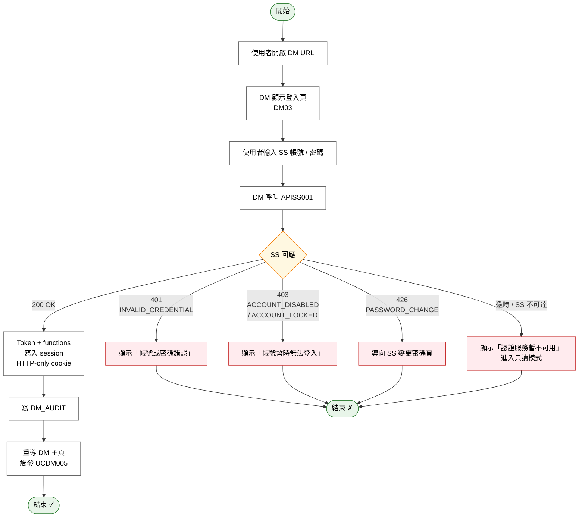
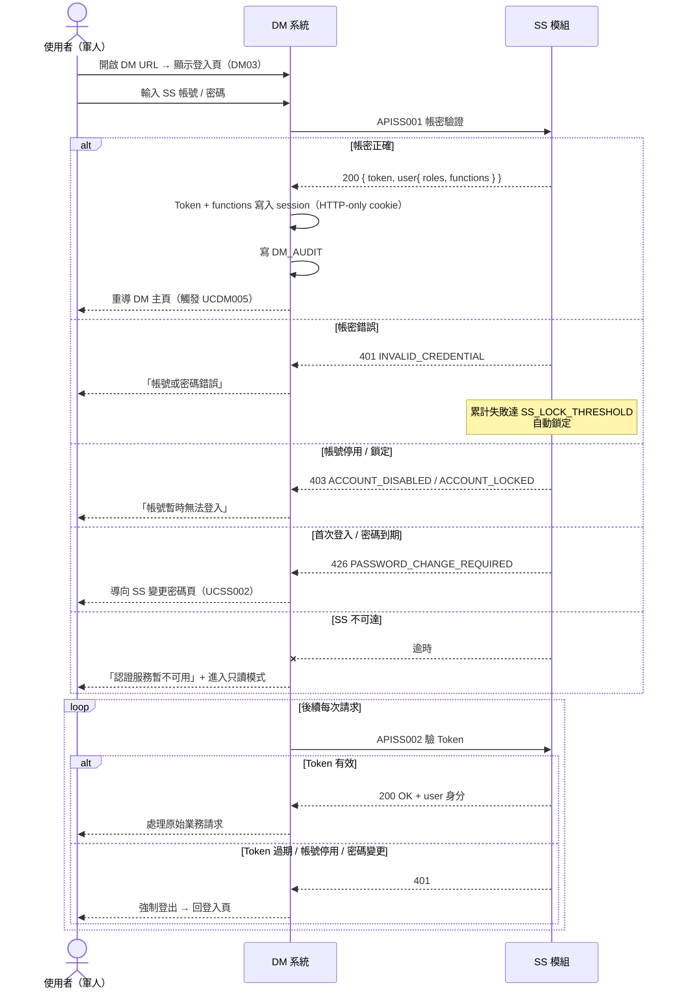

# User Story 1 — UCDM004 DM 登入（SS）

> 返回總檔：[spec.md](spec.md) | 模組：文件管理（DM） | UC：[UCDM004](../../use-cases/dm/UCDM004-DM%20登入.md)

使用者於 DM 獨立登入頁輸入 SS 帳密；DM 透過 SS 認證 API（APISS001）取 Token + 角色 + 可用功能後建立 session；後續每次請求呼叫 APISS002 驗 Token。**不啟用 MFA**（DM 主要為文件查閱，敏感度較低）。

**Why this priority** (P1): 身分驗證為一切作業的入口，無此即 DM 不可用。

**Independent Test**: SS 帳密正確 → DM 進入主頁；帳密錯誤 → SS 回 401，DM 顯示「帳號或密碼錯誤」；帳號鎖定 → 503 對應訊息。

## Acceptance Scenarios

1. **Given** 使用者於 SS 已建立帳號並指派角色，**When** 於 DM 登入頁輸入正確 SS 帳密，**Then** DM 後端呼叫 APISS001 成功取得 `{ token, expires_in, user: { account, name, roles, functions } }`，DM 將 Token + functions 存入 session 並導向 DM 主頁
2. **Given** 帳密錯誤，**When** 使用者送出登入，**Then** APISS001 回 401（INVALID_CREDENTIAL），DM 顯示「帳號或密碼錯誤」（不顯示細節避免帳號列舉）；SS 累計失敗次數達 `SS_LOCK_THRESHOLD` 自動鎖定
3. **Given** 帳號已停用 / 鎖定，**When** 使用者送出登入，**Then** APISS001 回 403，DM 顯示「帳號暫時無法登入，請洽資訊人員」
4. **Given** 使用者首次登入或密碼到期，**When** APISS001 回 426（PASSWORD_CHANGE_REQUIRED），**Then** DM 導向 SS 變更密碼頁
5. **Given** SS 服務暫時不可達，**When** DM 呼叫 APISS001 逾時，**Then** DM 顯示「認證服務暫不可用」並進入只讀模式（公開分類仍可瀏覽，禁止任何寫入）
6. **Given** 使用期間 DM 後端定期呼叫 APISS002 驗 Token，**When** Token 過期 / 帳號停用 / 密碼變更，**Then** SS 回 401，DM 強制登出並導回登入頁

## Activity Diagram（UC 內部流程）

## Sequence Diagram（互動序列）

## 對應 RQ

- RQSS013（SS 提供登入認證 API）
- RQSS014（SS 提供 Token 驗證 API）
- RQSS015（Token 具時效）
- RQSS018（登入歷程記錄）

## 前置依賴

- SS 模組（主專案 `TBMS/docs/specs/ss/spec.md`）已部署，APISS001 / APISS002 可用
- SS 端使用者帳號已建立並指派角色、角色↔功能對應已設定
