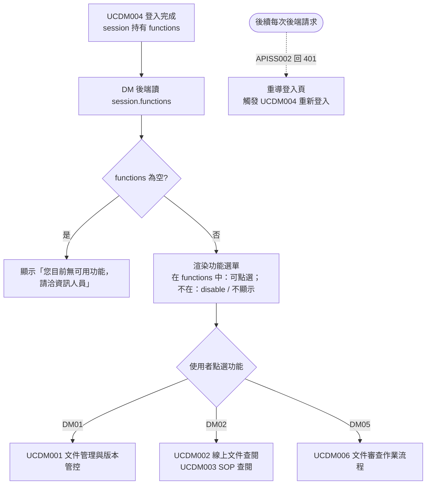

# User Story 2 — UCDM005 DM 主頁與功能選單載入

> 返回總檔：[spec.md](spec.md) | 模組：文件管理（DM） | UC：[UCDM005](../../use-cases/dm/UCDM005-DM%20主頁與功能選單載入.md)

使用者完成登入後進入 DM 主頁；DM 後端依 SS 回傳之 functions 渲染功能選單（DM01 / DM02 / DM05 等），無授權項目以 disable 或不顯示。

**Why this priority** (P1): 功能選單是進入各業務作業的入口。

**Independent Test**: 不同角色登入後看到的功能選單不同；無對應功能之角色看到「無可用功能」。

## Acceptance Scenarios

1. **Given** 使用者已透過 UCDM004 登入，**When** 進入 DM 主頁，**Then** DM 後端讀取 session 中的 functions，依此渲染功能選單（在 functions 中：可點選；不在：disable / 不顯示）
2. **Given** 使用者所屬角色於 SS 端無任何功能對應（functions 為空），**When** 進入主頁，**Then** DM 顯示「您目前無可用功能，請洽資訊人員」
3. **Given** 使用者點選某功能，**When** functions 包含該項，**Then** DM 觸發對應作業（DM01 → UCDM001、DM02 → UCDM002 / UCDM003、DM05 → UCDM006）
4. **Given** session 過期或 Token 失效，**When** APISS002 回 401，**Then** DM 重導登入頁（觸發 UCDM004 重新登入）
5. **Given** SS 端管理者異動角色↔功能對應，**When** 使用者下一次登入，**Then** DM 主頁依新對應渲染（DM 不快取 functions，每次登入重新取）

## 流程圖（Mermaid）

> **詳細 Activity Diagram**：見 [UCDM005-DM 主頁與功能選單載入.md](../../use-cases/dm/UCDM005-DM%20主頁與功能選單載入.md)（EA 匯出 PNG）

## 對應 RQ

- RQSS011（角色↔功能對應）
- RQSS013（登入時取 Token + 可用功能）
- RQSS009（一個使用者可指派多個角色）

## 前置依賴

- US1（UCDM004 DM 登入）已完成；session 中持有 functions
