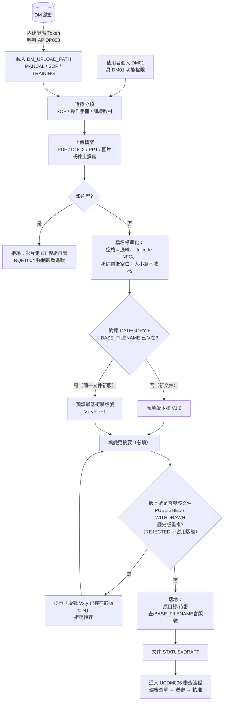

# User Story 3 — UCDM001 文件管理與版本管控

> 返回總檔：[spec.md](spec.md) | 模組：文件管理（DM） | UC：[UCDM001](../../use-cases/dm/UCDM001-文件管理與版本管控.md)

使用者透過 DM01 文件管理作業上傳文件（操作手冊 / SOP / 訓練教材三類），系統依檔名作為文件邏輯識別，同分類同檔名再上傳一律視為新版；版本號預設 `V{MAJOR}.{MINOR}` 或 `V{MAJOR}.{MINOR}R{REVISION}`，唯一性由系統卡控；最新版檔名固定無版本後綴（外部連結穩定），歷史版檔名加版號後綴並移到 `歷史版本/` 目錄。

**Why this priority** (P1): 文件 CRUD + 版本是 DM 模組的核心職責。

**Independent Test**: 上傳新文件 → V1.0；同分類同檔名再上傳 → 系統建議 V1.0R1；核准後最新版檔名固定，舊版移到歷史版本目錄。

## Acceptance Scenarios

1. **Given** 使用者已登入且具 DM01 功能權限，**When** 上傳一份新文件並選擇分類（SOP / 操作手冊 / 訓練教材），**Then** 系統將檔案放入 `{DM_UPLOAD_PATH[CATEGORY]}/待審查/{BASE_FILENAME含版號}`，狀態為 DRAFT；版本號預設 V1.0
2. **Given** 同分類同檔名（NFC 正規化、空格→底線、大小寫不敏感後比對）已存在 DOC_ID，**When** 使用者上傳，**Then** 系統視為**新版**（不允許「另存為新文件」），預填建議版本號 `Vx.yR(z+1)`
3. **Given** 使用者改版本號為 V2.0，**When** 該版號於該 DOC_ID 任一已發布版本（PUBLISHED / WITHDRAWN）已存在，**Then** 系統提示「版號 V2.0 已存在於版本 N」拒絕儲存
4. **Given** 文件已建立 V1.0 並核准發布，**When** 後續上傳新版核准後，**Then** 系統執行原子搬移：(A) 鎖 DOC_ID；(B) 重命名舊最新檔加版號移到 `歷史版本/`；(C) 待審查檔移到 `{原目錄}/{BASE_FILENAME}`（取代最新版）；(D) DB transaction 更新 DM_DOC_VERSION（IS_CURRENT 切換）+ DM_DOC.CURRENT_VERSION_ID + DM_AUDIT；(E) 釋放鎖、發訂閱通知
5. **Given** 原子搬移過程任一步驟失敗，**When** 系統偵測，**Then** 完整回滾檔案與 DB transaction，鎖釋放，事件寫稽核軌跡，由管理員介入查核
6. **Given** DM 啟動期間，**When** DM 程式內以常數寫入永不過期 Bearer Token（對應 `DP_PARAM_D` PARAM_KEY='DM'），**Then** DM 呼叫 APIDP003 取 `DM_UPLOAD_PATH` 三筆明細（MANUAL / SOP / TRAINING）載入記憶體；後續所有上傳依 CATEGORY 對應路徑落地
7. **Given** 影片型訓練教材，**When** 使用者意圖上傳，**Then** DM **不接受**（DM 限文件型；影片走 ET 模組自管，保留 RQET004 強制觀看追蹤）
8. **Given** 檢核設計：版本號唯一性比對對象包含 STATUS=PUBLISHED / WITHDRAWN，**When** 使用者改版號為某退件版本（REJECTED）的版號，**Then** 允許（退件版本不占用版號）

## Activity Diagram（UC 內部流程）



> **核准後原子搬移流程** 圖示：見 [spec_us4.md](spec_us4.md) §流程細節（補充）

## 對應 RQ

- RQDM001（文件儲存 / 版本管控 / 簽核 / 稽核軌跡）
- RQDM002（版本管理與線上存取）
- RQDM005（獨立儲存空間 + 分類分區）
- RQDM006（DM01 文件管理作業入口）
- RQDM007（DM 內建靜態 Token + APIDP003 取參數）
- RQDM008（檔名作為文件邏輯識別）
- RQDM009（版本號規則與唯一性）
- RQDM010（最新版固定檔名 + 歷史版本目錄）
- RQDM011（核准後原子搬移流程）

## 前置依賴

- US1（UCDM004 DM 登入）已完成
- US2（UCDM005 主頁載入）已完成，使用者具 DM01 功能權限
- DP `DP_PARAM_D` 已建立 `PARAM_ID='DM_UPLOAD_PATH'` 三筆 + `PARAM_KEY='DM'` 內建 Token

## 目錄結構（per CATEGORY）

```
{DM_UPLOAD_PATH[CATEGORY]}/
├── {BASE_FILENAME}                ← 最新發布版（PUBLISHED）
├── 待審查/
│   └── {BASE_FILENAME含版號}      ← 上傳完落腳處（DRAFT / SUBMITTED）
└── 歷史版本/
    └── {BASE_FILENAME含版號}      ← 舊版（PUBLISHED 過、被新版取代）
```

最新版檔名**固定無版本後綴**（外部連結穩定）；待審查 / 歷史版本檔名含版號後綴避免並行衝突。
