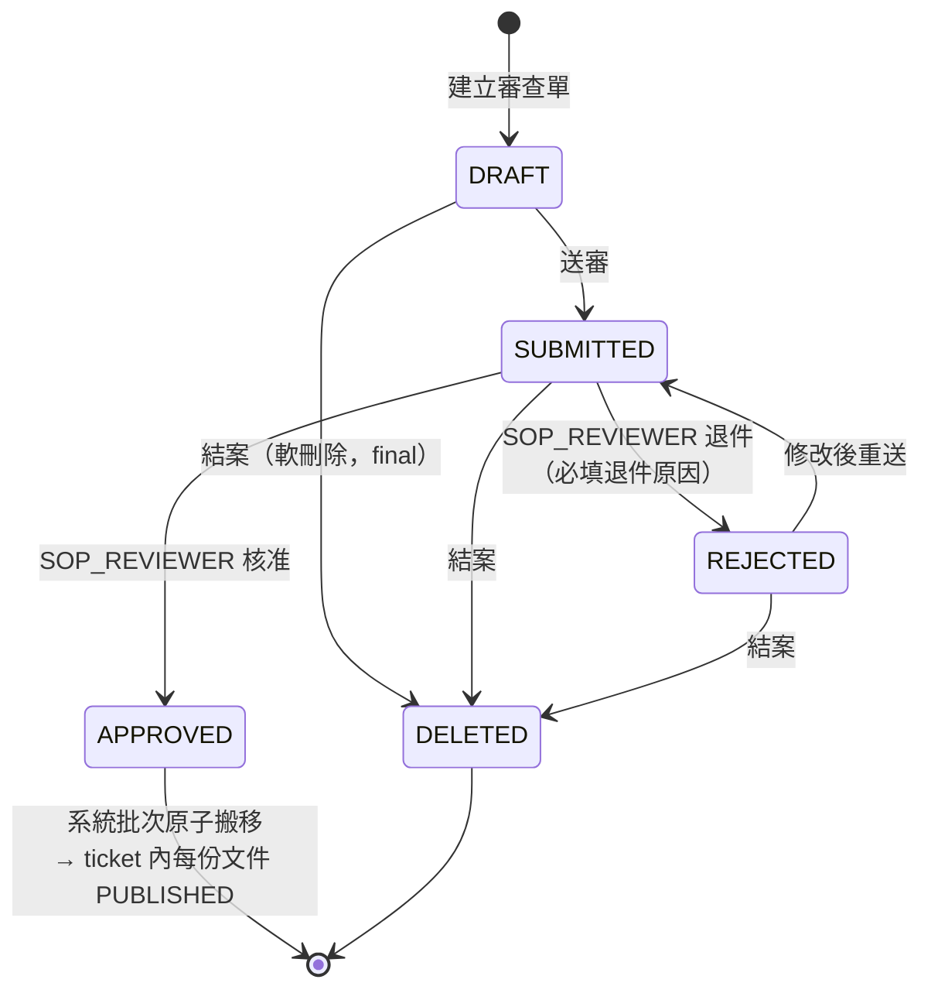
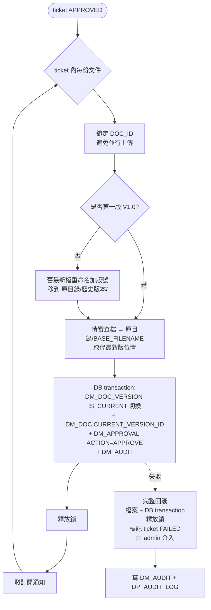
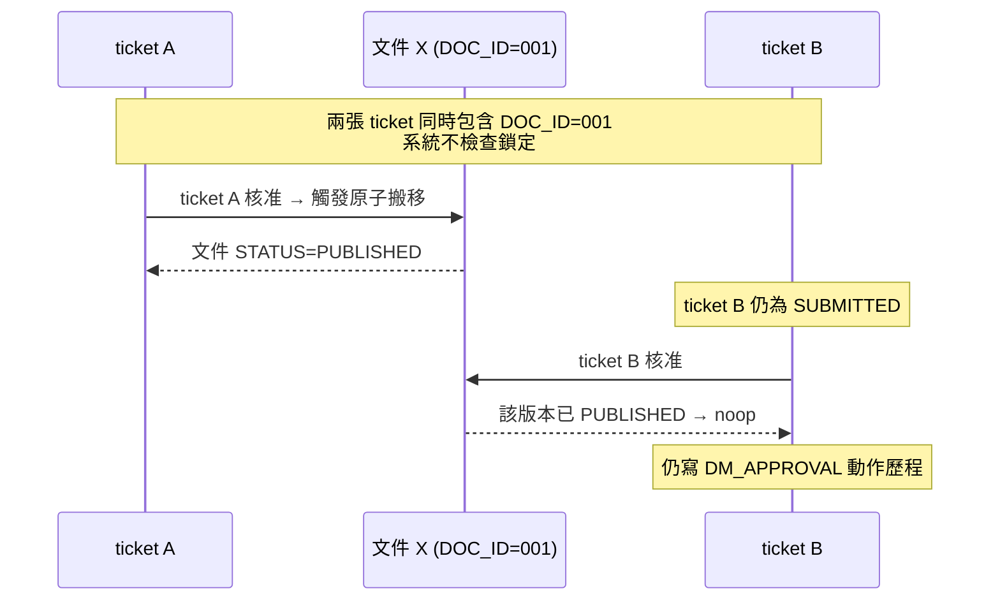

# User Story 4 — UCDM006 文件審查作業流程

> 返回總檔：[spec.md](spec.md) | 模組：文件管理（DM） | UC：[UCDM006](../../use-cases/dm/UCDM006-文件審查作業流程.md)

使用者透過 DM05 建立**審查單（ticket）**並加入多份文件明細，狀態機 `DRAFT → SUBMITTED → APPROVED / REJECTED`；任一狀態使用者可主動「結案（軟刪除）」標記 DELETED 不可逆。**核准 / 退件僅 SOP_REVIEWER 硬卡點**；建單 / 加文件 / 送審 / 讀取由「任一帳號 + DM05 功能權限」即可，不限自審。

**Why this priority** (P1): 簽核軌跡為文件版本管控的法規面要求，與 US3 並列為 MVP。

**Independent Test**: 建立審查單 → 加入 2 份文件 → 送審 → SOP_REVIEWER 核准 → 兩份文件依原子搬移流程同步發布；退件 → 兩份回 DRAFT。

## Acceptance Scenarios

1. **Given** 使用者具 DM05 功能權限，**When** 進入審查作業頁建立審查單，**Then** 系統建立 ticket（STATUS=DRAFT, SUBMITTER_USER_ID=當前使用者）
2. **Given** 一張 DRAFT ticket，**When** 使用者加入文件明細（任意分類），**Then** 系統寫入 DM_APPROVAL_TICKET_DOC（不檢查文件鎖定，**同一文件可同時加入多張 ticket**）
3. **Given** 一張 DRAFT ticket 含 ≥1 份文件明細，**When** 使用者送審，**Then** ticket 狀態 → SUBMITTED；系統通知具 SOP_REVIEWER 角色之使用者
4. **Given** 一張 SUBMITTED ticket，**When** SOP_REVIEWER 核准，**Then** ticket → APPROVED；系統批次為 ticket 內每份文件執行原子搬移流程（per ticket 內逐份文件，詳見 spec_us3.md §目錄結構）
5. **Given** 一張 SUBMITTED ticket，**When** SOP_REVIEWER 整批退件並填退件原因，**Then** ticket → REJECTED；ticket 內所有文件回 DRAFT；待審查檔保留於 `待審查/` 不動；送審者修改後可建新 ticket 重送
6. **Given** 任一狀態（DRAFT / SUBMITTED / REJECTED）之 ticket，**When** 使用者主動「結案」，**Then** ticket → DELETED（軟刪除，final）
7. **Given** 同一文件已加入 ticket A（PENDING）與 ticket B（PENDING），**When** ticket A 先核准發布，**Then** ticket B 仍可繼續審查；ticket B 通過時若文件已 PUBLISHED 則 noop（仍記動作歷程）
8. **Given** 任一簽核動作（送審 / 核准 / 退件 / 結案），**When** 完成，**Then** 系統寫入 DM_APPROVAL（動作歷程，append-only）+ DM_AUDIT；跨系統重大事件同步寫 DP_AUDIT_LOG（透過 SRVDP003）
9. **Given** 一般使用者（非 SOP_REVIEWER），**When** 嘗試核准 / 退件，**Then** 系統拒絕並提示權限不足

## 流程圖（Mermaid）

### 審查單狀態機

### 核准後原子搬移流程（per ticket 內每份文件）

### 同一文件多 ticket 並行處理

> **詳細 Activity Diagram（送審者 / 審查者 swim lane）**：見 [UCDM006-文件審查作業流程.md](../../use-cases/dm/UCDM006-文件審查作業流程.md)（EA 匯出 PNG）

## 對應 RQ

- RQDM001（電子簽核與稽核軌跡）
- RQSS011（角色↔功能對應，SOP_REVIEWER 由 SS 端設定）

## 前置依賴

- US3（UCDM001 文件管理與版本管控）已完成；至少有一份 DRAFT 文件
- 使用者具 DM05 功能權限；核准 / 退件動作執行者具 SOP_REVIEWER 角色

## 角色卡點

| 操作 | 角色卡點 |
|------|---------|
| 建立審查單 / 加文件 / 送審 / 讀取 | 任一帳號 + DM05 功能權限 |
| **核准 / 退件** | **`SOP_REVIEWER` 硬卡點** |
| 自審 | **不限制**（同一人若兼具 SOP_REVIEWER 角色可核准自己送審的 ticket）|
| 退件範圍 | **僅 ticket 級別**（整批退），不可單一文件退件 |
