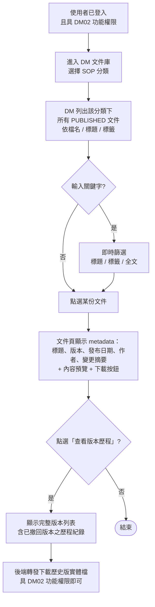

# User Story 6 — UCDM003 SOP 文件查閱

> 返回總檔：[spec.md](spec.md) | 模組：文件管理（DM） | UC：[UCDM003](../../use-cases/dm/UCDM003-SOP文件查閱.md)

使用者主動於 DM 文件庫進入 SOP 分類，依分類 / 標籤 / 關鍵字搜尋並調閱 SOP 最新發布版（單一入口，與 US5 多入口共用查閱邏輯）。

**Why this priority** (P2): SOP 主動查閱為日常作業需求；US5 已涵蓋三入口共用查閱邏輯，US6 為 DM 端 UI 之具體案例。

**Independent Test**: 使用者進入 DM SOP 分類 → 搜尋關鍵字 → 點選文件 → 看到最新發布版。

## Acceptance Scenarios

1. **Given** 使用者已登入且具 DM02 功能權限，**When** 進入 DM 文件庫並選擇 SOP 分類，**Then** DM 列出該分類下所有 PUBLISHED 文件（依檔名 / 標題 / 標籤）
2. **Given** 文件清單已顯示，**When** 使用者輸入關鍵字搜尋（標題 / 標籤 / 全文），**Then** DM 即時篩選並顯示匹配結果
3. **Given** 使用者點選一份文件，**When** 進入文件頁，**Then** DM 顯示文件 metadata（標題、版本、發布日期、作者、變更摘要）+ 內容預覽 / 下載按鈕
4. **Given** 一份文件含版本歷程，**When** 使用者點選「查看版本歷程」，**Then** DM 顯示完整版本列表（含已撤回版本之歷程紀錄）；具 DM02 功能權限即可由後端轉發下載歷史版實體檔（系統權限管控僅至功能層）

## Activity Diagram（UC 內部流程）

## 對應 RQ

- RQDM001（文件庫及檢索）
- RQDM002（版本管理與線上存取）

## 前置依賴

- US2（UCDM005 主頁與功能選單載入）已完成，使用者具 DM02 功能權限
- US3（UCDM001 文件管理與版本管控）已上線且 SOP 分類至少有一份 PUBLISHED 文件
