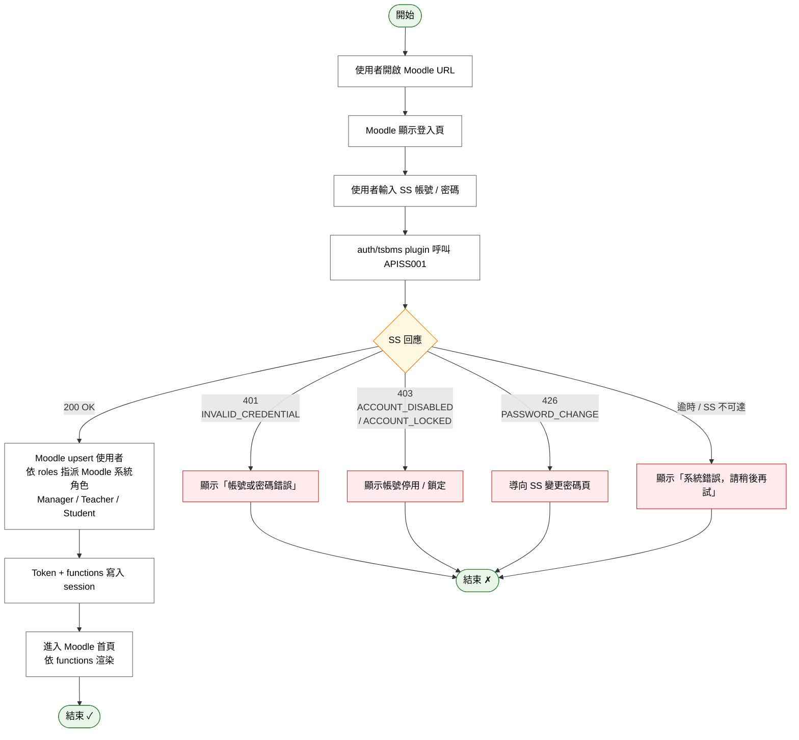
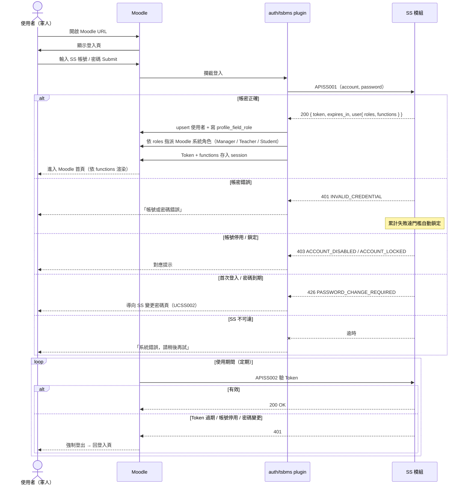

# User Story 1 — UCET013 登入線上學習平台（SS）

> 返回總檔：[spec.md](spec.md) | 模組：教育訓練（ET） | UC：[UCET013](../../use-cases/et/UCET013-登入線上學習平台（SS）.md)

使用者開啟 Moodle 登入頁，輸入 SS 帳密；Moodle 透過 `auth/tsbms/` custom plugin 呼叫 SS 認證 API（APISS001），取 Token + 角色 + 可用功能後建立 Moodle session。

**Why this priority** (P1): 身分驗證為一切作業的入口，無此即無 ET 模組可用。

**Independent Test**: SS 帳密正確 → Moodle 取得 Token 並進入首頁；帳密錯誤 → SS 回 401，累計失敗達門檻自動鎖定。

## Acceptance Scenarios

1. **Given** 使用者已於 SS 建立帳號並指派角色，**When** 於 Moodle 登入頁輸入正確 SS 帳密，**Then** auth/tsbms plugin 呼叫 APISS001 成功取得 `{ token, expires_in, user: { account, name, roles, functions } }`，Moodle 在本地 upsert 使用者並依 roles 指派 Moodle 系統角色，建立 session
2. **Given** 帳密錯誤，**When** 使用者送出登入，**Then** APISS001 回 401（INVALID_CREDENTIAL），Moodle 顯示「帳號或密碼錯誤」，SS 累計失敗次數達門檻自動鎖定
3. **Given** 帳號已停用 / 鎖定，**When** 使用者送出登入，**Then** APISS001 回 403，Moodle 顯示對應訊息
4. **Given** 使用者首次登入或密碼到期，**When** APISS001 回 426（PASSWORD_CHANGE_REQUIRED），**Then** Moodle 導向 SS 變更密碼頁
5. **Given** SS 服務暫時不可達，**When** auth/tsbms plugin 呼叫 APISS001 逾時，**Then** Moodle 登入頁顯示「系統錯誤，請稍後再試」
6. **Given** 使用者所屬角色於 SS 端尚無功能對應，**When** 登入成功，**Then** Moodle 僅顯示登入後首頁，課程 / 教材列表為空
7. **Given** 使用期間 Moodle 定期呼叫 APISS002 驗 Token，**When** Token 過期 / 帳號停用 / 密碼變更，**Then** SS 回 401，Moodle 強制登出並導回登入頁

## Activity Diagram（UC 內部流程）

## Sequence Diagram（互動序列）

> SS 端認證流程詳見 SS 模組規格（主專案 `TBMS/docs/specs/ss/spec.md`）§User Story 5。

## 對應 RQ

- RQSS013（SS 提供登入認證 API）
- RQSS014（SS 提供 Token 驗證 API）
- RQSS015（Token 具時效）
- RQSS018（登入歷程記錄）

## 前置依賴

- SS 模組已部署，APISS001 / APISS002 可用
- Moodle 已安裝 `auth/tsbms/` custom plugin 並設好 SS endpoint / API Key
- SS 端使用者帳號已建立並指派角色、角色↔功能對應已設定
