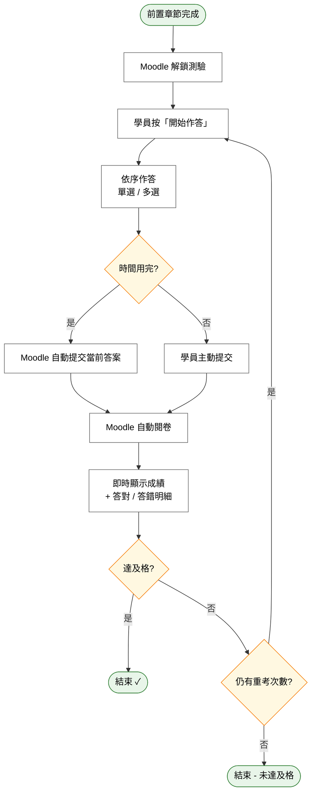

# User Story 10 — UCET009 進行線上測驗（學員）

> 返回總檔：[spec.md](spec.md) | 模組：教育訓練（ET） | UC：[UCET009](../../use-cases/et/UCET009-進行線上測驗.md)

學員在前置章節完成後進行隨堂測驗，系統自動閱卷並顯示成績；未達及格可依管理者設定重考。

**Why this priority** (P2): 測驗是學習成效驗證；在學習功能完備後即可導入。

**Independent Test**: 學員作答提交後即時看到成績；未及格時可重考。

## Acceptance Scenarios

1. **Given** 前置章節已完成，**When** Moodle 解鎖測驗，**Then** 學員可點選「開始作答」
2. **Given** 學員依序作答（單選 / 多選）並提交，**When** Moodle 自動閱卷，**Then** 系統即時顯示成績與答對 / 答錯明細
3. **Given** 學員未達及格分數且仍有重考次數，**When** 學員選擇重考，**Then** Moodle 開放下一次作答
4. **Given** 學員作答時間已達上限，**When** 系統倒數結束，**Then** Moodle 自動提交當前答案

## Activity Diagram（UC 內部流程）

## 對應 RQ

- RQET005（學員端：自動閱卷、即時成績）

## 前置依賴

- US9（UCET008 學習課程內容）已上線；前置章節已完成
- US5（UCET004 建立測驗）已建立題目
