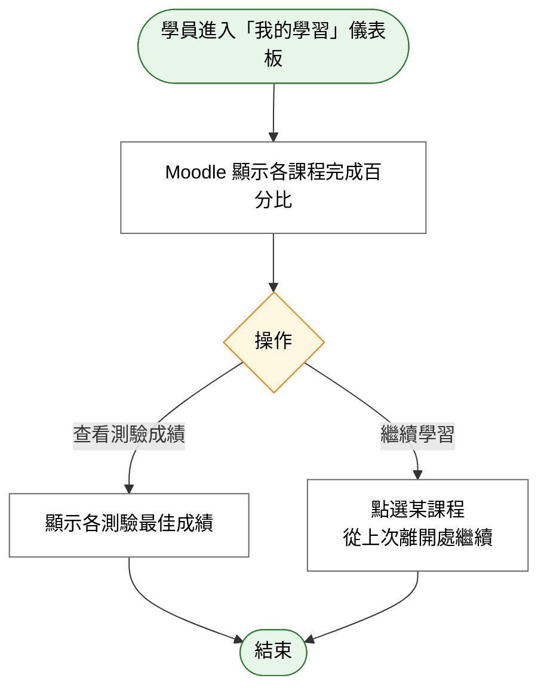

# User Story 11 — UCET010 查看個人學習進度

> 返回總檔：[spec.md](spec.md) | 模組：教育訓練（ET） | UC：[UCET010](../../use-cases/et/UCET010-查看個人學習進度.md)

學員於「我的學習」儀表板檢視各課程完成百分比與測驗成績。

**Why this priority** (P3): 自我追蹤功能為輔助工具，非首要需求。

**Independent Test**: 學員至少加入一門課程並完成部分章節後，儀表板顯示對應進度。

## Acceptance Scenarios

1. **Given** 學員已加入至少一門課程，**When** 進入「我的學習」儀表板，**Then** Moodle 顯示各課程完成百分比
2. **Given** 學員已參加測驗，**When** 查看儀表板測驗成績區，**Then** Moodle 顯示各測驗最佳成績
3. **Given** 學員點選某課程，**When** 進入課程頁，**Then** 可從上次離開處繼續學習

## Activity Diagram（UC 內部流程）

## 對應 RQ

- 無直接 RQET 對應（屬學員端輔助功能，分析資料新增）

## 前置依賴

- US8（UCET007 加入課程）已完成
- US9 / US10 已產生學習進度與測驗成績資料
