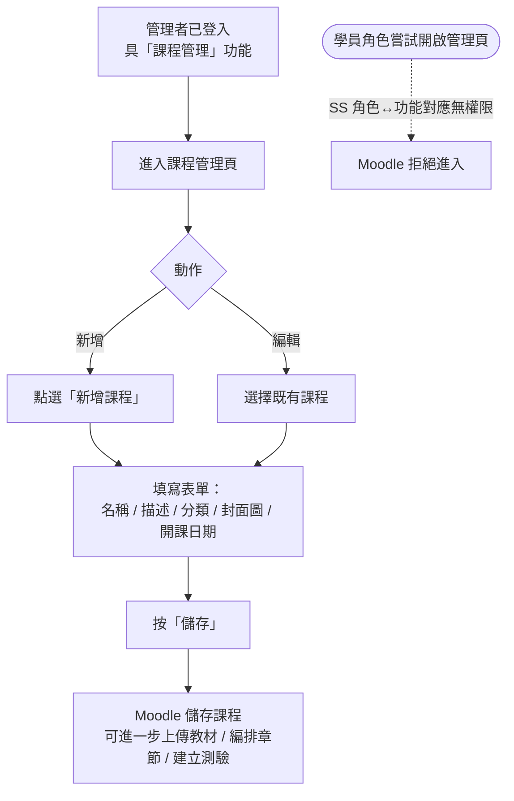

# User Story 2 — UCET001 建立與編輯課程

> 返回總檔：[spec.md](spec.md) | 模組：教育訓練（ET） | UC：[UCET001](../../use-cases/et/UCET001-建立與編輯課程.md)

管理者於 Moodle 建立新課程或編輯既有課程基本資料（名稱、描述、分類、封面圖、開課日期）。

**Why this priority** (P1): 課程是所有後續作業（上傳教材、編排章節、建立測驗、邀請學員）的前置條件。

**Independent Test**: 建立課程後，可進入該課程進行教材上傳與章節編排（接 US3 / US4）。

## Acceptance Scenarios

1. **Given** 管理者已登入 Moodle 且具管理者角色，**When** 進入課程管理頁並點選「新增課程」，**Then** Moodle 顯示新增表單供輸入名稱、描述、分類、封面圖
2. **Given** 表單填寫完成，**When** 管理者按「儲存」，**Then** 課程已建立，可進一步上傳教材、編排章節、建立測驗
3. **Given** 一個既有課程，**When** 管理者編輯名稱 / 描述 / 分類 / 封面，**Then** Moodle 儲存變更
4. **Given** 學員角色之使用者，**When** 嘗試開啟課程管理頁，**Then** Moodle 拒絕（依 SS 角色↔功能對應，無「課程管理」權限）

## Activity Diagram（UC 內部流程）

## 對應 RQ

- RQET007（角色與權限：管理者 / 學員區分）

## 前置依賴

- US1（UCET013 登入）已完成；管理者具「課程管理」功能對應
