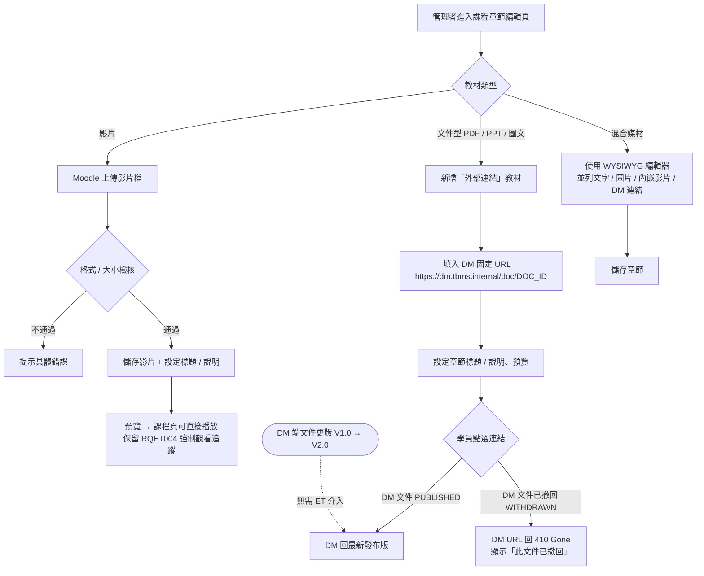

# User Story 3 — UCET002 上傳教材（影片 / 引用 DM 文件）

> 返回總檔：[spec.md](spec.md) | 模組：教育訓練（ET） | UC：[UCET002](../../use-cases/et/UCET002-上傳教材.md)

管理者上傳課程教材至章節。**影片型**直接由 ET 上傳並播放（保留強制觀看追蹤能力以滿足 RQET004）；**文件型**（PDF / PPT / 圖文）改以連結引用 DM 模組之固定 URL（`https://dm.tbms.internal/doc/{DOC_ID}`），享 DM 版本管控。

**Why this priority** (P1): 教材是課程的內容主體，無教材無從學習。

**Independent Test**: 影片上傳後可在課程頁播放；文件型教材以 DM URL 引用後，DM 端更版時 ET 課程連結自動指向最新版。

## Acceptance Scenarios

1. **Given** 一個既有課程章節，**When** 管理者選擇「影片教材」並上傳影片檔，**Then** Moodle 驗證格式 / 大小通過後儲存影片，課程頁可直接播放
1a. **Given** 影片格式不支援或超過上傳大小限制，**When** 管理者上傳，**Then** 系統提示具體錯誤
2. **Given** DM 已發布一份 SOP 文件（DOC_ID 已知），**When** 管理者於章節新增「外部連結」教材並填入 DM 固定 URL，**Then** Moodle 儲存連結；學員點選即跳轉 DM 對應文件頁
3. **Given** 同一份 DM 文件更版（v2.0），**When** 學員再次點選 ET 課程章節之引用連結，**Then** DM 回最新版，ET 課程不需異動連結
4. **Given** DM 端文件被撤回（STATUS=WITHDRAWN），**When** 學員點選引用連結，**Then** DM URL 回 410 Gone（Phase 2 補 webhook 通知 ET 課程）
5. **Given** 章節同時包含影片、文件、圖文，**When** 管理者使用頁面編輯器（WYSIWYG）製作混合媒材頁面，**Then** Moodle 支援多媒體混排呈現

## 流程圖（Mermaid）

> **詳細 Activity Diagram**：見 [UCET002-上傳教材.md](../../use-cases/et/UCET002-上傳教材.md)（EA 匯出 PNG）

## 對應 RQ

- RQET001（直接上傳影片檔，課程頁直接播放）
- RQET002（拖拉式介面調整影片 / 文件 / 作業順序）
- RQET003（混合媒材呈現）
- RQET010（文件型教材引用 DM 固定 URL，享 DM 版本管控）

## 前置依賴

- US2（UCET001 建立課程）已完成
- DM 模組已上線；文件型教材已於 DM 上傳並 PUBLISHED（取得 DOC_ID）
- 影片型教材檔案儲存空間已配置
