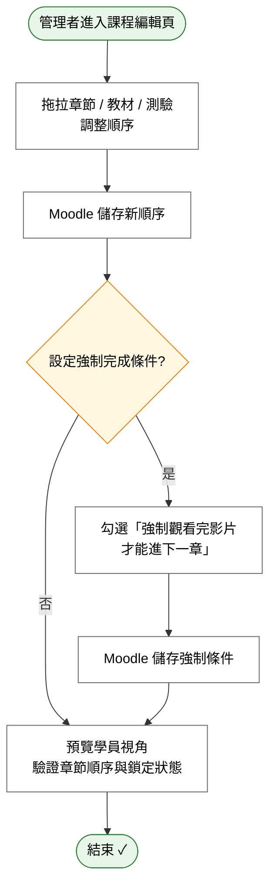

# User Story 4 — UCET003 編排課程章節與進度條件

> 返回總檔：[spec.md](spec.md) | 模組：教育訓練（ET） | UC：[UCET003](../../use-cases/et/UCET003-編排課程章節與進度條件.md)

管理者透過拖拉介面調整章節 / 教材 / 測驗順序，並設定強制完成條件（強制觀看影片 / 強制通過測驗才能進下一章）。

**Why this priority** (P1): RQET004「強制完成」邏輯是 ET 課程設計的核心要求。

**Independent Test**: 設定章節 A 完成才能進章節 B → 學員未完成 A 時 B 鎖定。

## Acceptance Scenarios

1. **Given** 一個既有課程含多個章節，**When** 管理者拖拉調整章節 / 教材 / 測驗的先後順序，**Then** Moodle 儲存新順序
2. **Given** 一個章節含影片，**When** 管理者勾選「強制觀看完影片才能進下一章」，**Then** Moodle 儲存強制完成條件
3. **Given** 章節 A 設為強制完成才能進 B，**When** 學員未看完 A 之影片即嘗試進 B，**Then** Moodle 鎖定 B 並顯示「請先完成本章」
4. **Given** 管理者已完成編排，**When** 預覽學員視角，**Then** Moodle 顯示學員實際看到的章節順序與鎖定狀態

## Activity Diagram（UC 內部流程）

## 對應 RQ

- RQET004（強制完成邏輯：學員必須觀看完影片才能進下一章節 / 進行測驗）

## 前置依賴

- US3（UCET002 上傳教材）已完成；課程內已有影片 / 文件 / 測驗素材
