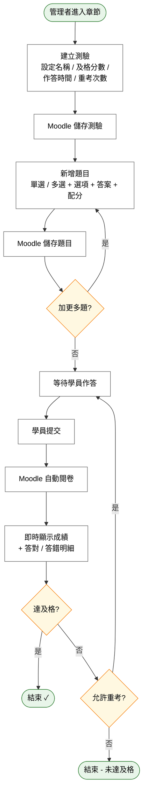

# User Story 5 — UCET004 建立線上測驗

> 返回總檔：[spec.md](spec.md) | 模組：教育訓練（ET） | UC：[UCET004](../../use-cases/et/UCET004-建立線上測驗.md)

管理者於章節後方建立隨堂測驗，支援單選 / 多選題型，系統自動閱卷並計分。

**Why this priority** (P2): 測驗是評估學習成效的工具；可在課程內容上線後再導入。

**Independent Test**: 建立測驗 → 學員作答 → 系統自動閱卷 → 顯示成績與答對 / 答錯明細。

## Acceptance Scenarios

1. **Given** 一個既有章節，**When** 管理者建立測驗並設定名稱、及格分數、作答時間、重考次數，**Then** Moodle 儲存測驗
2. **Given** 測驗已建立，**When** 管理者於題庫新增單選 / 多選題並設定選項與正確答案、配分，**Then** Moodle 儲存題目
3. **Given** 學員作答提交，**When** Moodle 自動閱卷，**Then** 系統即時顯示成績與答對 / 答錯明細
4. **Given** 學員未達及格分數，**When** 管理者已設定允許重考次數，**Then** 學員可依次重考至達上限

## Activity Diagram（UC 內部流程）

## 對應 RQ

- RQET005（章節後方緊接線上隨堂考，自動對單選 / 多選題閱卷）

## 前置依賴

- US2（UCET001 建立課程）已完成；章節已建立
