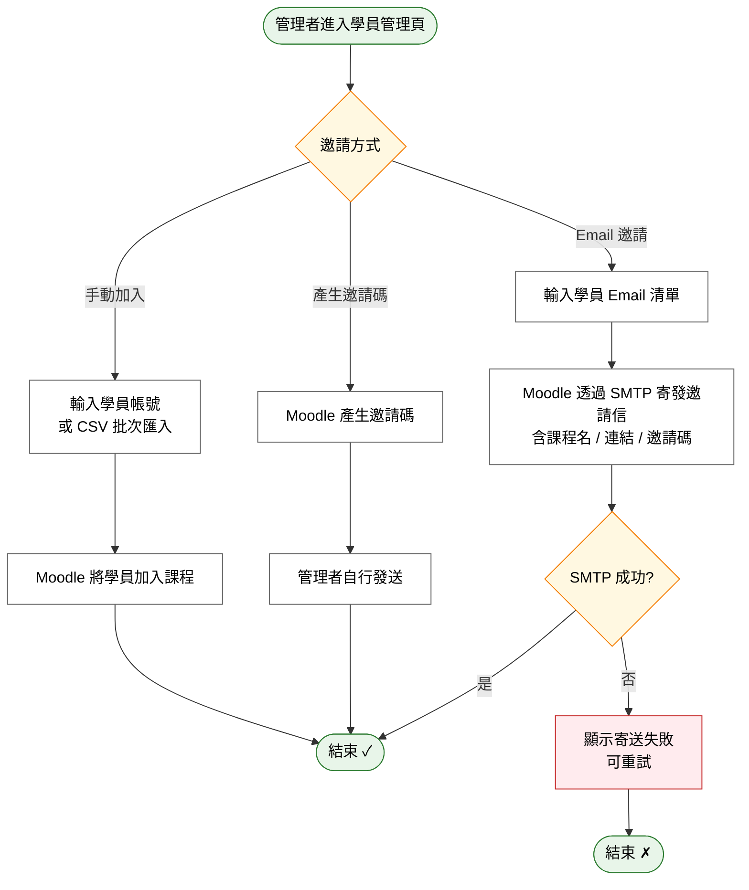

# User Story 6 — UCET005 邀請學員加入課程

> 返回總檔：[spec.md](spec.md) | 模組：教育訓練（ET） | UC：[UCET005](../../use-cases/et/UCET005-邀請學員加入課程.md)

管理者透過 Email 邀請或產生課程邀請碼，讓學員自行加入指定課程。

**Why this priority** (P2): 邀請是學員加入的主要管道，但管理者亦可手動加入或批次匯入作為替代方案。

**Independent Test**: 管理者輸入學員 Email → 系統寄出邀請信 → 學員點連結加入課程。

## Acceptance Scenarios

1. **Given** 一個既有課程，**When** 管理者於學員管理頁輸入 Email 清單並送出，**Then** 系統透過 eMail Server 寄發邀請信（含課程名稱、邀請連結、邀請碼）
2. **Given** 一個既有課程，**When** 管理者產生課程邀請碼，**Then** 系統顯示邀請碼供管理者自行發送
3. **Given** 管理者選擇手動加入，**When** 輸入學員帳號或批次匯入 CSV，**Then** Moodle 將該批學員加入課程
4. **Given** 邀請信送出，**When** SMTP 失敗，**Then** Moodle 顯示寄送失敗，可重新嘗試

## Activity Diagram（UC 內部流程）

## 對應 RQ

- RQET006（透過 Email 邀請或提供課程邀請碼）

## 前置依賴

- US2（UCET001 建立課程）已完成
- eMail Server（SMTP）已配置
