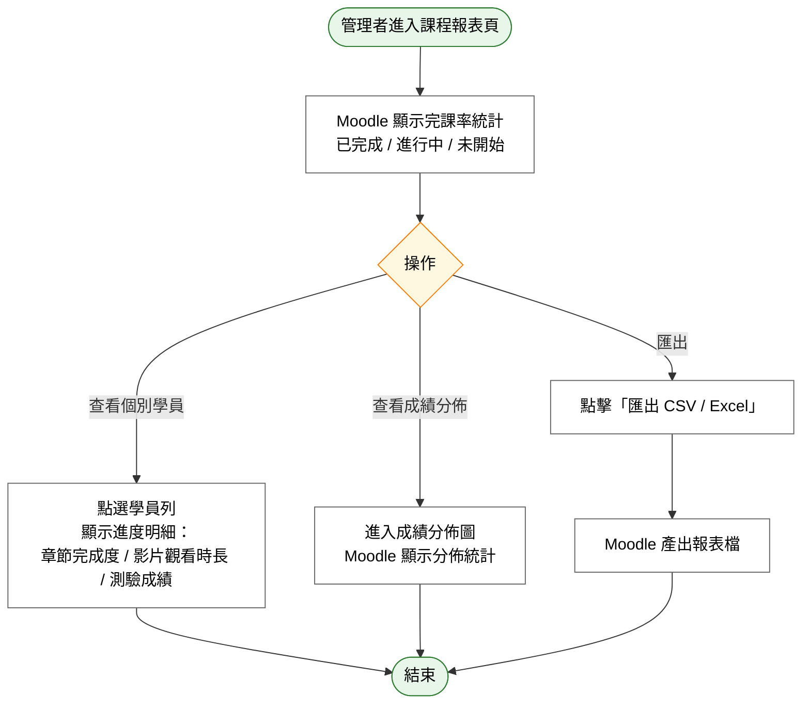

# User Story 7 — UCET006 檢視學習報表與完課率

> 返回總檔：[spec.md](spec.md) | 模組：教育訓練（ET） | UC：[UCET006](../../use-cases/et/UCET006-檢視學習報表與完課率.md)

管理者檢視課程的學員學習進度、完課率、測驗成績統計，並可匯出 CSV / Excel 供管理分析。

**Why this priority** (P2): 報表為管理決策輔助；在課程運行一段時間後才有意義。

**Independent Test**: 在課程已有學員參與後，產出完課率與成績分佈統計。

## Acceptance Scenarios

1. **Given** 課程已有學員參與，**When** 管理者進入課程報表頁面，**Then** Moodle 顯示完課率統計（已完成 / 進行中 / 未開始）
2. **Given** 管理者查看個別學員，**When** 點選學員列，**Then** Moodle 顯示該學員之進度明細（章節完成度、影片觀看時長、測驗成績）
3. **Given** 管理者查看測驗成績，**When** 進入成績分佈圖，**Then** Moodle 顯示成績分佈統計
4. **Given** 管理者需要匯出報表，**When** 點擊「匯出 CSV / Excel」，**Then** Moodle 產出報表檔案

## Activity Diagram（UC 內部流程）

## 對應 RQ

- RQET008（管理者後台需能產出清單，顯示哪些學員已完成影片觀看 / 通過測驗）

## 前置依賴

- US3（上傳教材）+ US5（建立測驗）已上線；US8 / US9 / US10（學員端流程）已產生學習資料
