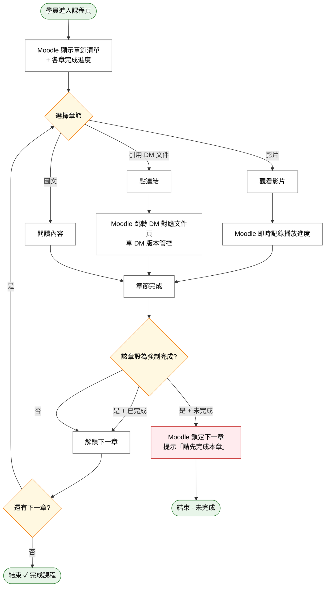

# User Story 9 — UCET008 學習課程內容

> 返回總檔：[spec.md](spec.md) | 模組:教育訓練（ET） | UC：[UCET008](../../use-cases/et/UCET008-學習課程內容.md)

學員依序觀看課程章節（影片、文件、圖文），系統追蹤觀看進度並依強制完成條件解鎖下一章。

**Why this priority** (P1): 學習是 ET 模組的核心目的。

**Independent Test**: 學員觀看完強制章節 → 下一章解鎖；未完成 → 下一章保持鎖定。

## Acceptance Scenarios

1. **Given** 學員已加入課程，**When** 進入課程頁，**Then** Moodle 顯示章節清單與各章完成進度
2. **Given** 學員點選一個影片章節，**When** 觀看，**Then** Moodle 即時記錄播放進度
3. **Given** 學員點選引用 DM 文件之章節，**When** 點連結，**Then** Moodle 跳轉 DM 對應文件頁（享 DM 版本管控）
4. **Given** 章節已完成且該章設為強制完成，**When** 學員嘗試進下一章，**Then** Moodle 解鎖下一章
5. **Given** 章節未完成且該章設為強制完成，**When** 學員嘗試進下一章，**Then** Moodle 鎖定並提示「請先完成本章」

## Activity Diagram（UC 內部流程）

## 對應 RQ

- RQET004（強制完成邏輯，學員端解鎖判斷）
- RQET010（學員點 DM 連結時跳轉 DM 享版本管控）

## 前置依賴

- US8（UCET007 加入課程）已完成
- US3（上傳教材）+ US4（章節編排與強制完成）已配置
