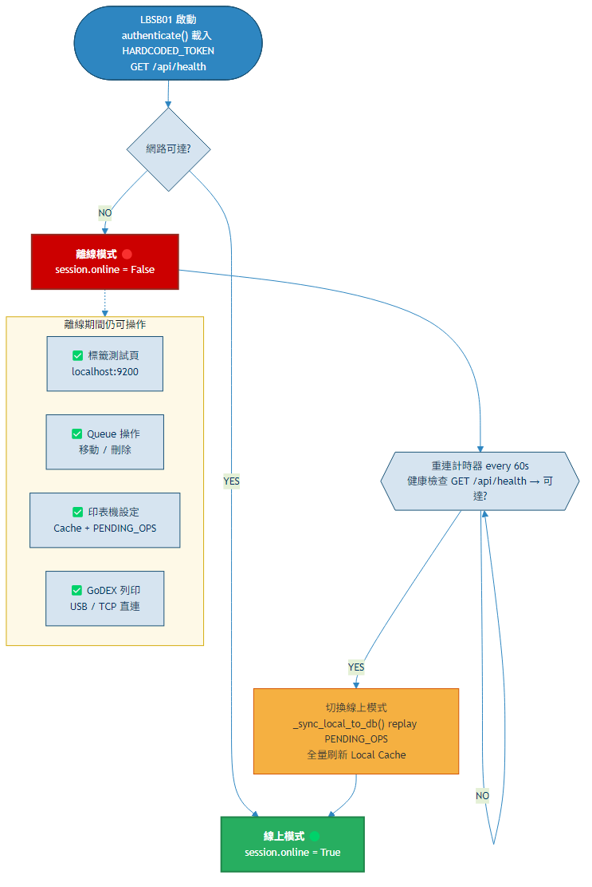
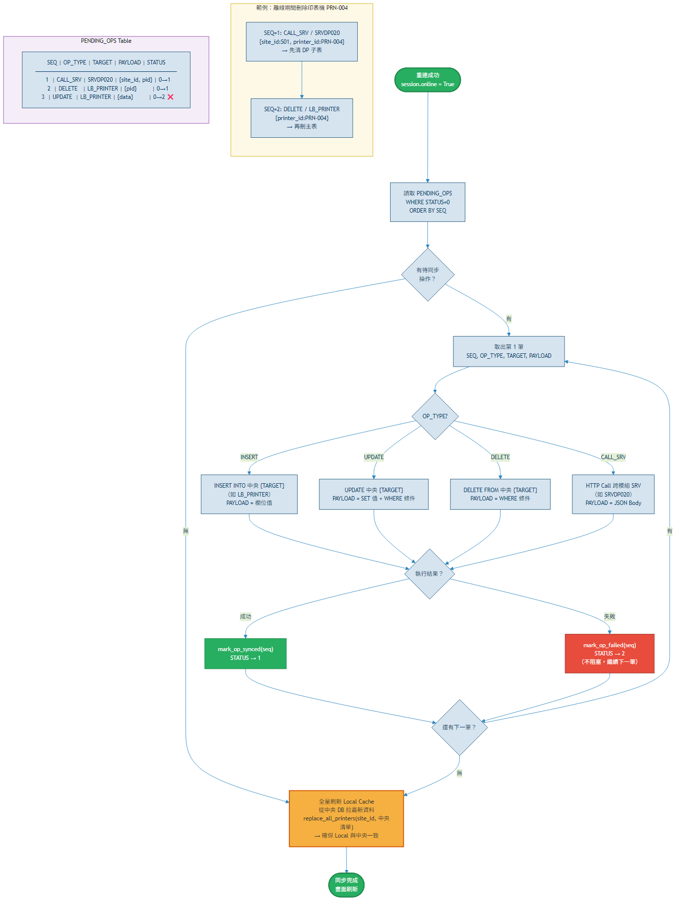
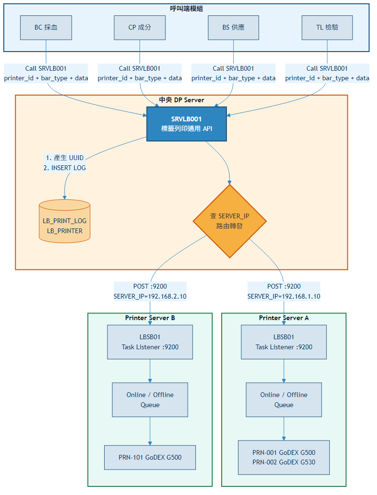
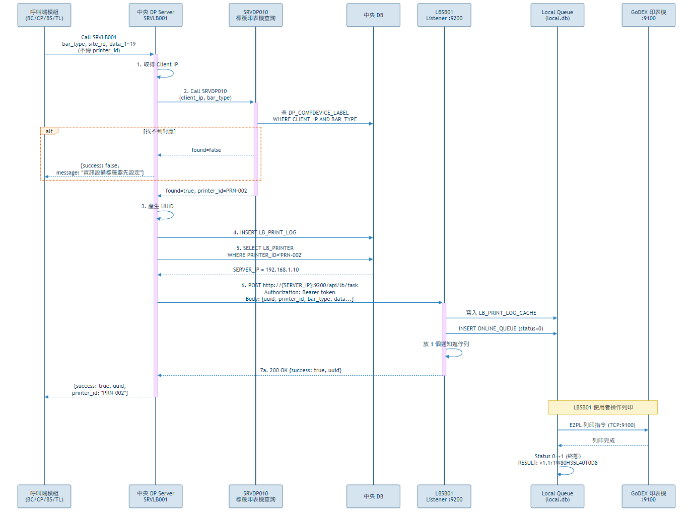
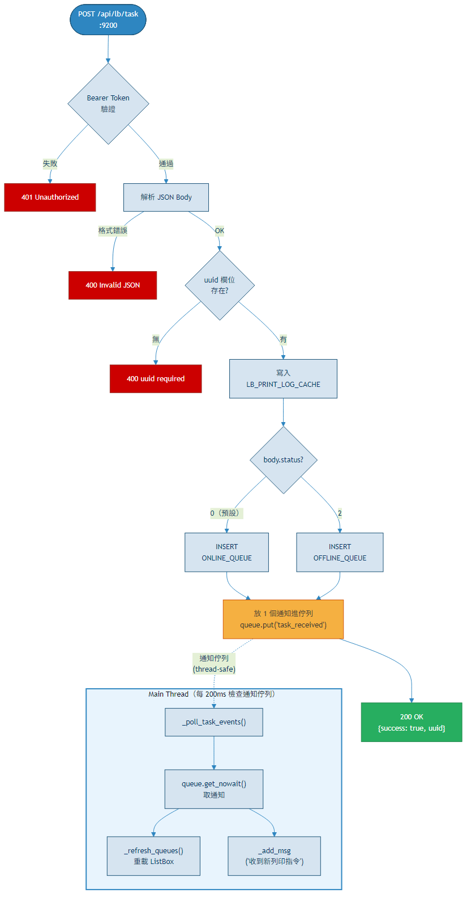
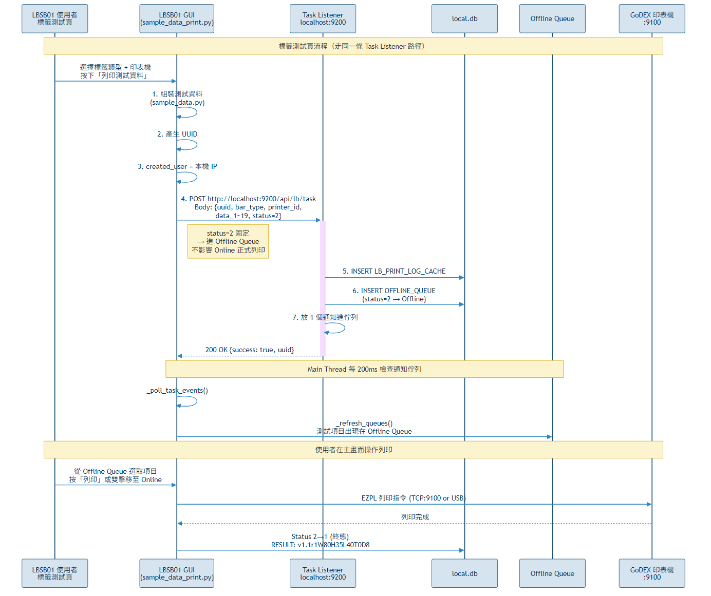
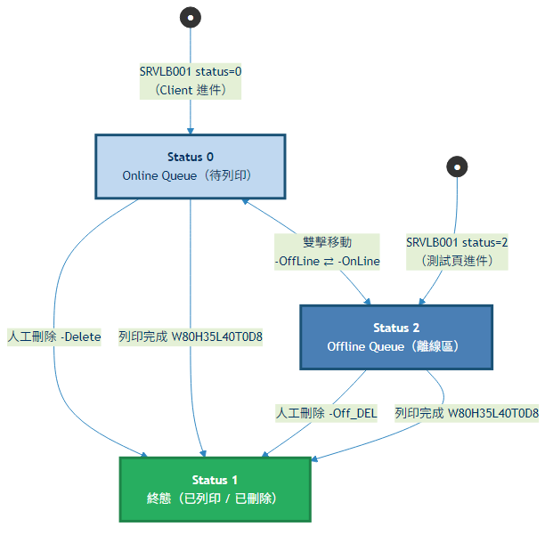

# LBSB01 標籤服務程式 — 開發者指南

**適用對象**: LB 模組開發者（無法存取主專案 TSBMS_SA）
**程式語言**: Python 3.12+
**交付型態**: 編譯為 .exe（PyInstaller / Nuitka），config.ini 隨附

---

## 目錄

1. [專案架構](#1-專案架構)
2. [開發環境設定](#2-開發環境設定)
3. [config.ini 設定](#3-configini-設定)
4. [啟動流程與認證](#4-啟動流程與認證)
5. [DB 存取規則與 SRV 架構](#5-db-存取規則與-srv-架構)
6. [離線暫存與同步架構（local.db）](#6-離線暫存與同步架構localdb)
7. [SRV 清單速查](#7-srv-清單速查)
8. [API 呼叫模式](#8-api-呼叫模式)
9. [Queue 三層架構](#9-queue-三層架構)
10. [標籤印表機設定](#10-標籤印表機設定)
11. [標籤測試頁](#11-標籤測試頁)
12. [編譯為 EXE](#12-編譯為-exe)
13. [注意事項與規則](#13-注意事項與規則)

---

## 1. 專案架構

```
_LB/
├── Source/Python/LBSB01/        ← Python 原始碼
│   ├── main.py                  ← 程式進入點（App 主視窗）
│   ├── login.py                 ← 認證模組（TOKEN + 中央 URL 硬寫常數 + 健康檢查）
│   ├── local_db.py              ← 本地 SQLite 封裝（Cache + Queue + PENDING_OPS）
│   ├── printer_setting.py       ← 印表機設定頁面
│   ├── sample_data_print.py     ← 標籤測試頁
│   ├── labels.py                ← 標籤定義（目前啟用 4 種：TL01, CP01, CP11, CP19）
│   ├── sample_data.py           ← 標籤樣本資料
│   ├── ezpl.py                  ← GoDEX EZPL DLL 封裝
│   ├── config.ini               ← 本機設定（站點 + API URL，隨執行檔部署）
│   ├── local.db                 ← SQLite 本地資料庫（程式自動建立）
│   └── Log/
│       └── LBSB01{YYYYMMDD}.log ← 每日系統 Log
│
├── docs/
│   └── specs/lb/
│       ├── LBSB01-操作手冊.md       ← 操作人員用
│       ├── LBSB01-開發者指南.md     ← ← 本文件
│       ├── SRVLB001-標籤列印整合指南.md
│       ├── spec.md                  ← 功能規格
│       ├── data-model.md            ← 資料模型 + ERD
│       └── contracts/
│           └── srv-contracts.md     ← SRV 契約（完整 I/O 定義）
```

---

## 2. 開發環境設定

### 2.1 前置需求

| 項目 | 版本 | 說明 |
|------|------|------|
| Python | 3.12+ | 使用 dataclass, `X \| None` 語法 |
| tkinter | 內建 | GUI 框架 |
| pystray | 0.19+ | 系統匣 icon（最小化到工作列右下角） |
| Pillow | 10+ | Tray icon 圖像處理 |
| GoDEX EZIO DLL | 官方 SDK | 標籤印表機驅動（見 2.2 下載說明） |

安裝 Python 套件：
```bash
pip install pystray Pillow
```

### 2.2 GoDEX EZIO DLL 下載

EZIO 是 GoDEX 官方提供的印表機 SDK DLL（`EZio32.dll` / `EZio64.dll`），用於控制 GoDEX 標籤印表機（G500 / G530 / EZ 系列等）。

**官方下載位置**：

| 管道 | 網址 |
|------|------|
| GoDEX 全球官網（英文）| https://www.godexintl.com/ → `Support` → `Download Center` → `SDK` |
| 科誠科技（台灣）| https://www.godexintl.com.tw/ → `技術支援` → `下載專區` → `SDK` |

**檔名**：
- `EZio32.dll`（32-bit Python 用）
- `EZio64.dll`（64-bit Python 用）
- 程式會依 Python 位元自動偵測載入

**部署**：DLL 檔必須與 `LBSB01.exe`（或 `main.py`）**放在同一目錄**，或在 Windows `PATH` 環境變數可搜尋到的位置。

> **建議**：首次部署時連同印表機隨附光碟或向 GoDEX 經銷商索取最新版 SDK。使用與印表機韌體匹配的 DLL 版本可避免相容性問題。

### 2.3 快速啟動

```bash
cd Source/Python/LBSB01
python main.py
```

首次執行會自動建立 `config.ini`（預設值）。修改 `[site]` 後重啟即可。

### 2.4 開發用離線模式

網路不通或中央服務未啟動時，健康檢查失敗 → 程式自動進入**離線模式**（`session.online = False`）：

- 印表機設定 CRUD → 寫 Local Cache + 排 PENDING_OPS
- 標籤測試頁 → POST localhost:9200 走本機迴路（正常可用）
- Queue 操作（移動/刪除/列印）→ 操作 local.db
- 跨模組 SRV（SRVDP020）→ 排入 PENDING_OPS，上線後 replay

> 離線模式讓開發者不需中央服務即可開發 UI 與流程邏輯。中央恢復連線後健康檢查成功即自動切換為線上模式。

---

## 3. config.ini 設定

設定檔位於**執行檔同目錄**，INI 格式（UTF-8）。

> **設計變更（2026-04-17）**：TOKEN 與中央 API Base URL 已改為**硬寫於 `login.py` 常數**，不再寫入 config.ini。
> config.ini 只保留 `[site]`。

```ini
; LBSB01 標籤服務程式設定檔
; [site] 由管理者依站點設定

[site]
site_id = S01
site_name = 總院捐血中心
```

| Section | Key | 說明 | 維護者 |
|---------|-----|------|--------|
| `[site]` | `site_id` | 站點代碼（須與中央 DP 一致） | 管理者 |
| `[site]` | `site_name` | 站點中文名稱 | 管理者 |

### 程式內硬寫常數（login.py）

| 常數 | 說明 |
|------|------|
| `HARDCODED_TOKEN` | 供 Task Listener 驗證 + 主動呼叫中央時帶入 Bearer |
| `CENTRAL_API_BASE` | 中央 API Base URL（例：`http://192.168.1.100:8000`） |
| `HEALTH_CHECK_PATH` | 健康檢查路徑（例：`/api/health`，待主專案定義） |

> ⚠ **URL 對齊規則**：未來任何 URL 變更（包括健康檢查、APIDP/SRV 路徑等），一律**以主專案 infra 文件為準**（`c:\TSBMS\TBMS\docs\specs\dp\contracts\api-contracts.md` 等）。
> 不得自行決定路徑規則，避免與主專案不一致。

> 程式啟動時若 config.ini 不存在，會自動建立預設 `[site]`。

---

## 4. 啟動流程與認證

```
main.py 啟動
  │
  ├─ 顯示 Splash：「正在檢查主系統連線 ...」
  │
  ├─ login.authenticate()
  │    ├─ 讀 config.ini（[site]）
  │    ├─ 載入 HARDCODED_TOKEN（login.py 常數）
  │    ├─ 健康檢查：GET {CENTRAL_API_BASE}{HEALTH_CHECK_PATH}
  │    │    Header: Authorization: Bearer <HARDCODED_TOKEN>
  │    │
  │    ├─ 網路通 → Session(online=True)
  │    └─ 網路不通 → Session(online=False, error_message=原因)
  │
  ├─ 移除 Splash
  │
  ├─ online=True  → 顯示「連線成功」+ 標題【線上】（綠色）
  └─ online=False → 顯示「離線作業」+ 標題【離線】（紅色）
       │
       └─ 程式仍可執行（僅本地 Queue 功能可用，異動排入 PENDING_OPS）
```

### Session 結構

```python
@dataclass
class Session:
    site_id: str          # 站點代碼（from config.ini）
    site_name: str        # 站點名稱
    token: str            # from login.HARDCODED_TOKEN（永久有效）
    online: bool          # True=線上 / False=離線（依健康檢查結果）
    error_message: str    # 連線失敗原因（online=True 時為空）
```

### 認證機制

| 項目 | 值 | 來源 |
|------|-----|------|
| TOKEN | 硬寫字串 | `login.HARDCODED_TOKEN` |
| 中央 Base URL | 硬寫字串 | `login.CENTRAL_API_BASE` |
| 健康檢查路徑 | 硬寫字串 | `login.HEALTH_CHECK_PATH`（待主專案定義） |

> **變更紀錄（2026-04-17）**：原設計呼叫 APIDP001 取得動態 TOKEN，現改為 TOKEN 永久有效、硬寫於程式。
> TOKEN 由管理者人工配發給 LBSB01 開發者，編譯進程式碼。

---

## 5. DB 存取規則與 SRV 架構

### 核心規則

> **自家模組（LB）可直接存取自家 Table；跨模組 Table 仍需透過 SRV。**

| 存取對象 | 方式 | 說明 |
|---------|------|------|
| **LB_PRINTER**（自家） | 直接 SQL | 透過 `local_db.py` 讀寫本地 SQLite Cache，線上時同步中央 |
| **LB_PRINT_LOG**（自家） | 直接 SQL | 同上 |
| **DP_COMPDEVICE_LABEL**（跨模組） | Call **SRVDP020** | 離線時排入 PENDING_OPS |
| **其他模組呼叫 LB** | 透過 **SRVLB001** | LB 提供的對外服務（列印指令接收） |

```
LBSB01 (Python)
  │
  ├─ TOKEN + 中央 URL 硬寫於 login.py 常數
  ├─ 健康檢查（GET /api/health）判定線上/離線
  │
  ├─ local_db.py（本地 SQLite）
  │   ├─ LB_PRINTER_CACHE      ← 自家 Table 直接讀寫
  │   ├─ LB_PRINT_LOG_CACHE    ← 自家 Table 直接讀寫
  │   ├─ ONLINE_QUEUE / OFFLINE_QUEUE
  │   └─ PENDING_OPS           ← 同步操作佇列
  │
  ├─ 寫入一律先寫 Local Cache + 排 PENDING_OPS
  └─ 背景同步 Timer（每 30 秒）→ replay PENDING_OPS
                                     │
        主動呼叫中央（帶 Bearer TOKEN）┘
```

### SRV 清單（僅保留對外服務 + 跨模組呼叫）

| 編碼 | 名稱 | 類別 | 說明 |
|------|------|------|------|
| **SRVLB001** | 標籤列印通用API | 對外提供 | 其他模組（BC/CP/BS/TL）Call LB 送列印指令 |
| **SRVDP010** | 標籤印表機查詢服務 | 由 SRVLB001 呼叫 | LB 不直接呼叫 |
| **SRVDP020** | 刪除元件設備標籤對應 | 跨模組呼叫 | 刪除印表機時先清 DP 子表 |
| **健康檢查端點** | `GET /api/health`（待主專案定義） | 跨模組呼叫 | 判定線上狀態 |

> 自家 Table 的 CRUD（新增/查詢/更新/刪除印表機、LOG 更新）走 Local Cache + PENDING_OPS，背景同步 Timer replay 至中央。
>
> **已棄用**：APIDP001（TOKEN 改硬寫，不再呼叫）。

---

## 6. 離線暫存與同步架構（local.db）

### 6.1 設計原則

LBSB01 為 24x7 常駐程式，必須在**網路中斷時仍能正常運作**。所有資料操作遵循：

1. **先寫 Local**（即時生效，畫面不卡）
2. **線上 → 同步寫中央**（直接 SQL 或 Call SRV）
3. **離線 → 排入 PENDING_OPS**（上線後依序 replay）

### 6.2 local.db 結構（SQLite，WAL mode）

```
local.db
│
├── LB_PRINTER_CACHE        ← 中央 LB_PRINTER 的本地鏡像（離線可讀寫）
├── LB_PRINT_LOG_CACHE      ← 中央 LB_PRINT_LOG 的本地鏡像
├── ONLINE_QUEUE            ← Online Queue（列印佇列，本地持久化）
├── OFFLINE_QUEUE           ← Offline Queue（離線重印佇列）
│
└── PENDING_OPS             ← 待同步操作佇列
    ├── SEQ         INTEGER PRIMARY KEY AUTOINCREMENT
    ├── OP_TYPE     TEXT    -- INSERT / UPDATE / DELETE / CALL_SRV
    ├── TARGET      TEXT    -- Table 名稱或 SRV 編碼
    ├── PAYLOAD     TEXT    -- JSON（完整參數）
    ├── CREATED_AT  TEXT    -- ISO 時間戳
    └── STATUS      INTEGER -- 0=待同步, 1=已同步, 2=失敗
```

> 資料庫採 WAL mode（`PRAGMA journal_mode=WAL`），允許 Task Listener Thread 寫入的同時，Main Thread 可安全讀取。

### 6.3 線上/離線模式判定



**離線模式下仍可使用的功能**：

| 功能 | 可用 | 說明 |
|------|------|------|
| 接收外部 Task | △ | Listener 仍運行，但中央通常也不可達 |
| 標籤測試頁 | ✓ | POST localhost:9200 走本機迴路 |
| Queue 操作（移動/刪除） | ✓ | 操作 local.db |
| 印表機設定 CRUD | ✓ | 寫 Local Cache + 排 PENDING_OPS |
| GoDEX 列印（USB/TCP） | ✓ | 與印表機的通訊不經中央 |

### 6.4 重連機制（60 秒自動重試）

離線時，程式每 60 秒自動呼叫 `authenticate()` 嘗試重連中央（流程見上圖）。

**程式對應**（[main.py](Source/Python/LBSB01/main.py)）：

```python
def _try_reconnect(self):
    new_session = authenticate()
    if new_session.online:
        self.session = new_session
        self._update_mode_display()     # 切換標題【線上】
        self._sync_local_to_db()        # replay PENDING_OPS
    else:
        self._reconnect_id = self.after(60_000, self._try_reconnect)
```

> 重連使用 Tkinter 的 `after()` 排程，不另開 Thread。`after()` 在 Main Thread 執行，與 UI 操作無衝突。

### 6.5 操作流程（online 旗標分流）

每個寫入操作都帶 `online` 參數，決定是否同步到中央：

```
使用者操作（新增/修改/刪除印表機、列印完成更新 LOG...）
  │
  ├─ 1. 寫入 Local Cache（即時生效，畫面立刻反映）
  │      └─ LB_PRINTER_CACHE / LB_PRINT_LOG_CACHE
  │
  ├─ 2. session.online?
  │      │
  │      ├─ YES → 直接寫中央 DB（LB 自家 Table）
  │      │        或 HTTP Call 跨模組 SRV（如 SRVDP020）
  │      │
  │      └─ NO  → INSERT INTO PENDING_OPS
  │               OP_TYPE: INSERT / UPDATE / DELETE / CALL_SRV
  │               TARGET:  Table 名稱 or SRV 編碼
  │               PAYLOAD: JSON（完整參數，可原樣 replay）
  │
  ▼
```

**程式範例**（[local_db.py](Source/Python/LBSB01/local_db.py)）：

```python
def add_printer(self, data: dict, online: bool):
    # 1. 永遠先寫 Local Cache
    self.insert_printer(data)
    # 2. 離線時排入 PENDING_OPS
    if not online:
        self.enqueue_op("INSERT", "LB_PRINTER", data)

def remove_printer(self, site_id, printer_id, online: bool):
    # 1. 永遠先刪 Local Cache
    self.delete_printer(printer_id)
    # 2. 離線時排入兩筆 PENDING_OPS（順序保證）
    if not online:
        self.enqueue_op("CALL_SRV", "SRVDP020",       # 先清 DP 子表
                        {"site_id": site_id, "printer_id": printer_id})
        self.enqueue_op("DELETE", "LB_PRINTER",         # 再刪主表
                        {"printer_id": printer_id})
```

### 6.6 上線後同步（_sync_local_to_db）

重連成功後，自動 replay 離線期間累積的 PENDING_OPS：



### 6.7 離線範例：刪除印表機

完整流程展示「Local 即時 + 離線暫存 + 上線 replay」三段式架構：

```python
# 情境：使用者在離線狀態下刪除印表機 PRN-004
# 呼叫：local_db.remove_printer("S01", "PRN-004", online=False)

# ── Step 1: Local Cache 即時刪除（畫面立刻消失）──
DELETE FROM LB_PRINTER_CACHE WHERE PRINTER_ID='PRN-004'

# ── Step 2: 排入 PENDING_OPS（順序保證）──
SEQ=1: CALL_SRV / SRVDP020 / {"site_id":"S01","printer_id":"PRN-004"}  ← 先清 DP 子表
SEQ=2: DELETE   / LB_PRINTER / {"printer_id":"PRN-004"}                 ← 再刪主表

# ── Step 3: 上線後 replay（_sync_local_to_db）──
SEQ=1 → HTTP POST SRVDP020（刪除 DP_COMPDEVICE_LABEL）→ 成功 → STATUS=1
SEQ=2 → DELETE FROM LB_PRINTER WHERE PRINTER_ID='PRN-004' → 成功 → STATUS=1
```

> **順序很重要**：SRVDP020 必須在 DELETE LB_PRINTER 之前執行，否則 DP 子表的外鍵參照會失敗。`enqueue_op` 的 SEQ 自增保證了 replay 順序。

### 6.8 local_db.py 主要 API

| 方法 | 用途 |
|------|------|
| `add_printer(data, online)` | 新增印表機：寫 Cache + 離線排 PENDING_OPS |
| `save_printer(data, online)` | 更新印表機：寫 Cache + 離線排 PENDING_OPS |
| `remove_printer(site, pid, online)` | 刪除印表機：刪 Cache + 離線排 SRVDP020 + DELETE |
| `list_printers(site_id)` | 查詢站點印表機（讀 Local Cache） |
| `insert_print_log(data)` | Task 寫入 LOG（Task Listener 呼叫） |
| `update_print_log(uuid, status, result)` | 更新 LOG 狀態 + RESULT |
| `delete_queue_task(uuid, online)` | 從 Queue 移除 + Status→1 |
| `move_task_to_offline(uuid)` | Online→Offline（Status 0→2） |
| `move_task_to_online(uuid)` | Offline→Online（Status 2→0） |
| `override_task_printer(uuid, new_pid)` | 覆寫 Task 的目標印表機 |
| `enqueue_op(op_type, target, payload)` | 直接排入 PENDING_OPS |
| `get_pending_ops()` | 取得待同步操作清單（STATUS=0） |
| `mark_op_synced(seq)` / `mark_op_failed(seq)` | 標記同步結果 |
| `replace_all_printers(site_id, list)` | 全量刷新 Cache（上線同步後用） |
| `build_result(...)` | 組 RESULT（見 Section 9.8） |

### 6.9 衝突處理

| 情境 | 策略 |
|------|------|
| 離線期間修改了印表機，中央也被改 | 上線同步後**全量刷新 Cache**，以中央為準 |
| PENDING_OPS 某筆 replay 失敗 | 標記 STATUS=2，不阻塞後續；下次同步重試 |
| 離線刪了印表機，但中央已不存在 | DELETE 失敗（不存在）→ 忽略，標記 STATUS=1 |
| 離線新增印表機，中央已有同 ID | INSERT 衝突 → 標記 STATUS=2，全量刷新後以中央為準 |

---

## 7. SRV 清單速查

### 對外提供（其他模組 Call LB）

| 編碼 | 名稱 | 說明 |
|------|------|------|
| **SRVLB001** | 標籤列印通用API | BC/CP/BS/TL 送列印指令；Status=0 進 Online、Status=2 進 Offline |

### 跨模組呼叫（LB Call DP）

| 編碼 | 名稱 | 呼叫場景 | 離線處理 |
|------|------|---------|---------|
| **健康檢查端點** | `GET /api/health`（待主專案定義） | 啟動時 + 每 60 秒 | 失敗 → 離線模式 |
| **SRVDP020** | 刪除元件設備標籤對應 | 刪除印表機時 | 排入 PENDING_OPS |

> **已棄用**：APIDP001-外部系統資料接收介面（TOKEN 改硬寫於 `login.py`，不再呼叫）。

### 自家模組直接操作（不需 SRV）

| Table | 操作 | 模組 |
|-------|------|------|
| LB_PRINTER | CRUD | `local_db.py` 直接讀寫 |
| LB_PRINT_LOG | INSERT / UPDATE | `local_db.py` 直接讀寫 |

> 完整 SRV 契約見 `docs/specs/lb/contracts/srv-contracts.md`

---

## 8. API 呼叫模式

本節說明 LBSB01 涉及的三種 API 呼叫模式：**健康檢查**、**被動接收**、**跨模組 SRV 呼叫**。

### 8.1 健康檢查（LBSB01 → 中央）

LBSB01 啟動時及每 60 秒 ping 中央健康檢查端點，判定 `session.online`：

```
LBSB01                                     中央 DP Server
──────                                     ──────────────
GET {CENTRAL_API_BASE}{HEALTH_CHECK_PATH}
  Header: Authorization: Bearer <HARDCODED_TOKEN>
                                   ──→ 驗證 TOKEN
                                       檢查中央服務存活
                                   ←── 200 OK

[網路可達] → session.online = True
[逾時 / 4xx / 5xx] → session.online = False
```

**呼叫時機**：

| 時機 | 說明 |
|------|------|
| 程式啟動 | Splash 畫面中自動執行 |
| 重連計時器 | 離線時每 60 秒重試 |
| 背景同步 Timer | 線上時每 30 秒 replay PENDING_OPS 前不主動 ping |

**TOKEN 與 URL 來源**：

| 項目 | 來源 | 說明 |
|------|------|------|
| TOKEN | `login.HARDCODED_TOKEN` | 硬寫於程式，永久有效 |
| 中央 Base URL | `login.CENTRAL_API_BASE` | 硬寫於程式 |
| 健康檢查路徑 | `login.HEALTH_CHECK_PATH` | 硬寫於程式（待主專案定義） |

**失敗處理**：
- 連線逾時 / 拒絕 → `session.online = False`，進入離線模式
- HTTP 4xx → TOKEN 可能失效（罕見，因 TOKEN 永久有效），記錄錯誤
- 離線模式下程式仍可正常運作（見 Section 6.3）

> **變更紀錄（2026-04-17）**：原設計呼叫 **APIDP001-外部系統資料接收介面** 取得動態 TOKEN。
> 改為 TOKEN 永久有效、硬寫於程式後，APIDP001 不再被 LB 呼叫。

### 8.2 Task Listener 被動接收（中央 → LBSB01）

LBSB01 不主動輪詢中央，而是開啟 HTTP Server **被動等待**中央派送列印指令：

```
外部模組（BC/CP）                中央 SRVLB001            LBSB01 (:9200)
────────────────                ──────────────            ──────────────
Call SRVLB001
  printer_id=PRN-002
  bar_type=CP11
  data_1~19=...
                    ──→ 產生 UUID
                        INSERT LB_PRINT_LOG
                        查 LB_PRINTER
                          .SERVER_IP
                    ──→ POST http://{SERVER_IP}:9200/api/lb/task
                        Authorization: Bearer <token>
                        Body: { uuid, printer_id, bar_type,
                                site_id, data_1~19, status }
                                                          ──→ 驗證 TOKEN
                                                              寫 local.db
                                                              通知 GUI
                                                          ←── 200 OK
                    ←── 回傳 Client 成功
```

**端點規格**（詳見 Section 9.3）：

| 項目 | 值 |
|------|-----|
| URL | `POST /api/lb/task` |
| Port | 9200（固定） |
| 認證 | `Authorization: Bearer {session.token}` |
| Body | JSON（uuid, bar_type, printer_id, data_1~19, status, ...） |

**本機測試頁也走同一端點**（POST `localhost:9200`，Status=2），確保整條路徑可驗證。

### 8.3 跨模組 SRV 呼叫（LBSB01 → 中央）

刪除印表機等跨模組操作需呼叫 DP 提供的 SRV：

```
LBSB01                                     中央 DP Server
──────                                     ──────────────
[線上] HTTP POST SRVDP020
  Authorization: Bearer <token>
  Body: {
    "site_id": "S01",
    "printer_id": "PRN-004"
  }
                                   ──→ DELETE FROM DP_COMPDEVICE_LABEL
                                       WHERE SITE_ID='S01'
                                       AND PRINTER_ID='PRN-004'
                                   ←── { success: true, deleted_count: 3 }

[離線] 不呼叫，排入 PENDING_OPS：
  SEQ=N: CALL_SRV / SRVDP020 / {"site_id":"S01","printer_id":"PRN-004"}
  → 上線後 _sync_local_to_db() 依 SEQ 順序 replay
```

### 8.4 呼叫模式對照表

| 模式 | 方向 | 觸發 | 離線處理 | 範例 |
|------|------|------|---------|------|
| 健康檢查 | LBSB01 → 中央 | 啟動 / 每 60 秒 | 網路不通→離線模式 | GET /api/health |
| 被動接收 | 中央 → LBSB01 | 中央 SRVLB001 轉發 | Listener 仍運行，但中央不可達 | Task Listener :9200 |
| 本機迴路 | LBSB01 → LBSB01 | 測試頁送件 | 正常可用（localhost） | POST localhost:9200 |
| 跨模組 SRV | LBSB01 → 中央 | 使用者操作 | 排入 PENDING_OPS | SRVDP020 |
| 自家 Table | LBSB01 → local.db + 中央同步 | 使用者操作 | 寫 Local + 排 PENDING_OPS | LB_PRINTER, LB_PRINT_LOG |

---

## 9. Queue 三層架構

### 9.1 架構總覽



### 9.2 SRVLB001 中央派送流程

外部模組（BC/CP/BS/TL）不直接與 LBSB01 通訊，一律透過中央 SRVLB001 進行路由：



> 一台 LBSB01 可管理多台實體印表機，中央以 `LB_PRINTER.SERVER_IP` 決定派送到哪台 LBSB01。

### 9.3 Task Listener 端點規格

LBSB01 啟動時開啟 HTTP Server，接收中央或本機的列印指令：

| 項目 | 值 |
|------|-----|
| Port | **9200**（固定，不可設定） |
| 綁定 | `0.0.0.0:9200` |
| 端點 | `POST /api/lb/task` |
| 認證 | `Authorization: Bearer <token>`（離線時略過驗證） |
| Content-Type | `application/json` |

**Request Body**：

```json
{
  "uuid": "f47ac10b-58cc...",
  "bar_type": "CP11",
  "site_id": "S01",
  "printer_id": "PRN-002",
  "specimen_no": "SPC-2026-0001",
  "data_1": "...", "data_2": "...",
  "status": 0,
  "created_user": "NurseA",
  "server_ip": "192.168.1.10"
}
```

**Response**：

```json
{ "success": true, "uuid": "f47ac10b-58cc..." }
```

**Listener 收到 Task 後的處理流程**（含 GUI Thread-Safe 通知機制）：



### 9.4 GUI 通知機制（Thread-Safe）

Task Listener 運行在背景 Thread，不可直接操作 Tkinter UI。採用 `queue.Queue` + 主 Thread 定時 poll 的模式（見上圖下半部）。

**程式對應**（[task_listener.py](Source/Python/LBSB01/task_listener.py)）：

```python
# Listener Thread 端 — 放旗標進 queue
app._task_event_queue.put_nowait("task_received")

# Main Thread 端 — 定時 poll（main.py:_poll_task_events）
def _poll_task_events(self):
    while True:
        self._task_event_queue.get_nowait()  # 非阻塞
        self._on_task_received()             # 刷新 Queue 畫面
    self.after(200, self._poll_task_events)   # 200ms 後再 poll
```

> **為何不用 `event_generate`？** Tkinter 的 `event_generate` 從 worker thread 呼叫時可能造成 deadlock（主 Thread 若同時在做阻塞操作如 `urlopen`）。queue.Queue 是 Python 內建的 thread-safe 結構，配合 `after()` poll 可確保穩定性。

### 9.5 標籤測試頁走 Queue 路徑

測試頁（[sample_data_print.py](Source/Python/LBSB01/sample_data_print.py)）不另開獨立列印通道，走**同一條 Task Listener 路徑**：



**這樣設計的好處**：
- 驗證整條路徑（Listener → local.db → Queue → GUI）是否正常
- 測試項目不會干擾 Online Queue 的正式列印作業（固定 Status=2 → Offline Queue）
- Offline Queue 可手動雙擊移至 Online Queue 排隊列印

### 9.6 狀態流轉（Status State Machine）



| 動作 | Status 變更 | RESULT 寫入 | local_db 方法 |
|------|------------|------------|--------------|
| Client 進件 | → 0 | — | `insert_print_log()` + INSERT ONLINE_QUEUE |
| 測試頁進件 | → 2 | — | `insert_print_log()` + INSERT OFFLINE_QUEUE |
| 列印完成 | 0/2 → 1 | `v1.1r1W80H35L40T0D8` | `update_print_log(status=1, result=...)` |
| 移至離線 | 0 → 2 | `v1.1r1-OffLine` | `move_task_to_offline(uuid)` |
| 移至線上 | 2 → 0 | `v1.1r1-OnLine` | `move_task_to_online(uuid)` |
| Online 刪除 | 0 → 1 | `v1.1r1-Delete` | `delete_queue_task(uuid, online=True)` |
| Offline 刪除 | 2 → 1 | `v1.1r1-Off_DEL` | `delete_queue_task(uuid, online=False)` |
| 變更印表機 | 不變 | — | `override_task_printer(uuid, new_pid)` |

### 9.7 Queue 操作對應

| GUI 操作 | 觸發位置 | 動作 |
|---------|---------|------|
| 點選 Queue 項目 | Online/Offline ListBox | 左側明細區帶入該筆資料 |
| 雙擊 Online 項目 | Online ListBox | 移至 Offline Queue（Status 0→2） |
| 雙擊 Offline 項目 | Offline ListBox | 移至 Online Queue（Status 2→0） |
| 刪除單筆 | 按鈕 | Status→1（終態），從 Queue 移除 |
| 變更印表機 | 明細區下拉 + 存檔 | 覆寫 LB_PRINT_LOG_CACHE.PRINTER_ID |
| 列印線上指定項目 | 大按鈕 | 呼叫 GoDEX EZPL 列印 → Status→1 |

### 9.8 RESULT 寫入格式

RESULT 記錄每次狀態異動的來源資訊，格式由 `local_db.build_result()` 產生：

```
格式：[VERSION] + ['F'?固定參數] + 'W'[寬] + 'H'[長] + 'L'[左位移] + 'T'[上位移] + 'D'[明暗值] + [備註]
```

| 場景 | RESULT 範例 | 說明 |
|------|------------|------|
| 列印完成 | `v1.1r1W80H35L40T0D8` | 帶完整列印參數 |
| 固定參數列印 | `v1.1r1FW80H35L40T0D8` | `F` 表示使用者勾選「固定參數」 |
| 移至離線 | `v1.1r1-OffLine` | 僅帶備註 |
| 移至線上 | `v1.1r1-OnLine` | 僅帶備註 |
| Online 刪除 | `v1.1r1-Delete` | 僅帶備註 |
| Offline 刪除 | `v1.1r1-Off_DEL` | 僅帶備註 |

> VERSION 取自 `version.py` 的 `VERSION` 常數（目前 `v1.1r1`），用於追蹤哪個版本的程式處理了該筆資料。

---

## 10. 標籤印表機設定

### 操作對應 local_db 方法

印表機設定為**自家模組直接操作**（不經 SRV），透過 `local_db.py` 讀寫 Local Cache：

| 操作 | local_db 方法 | 離線時 |
|------|--------------|--------|
| 開啟頁面 / 重新整理 | `list_printers(site_id)` | 讀 Local Cache，正常可用 |
| 新增 → 存檔 | `add_printer(data, online)` | 寫 Cache + 排 PENDING_OPS |
| 編輯 → 存檔 | `save_printer(data, online)` | 寫 Cache + 排 PENDING_OPS |
| 刪除 | `remove_printer(site, pid, online)` | 刪 Cache + 排 SRVDP020 + DELETE |

> 刪除印表機涉及跨模組操作（SRVDP020 清除 DP_COMPDEVICE_LABEL），離線時排入兩筆 PENDING_OPS，上線後按順序 replay。

### Driver / 印表機 IP 互斥

| 連線方式 | Driver 欄位 | 印表機 IP 欄位 |
|---------|------------|---------------|
| USB | 填 `USB` | 留空（鎖定） |
| 藍芽 | 填 設備名稱 | 留空（鎖定） |
| IP 網路 | 留空（鎖定） | 填 IP 位址 |

### 新增預設值

| 欄位 | 預設 | 來源 |
|------|------|------|
| site_id | session.site_id | config.ini |
| server_ip | 本機 IP | `socket` 自動取得 |
| driver | 空白 | — |
| darkness | 12 | — |

---

## 11. 標籤測試頁

- 測試頁 Call **SRVLB001** with `status=2`（直接進 Offline Queue）
- 與 Client 端走同一條 SRV，不另開獨立列印路徑
- 測試項目在主畫面 Offline Queue 可見

---

## 12. 編譯為 EXE

預計使用 PyInstaller 或 Nuitka 編譯：

```bash
# PyInstaller 範例
pyinstaller --onefile --windowed --name LBSB01 main.py
```

部署結構：
```
部署目錄/
├── LBSB01.exe          ← 執行檔
├── config.ini          ← 設定檔（首次自動建立或隨附）
├── app.log             ← 執行紀錄（自動產生）
└── EzGoLabel_Wrap.dll  ← GoDEX DLL（依平台）
```

> `config.ini` 與 `app.log` 必須與 exe 同目錄；DLL 路徑依 GoDEX SDK 設定。

---

## 13. 注意事項與規則

### 必遵守

1. **不可直接連中央 DB** — 所有存取一律透過 SRV（stub 或 HTTP）
2. **所有子視窗為 Modal** — `transient(master)` + `grab_set()`，開啟期間主畫面不可操作
3. **SRV 命名規範** — `SRV{模組代碼}{seq:03}-{說明}`（如 SRVLB001-標籤列印通用API）
4. **Status 語意** — 0=待列印、1=終態、2=離線區；具體動作由 RESULT 備註區分
5. **config.ini [token] 不可手動修改** — 由程式認證後自動回寫

### 開發流程

1. 以 stub 模式開發 UI 與流程邏輯（不需中央服務）
2. 實作 SRV HTTP Client（替換 stub → 正式呼叫）
3. 聯調測試（連接中央 DP/LB Services）
4. 編譯為 .exe + config.ini 隨附部署

### 參考文件

| 文件 | 路徑 | 用途 |
|------|------|------|
| 操作手冊 | `docs/specs/lb/LBSB01-操作手冊.md` | 操作人員使用說明 |
| 整合指南 | `docs/specs/lb/SRVLB001-標籤列印整合指南.md` | 外部模組呼叫 SRVLB001 |
| SRV 契約 | `docs/specs/lb/contracts/srv-contracts.md` | 完整 I/O 規格 |
| 功能規格 | `docs/specs/lb/spec.md` | SA 設計 |
| ERD / 欄位明細 | `docs/specs/lb/data-model.md` | 資料模型與實體關聯（含 Mermaid ERD） |
