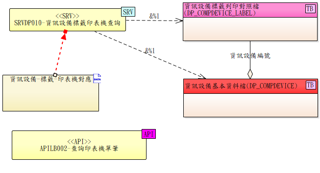

# API 契約：資訊設備標籤印表機查詢

**編碼**: SRVDP010
**日期**: 2026-04-23
**對應 FR**: UCLB001（標籤列印 — 格式一印表機解析）
**介接方向**: 中央 SRVLB001（格式一）→ 中央 SRVDP010（同一 server 內部呼叫）
**類型**: 內部服務（SRV）— 跨模組（DP 提供，LB 使用）
**提供方**: DP 模組（資訊設備）
**呼叫方**: 中央 [SRVLB001](./SRVLB001.md) 格式一內部呼叫（非 LBSB01 直接呼叫）

---

## 概述

依入參 `client_ip` + `bar_type` 內部中介至 `DP_COMPDEVICE_LABEL.CDE_ID` + `LABEL_TYPE`，查對應表（「哪台工作站 + 哪種標籤 → 哪台印表機」），回傳印表機完整連線資訊（`PRINTER_ID` + `PRINTER_DRIVER` + `PRINTER_IP` + `SERVER_IP` + `port` + 校正參數）。

`DP_COMPDEVICE_LABEL` 由中央管理員於「資訊設備」功能中設定（[US6](../spec_us6.md)）；`PRINTER_ID` 永遠指向 `LB_PRINTER` 主檔內實際存在的印表機記錄（**包含本機 USB 直連的印表機**，由 `PRINTER_DRIVER='USB'` 識別，無 sentinel 設計）。

**存取 Table**:
- `DP_COMPDEVICE_LABEL`（讀取，查 `(CDE_ID, LABEL_TYPE)`；`CDE_ID` 由入參 `client_ip` 經 `DP_COMPDEVICE.IP` 中介取得，`LABEL_TYPE` 由入參 `bar_type` 對應）
- `LB_PRINTER`（讀取，查 `PRINTER_ID`）



---

## Request

| 參數 | 型態 | 必填 | 說明 |
|------|------|------|------|
| client_ip | string | Y | 呼叫端工作站 IP（由 SRVLB001 從 HTTP Header 取得） |
| bar_type | string | Y | 標籤代碼（如 CP11、TL01） |

---

## Response

| 欄位 | 型態 | 說明 |
|------|------|------|
| printer_id | string | 印表機編號（`LB_PRINTER.PRINTER_ID`，主檔內實際記錄）|
| printer_name | string | 印表機名稱（`LB_PRINTER.PRINTER_NAME`）|
| printer_driver | string \| null | 連接類型：`USB`（本機 USB 直連）/ `#OS 印表機名`（網路印表機）/ `null`（用 `printer_ip`）|
| printer_ip | string \| null | 印表機固定 IP（有填則優先使用，Port 固定 `9100`） |
| server_ip | string | LBSB01 主機 IP（SRVLB001 據此 HTTP POST 派送至工作站）|
| server_port | int | 印表機主機 port（預設 `9200`）|
| printer_params | object | 印表機校正參數（`shift_left` / `shift_top` / `darkness` / `dpi` / `material`…）|

> **呼叫端依 `printer_driver` / `printer_ip` 決定列印路徑**：
> - `printer_driver='USB'` → LBSB01 端走本機 USB Port（`openport("6")`），無需網路傳輸
> - `printer_driver` 為 `#XXX` → 走 OS 印表機（依名稱）
> - `printer_ip` 有值 → HTTP POST 直送印表機 IP:9100（優先順序最高）
> - 以上三者皆無 → 走 `server_ip:server_port`（LBSB01 中介派送）

---

## 處理流程

```
SRVDP010(client_ip, bar_type)
  │
  ├─ Step 1：以 client_ip 查 DP_COMPDEVICE 取 CDE_ID
  │          SELECT CDE_ID FROM DP_COMPDEVICE
  │          WHERE IP = :client_ip AND DELETED = 0
  │          → 找不到 → 回 404「資訊設備未登錄」
  │
  ├─ Step 2：以 (CDE_ID, LABEL_TYPE) 查 DP_COMPDEVICE_LABEL 取 PRINTER_ID
  │          SELECT PRINTER_ID FROM DP_COMPDEVICE_LABEL
  │          WHERE CDE_ID = :cde_id AND LABEL_TYPE = :bar_type AND DELETED = 0
  │          → 找不到 → 回 404「資訊設備需先設定標籤對照」
  │
  ├─ Step 3：以 PRINTER_ID 查 LB_PRINTER 取完整印表機資訊
  │          SELECT * FROM LB_PRINTER WHERE PRINTER_ID = :printer_id
  │          （LB_PRINTER 為硬刪除例外表，無 DELETED 欄位）
  │          → 找不到 → 回 500「資料不一致：DP_COMPDEVICE_LABEL 指向不存在的印表機」
  │
  └─ 回傳 {printer_id, printer_name, printer_driver, printer_ip,
          server_ip, server_port, printer_params}
```

> **DP 設計脈絡**（依 `dp/data-model.md`）：`DP_COMPDEVICE` 為設備主檔（PK=`CDE_ID`，含 `IP` / `CDE_NAME` / `SITE_ID` 等）；`DP_COMPDEVICE_LABEL` 為設備×標籤類別→印表機對照表（PK=`(CDE_ID, LABEL_TYPE)`）。本服務以 `client_ip` 為 in 參數，是因為呼叫端（LBSB01 / 主系統前端）只能取到自己的 IP；SRVDP010 內部完成 IP → CDE_ID 對照後再走後續查詢。
>
> **USB 直連印表機的處理**（2026-04-28 設計修正）：USB 直連印表機**為 `LB_PRINTER` 主檔內的真實記錄**（不再是 `PRINTER_ID="USB"` sentinel），由欄位 `PRINTER_DRIVER='USB'` 識別。Step 3 一律查 `LB_PRINTER`，回傳的 `printer_driver` 欄位告訴呼叫端走哪條列印路徑。

---

## 錯誤情境

| 情境 | HTTP | 說明 |
|------|------|------|
| `DP_COMPDEVICE` 查無對應 IP | 404 | 資訊設備未登錄 |
| `DP_COMPDEVICE_LABEL` 查無對應 | 404 | 資訊設備需先設定標籤對照 |
| `LB_PRINTER` 查無對應 PRINTER_ID | 500 | 資料不一致（`DP_COMPDEVICE_LABEL` 指向不存在的印表機；可能因印表機已被 APILB005 硬刪但對應未清）|
| 參數缺漏 | 400 | `client_ip` 或 `bar_type` 為空 |

---

## 廢除歷史

> **SRVDP020 已於 2026-04-22 廢除**。原「LBSB01 → SRVDP020 → SRVLB092」兩段式刪除流程簡化為「LBSB01 → APILB005」單一端點，由 APILB005 後端在 Transaction 內 cascade 清 `DP_COMPDEVICE_LABEL` 子表對應後硬刪 `LB_PRINTER`。

---

## 設定職責

| 職責 | 誰設定 | 工具 |
|------|-------|------|
| `DP_COMPDEVICE_LABEL` 對應表 | 中央管理員 | 中央「資訊設備」功能（[US6](../spec_us6.md)） |
| `LB_PRINTER` 主檔 | 中央管理員 / LBSB01 使用者 | 中央 Admin UI / LBSB01 印表機設定頁（[US4](../spec_us4.md)） |
