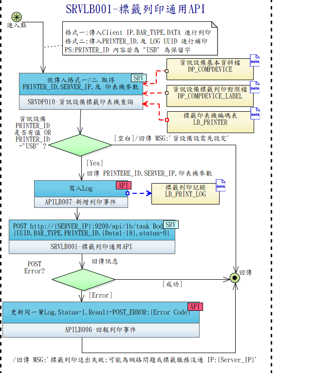

# 使用契約：SRVLB001 — 標籤列印通用 API（Client 視角）

**呼叫方**: LBSB01（標籤測試頁 / 補印觸發）
**方向**: LBSB01 → 中央 DP Server
**完整 Server-side 契約**: 主專案 TBMS `docs/specs/lb/contracts/SRVLB001.md`



---

## 何時呼叫

LBSB01 **不直接**呼叫 SRVLB001；SRVLB001 是 Client 前端（BC/CP/BS/TL）或中央 UI 呼叫中央的入口。LBSB01 的角色是**被動接收** SRVLB001 派送的 Task（見 [APILB007](./APILB007.md) 配對進件 + LBSB01 Listener `:9200`）。

**唯一例外**: LBSB01 標籤測試頁可走 `localhost:9200/api/lb/task`（本機迴路），行為等同中央 SRVLB001 派送，走內部列印流程。

## 兩種輸入模式（僅供理解）

| 模式 | 使用者 | 觸發 |
|------|-------|------|
| 格式一 | Client 模組（BC/CP/BS/TL） | 一般列印，`bar_type + site_id + data_*` |
| 格式二 | UCLB002 補印 | `printer_id + log_uuid`，中央讀回原資料 |

## LBSB01 Listener 接收

```
中央 SRVLB001 → POST http://{SERVER_IP}:9200/api/lb/task
                 Header: Authorization: Bearer <token>
                 Body: { uuid, printer_id, bar_type, site_id, data_1~19, status }

LBSB01 Listener：
  ├─ 驗證 Bearer Token
  ├─ 寫 local.db（ONLINE_QUEUE / OFFLINE_QUEUE 依 status）
  └─ 通知 GUI 刷新
```

Port `9200` **固定不可設定**。
