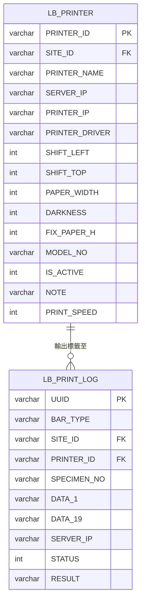

# 資料模型：標籤列印模組（Label Printing）

**日期**: 2026-04-20
**模組代碼**: LB（標籤列印）

---

## 實體清單

| 實體名稱 | Code | 檔案類別 | 說明 |
|----------|------|----------|------|
| 標籤列印記錄 | LB_PRINT_LOG | 記錄檔 | 標籤列印作業之條碼檔（新增/印出/離線） |
| 標籤印表機編碼表 | LB_PRINTER | 參數檔 | 標籤印表機設定（IP、邊界位移、紙張規格等） |

---

## 實體屬性

### 標籤列印記錄（LB_PRINT_LOG）

| # | 欄位名稱 | 欄位代碼 | 資料型別 | 必填 | 說明 |
|---|----------|----------|----------|------|------|
| 1 | UUID | UUID | VARCHAR(36) | PK | 通用唯一識別碼 |
| 2 | 條碼處理種類 | BAR_TYPE | VARCHAR(5) | Y | 種類代碼（值域 00~ZZ），決定 DATA_1~DATA_19 的欄位意義 |
| 3 | 資料站點 | SITE_ID | VARCHAR(9) | Y | 登入者資訊設備之站點代碼，FK → DP_SITE |
| 4 | 印表機編號 | PRINTER_ID | VARCHAR(20) | Y | FK → LB_PRINTER.PRINTER_ID |
| 5 | 檢體號碼 | SPECIMEN_NO | VARCHAR(16) | N | 檢體的唯一編號 |
| 6 | 資料1 | DATA_1 | VARCHAR(512) | N | 依 BAR_TYPE 決定意義 |
| 7 | 資料2 | DATA_2 | VARCHAR(512) | N | 依 BAR_TYPE 決定意義 |
| 8 | 資料3 | DATA_3 | VARCHAR(512) | N | 依 BAR_TYPE 決定意義 |
| 9 | 資料4 | DATA_4 | VARCHAR(512) | N | 依 BAR_TYPE 決定意義 |
| 10 | 資料5 | DATA_5 | VARCHAR(512) | N | 依 BAR_TYPE 決定意義 |
| 11 | 資料6 | DATA_6 | VARCHAR(512) | N | 依 BAR_TYPE 決定意義 |
| 12 | 資料7 | DATA_7 | VARCHAR(512) | N | 依 BAR_TYPE 決定意義 |
| 13 | 資料8 | DATA_8 | VARCHAR(512) | N | 依 BAR_TYPE 決定意義 |
| 14 | 資料9 | DATA_9 | VARCHAR(512) | N | 依 BAR_TYPE 決定意義 |
| 15 | 資料10 | DATA_10 | VARCHAR(512) | N | 依 BAR_TYPE 決定意義 |
| 16 | 資料11 | DATA_11 | VARCHAR(512) | N | 依 BAR_TYPE 決定意義 |
| 17 | 資料12 | DATA_12 | VARCHAR(512) | N | 依 BAR_TYPE 決定意義 |
| 18 | 資料13 | DATA_13 | VARCHAR(512) | N | 依 BAR_TYPE 決定意義 |
| 19 | 資料14 | DATA_14 | VARCHAR(512) | N | 依 BAR_TYPE 決定意義 |
| 20 | 資料15 | DATA_15 | VARCHAR(512) | N | 依 BAR_TYPE 決定意義 |
| 21 | 資料16 | DATA_16 | VARCHAR(512) | N | 依 BAR_TYPE 決定意義 |
| 22 | 資料17 | DATA_17 | VARCHAR(512) | N | 依 BAR_TYPE 決定意義 |
| 23 | 資料18 | DATA_18 | VARCHAR(512) | N | 依 BAR_TYPE 決定意義 |
| 24 | 資料19 | DATA_19 | VARCHAR(512) | N | 依 BAR_TYPE 決定意義 |
| 25 | 服務主機執行IP | SERVER_IP | VARCHAR(30) | N | Printer Server 執行當下的主機 IP |
| 26 | 處理狀態 | STATUS | INT | Y | 0=新增 / 1=已印出 / 2=已移至離線區（數字比對） |
| 27 | 列印結果識別碼 | RESULT | VARCHAR(100) | N | 列印版本+參數+操作備註（如 `v1.1r1_W80H35L40T0D8`、`v1.1r1_F1W80H35L40T0D8`、`v1.1r1-OffLine`） |
| 28 | 建立者 | CREATED_USER | VARCHAR(20) | Y | |
| 29 | 建立時間 | CREATED_DATE | TIMESTAMP | Y | 標籤資料寫入時間，需間隔 1/1000 秒避免順序錯亂 |
| 30 | 建立站點 | CREATED_SITE | VARCHAR(10) | Y | |
| 31 | 異動者 | UPDATED_USER | VARCHAR(20) | N | |
| 32 | 異動時間 | UPDATED_DATE | TIMESTAMP | N | |
| 33 | 異動站點 | UPDATED_SITE | VARCHAR(10) | N | |
| 34 | 來源功能 ID | RES_ID | VARCHAR(30) | N | |
| 35 | 刪除標記 | DELETED | INT | N | 預設 0（0=正常, 1=已刪除） |

---

### 標籤印表機編碼表（LB_PRINTER）

| # | 欄位名稱 | 欄位代碼 | 資料型別 | 必填 | 說明 |
|---|----------|----------|----------|------|------|
| 1 | 印表機編號 | PRINTER_ID | VARCHAR(12) | PK | 唯一不可重複（站點碼+編號） |
| 2 | 所屬站點 | SITE_ID | VARCHAR(9) | Y | 捐供血站點代碼，FK → DP_SITE（下拉過濾） |
| 3 | 印表機說明 | PRINTER_NAME | VARCHAR(256) | N | 印表機說明 |
| 4 | 印表服務器IP | SERVER_IP | VARCHAR(20) | N | Printer Services IP |
| 5 | 印表機IP | PRINTER_IP | VARCHAR(20) | N | 印表機 IP 位址 |
| 6 | 印表機在WIN的編號 | PRINTER_DRIVER | VARCHAR(20) | N | `USB`=固接 USB；其他=Windows 上的印表機名稱 |
| 7 | 左邊界位移點數 | SHIFT_LEFT | INT | N | 左邊界位移（點數） |
| 8 | 上邊界位移點數 | SHIFT_TOP | INT | N | 上邊界位移（點數） |
| 9 | 固定裝紙規格-寬 | PAPER_WIDTH | INT | N | 裝紙寬度（點數） |
| 10 | 明暗度 | DARKNESS | INT | N | 列印明暗度 |
| 11 | 固定裝紙規格-長 | FIX_PAPER_H | INT | N | 裝紙長度（點數） |
| 12 | 標籤印表機型號編號 | MODEL_NO | VARCHAR(10) | N | 印表機型號（參考用） |
| 13 | 啟用旗標 | IS_ACTIVE | INT | Y | 1=啟用 / 0=停用 |
| 14 | 印表機備註 | NOTE | VARCHAR(200) | N | 備註說明 |
| 15 | 列印速度 | PRINT_SPEED | INT | N | 列印速度 |
| 16 | 建立者 | CREATED_USER | VARCHAR(20) | Y | |
| 17 | 建立時間 | CREATED_DATE | TIMESTAMP | Y | |
| 18 | 建立站點 | CREATED_SITE | VARCHAR(10) | Y | |
| 19 | 異動者 | UPDATED_USER | VARCHAR(20) | N | |
| 20 | 異動時間 | UPDATED_DATE | TIMESTAMP | N | |
| 21 | 異動站點 | UPDATED_SITE | VARCHAR(10) | N | |
| 22 | 來源功能 ID | RES_ID | VARCHAR(30) | N | |
| 23 | 刪除標記 | DELETED | INT | N | 預設 0（0=正常, 1=已刪除） |

---

## 說明備註

- **STATUS 狀態機**：0=新增（待印）→ 1=已印出；若被移至離線區則為 2。
- **RESULT 格式範例**：
  - 正常列印：`v1.1r1_W80H35L40T0D8` 或 `v1.1r1_F1W80H35L40T0D8`（格式：版本 + `_` + [`F1`] + 紙張/邊界/明暗度參數；`F1` 僅於勾選「固定」時加入）
  - 離線：`v1.1r1-OffLine`
  - 刪除：`v1.1r1-Delete`
  - 離線刪除：`v1.1r1-Off_DEL`
- **DATA_1~DATA_19**：依 `BAR_TYPE` 決定各欄位意義，具體對應表請見 LB 模組規格。
- **標準欄位**：CREATED_USER/CREATED_DATE/CREATED_SITE/UPDATED_USER/UPDATED_DATE/UPDATED_SITE/RES_ID/DELETED 依 CLAUDE.md 規範於 DDL 時補齊。

---

## 實體關聯圖（ERD）

### 關聯說明

| 關聯 | 基數 | 說明 |
|------|------|------|
| LB_PRINTER → LB_PRINT_LOG | 1:N | 一台印表機可產出多筆列印記錄（透過 PRINTER_ID） |
| DP_SITE → LB_PRINTER | 1:N | 一個站點可有多台印表機（透過 SITE_ID） |
| DP_SITE → LB_PRINT_LOG | 1:N | 一個站點可有多筆列印記錄（透過 SITE_ID） |
