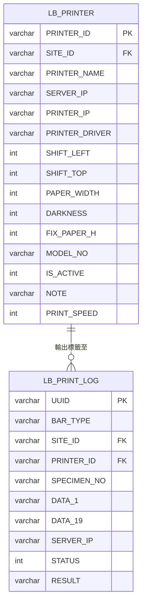

# ERD：標籤列印模組（Label Printing）

**日期**: 2026-04-20
**模組代碼**: LB（標籤列印）
**欄位明細**: [data-model.md](data-model.md)

---

## 實體關聯圖

---

## 關聯說明

| 關聯 | 基數 | 說明 |
|------|------|------|
| LB_PRINTER → LB_PRINT_LOG | 1:N | 一台印表機可產出多筆列印記錄（透過 PRINTER_ID） |
| DP_SITE → LB_PRINTER | 1:N | 一個站點可有多台印表機（透過 SITE_ID） |
| DP_SITE → LB_PRINT_LOG | 1:N | 一個站點可有多筆列印記錄（透過 SITE_ID） |
