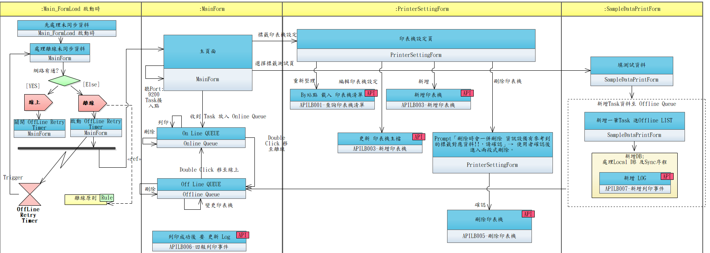

# Feature Specification: 標籤列印模組（Label Printing）

**Feature Branch**: `lb-label-printing`
**Created**: 2026-04-10
**Status**: Draft
**Input**: VB6 ALLB01-BarcodeServer 移植 + 新架構設計；依據 `requirements/RQ0.md`、EA Model `UCLB001/UCLB002/UCLB101` 產出
**程式代號**: LBSB01-標籤服務程式

---

## 系統概述

LBSB01 為部署於各工作站的**標籤列印客戶端程式**，負責接收列印指令、管理列印佇列、驅動 GoDEX 條碼印表機輸出血品 / 檢體 / 設備標籤。

### 核心特性

- **本地運作**：不直接存取中央資料庫，所有資料交換透過 SRV（R01）
- **TOKEN 內建**：TOKEN 與中央 API Base URL 硬寫於程式（`login.py` 常數），**無 Login 動作、無健康檢查端點**；CALL API 一律帶 Bearer Token（R02）
- **離線行為**：採 Token-based 呼叫、Timer 3 分鐘補同步、Local-first 寫入 → 詳見 [§離線原則](#離線原則r03)（R03）
- **指令可追溯**：所有進出與異動皆透過 SRV 記錄至中央 DB

---

## 離線原則（R03）

LBSB01 的離線行為集中於此節定義，其他章節出現「離線」時一律依本節規則。EA Model 以 `Artifact<<Rule>>` 集中表達同一組規則（GUID `{2B94E1A9-8051-4083-BA45-80732128CA0C}`），spec 與 EA 為同一 source of truth。

1. **沒有 Login 動作**：Call API 一律帶 Token（無獨立 ping / 健康檢查端點）；**當 APILB 連不上中央 DB 時才會知道當下是離線**。
2. **離線補同步觸發**：離線後啟動 Retry Timer **每 3 分鐘**、或使用者按主畫面 **[更新]** 才觸發同步；同步動作本身就是下一次 Call API，**Call API 成功即視為回復線上**（靜默切換，不另外做連線測試）。
3. **Local-first 寫入**：不管線上或離線，Call APILB 之前一律**先寫 Local DB**；上線後 Sync 策略為「**一律以 Local DB 蓋中央 DB**」。此規則確保離線時仍可修改印表機資料、列印測試標籤。

### 內部流程（UCLB101）



上圖中以 `<<Rule>>` 明確標示「離線原則」適用範圍（啟動時處理未同步資料、OffLine Retry Timer 啟停、Online/Offline Queue 流向）。

---

## Clarifications

### Session 2026-04-22 (離線原則對齊 EA UCLB101)

- Q: 線上/離線判定是否要做獨立 `/api/health` ping？ → A: **不做**。線上/離線完全由 Call APILB 結果判定（成功=線上、失敗=離線）。ISLB001 健康檢查機制已撤回，被本節 R03 取代。
- Q: 離線後 Retry Timer 間隔? → A: **每 3 分鐘**（非 60 秒）。同步動作本身即為下一次 Call API，成功即視為回復線上，靜默切回綠燈。
- Q: 離線中本地資料與中央衝突如何處理? → A: **一律以 Local DB 蓋中央 DB**。離線時可修改印表機、列印測試標籤，上線後全部 replay 回中央。

### Session 2026-04-21 (SRV / API 對齊)

- Q: SRV 與 API 前綴用法? → A: **SRV=對內**（Client 前端各模組 / 中央 UI 呼叫），**API=對外**（LBSB01 本地 → 中央，Bearer Token 認證）。
- Q: 印表機 CRUD 如何拆分？ → A: 5 支 API（APILB001 查清單 / 002 查單筆 / 003 POST 新增 / 004 PATCH 修改 / 005 DELETE 硬刪 + cascade）。
- Q: 列印事件流的 INSERT 與 UPDATE 分開？ → A: **分開兩支**。APILB007 進件寫 LOG（INSERT）；APILB006 回報狀態事件（UPDATE，append-only 事件流）。

### Session 2026-04-17 (TOKEN 硬寫)

- Q: LBSB01 是否需要 Login / APIDP001 取 Token？ → A: **不需要**。Token 與中央 API Base URL 硬寫於 `login.py` 常數；LBSB01 是單一角色（列印服務），不需多帳號認證。

### Session 2026-04-22 (SRVDP020 廢除)

- Q: 刪除印表機是否要走「LBSB01 → SRVDP020 → SRVLB092」兩段式？ → A: **簡化為單端點**。SRVDP020 從 EA 刪除，LBSB01 PENDING_OPS 只排一筆 DELETE（對應 APILB005），由 APILB005 後端在 Transaction 內 cascade 清 `DP_COMPDEVICE_LABEL`。

---

## User Stories

| Story | UC 編號 | 名稱 | 優先級 | 子檔 |
|-------|---------|------|--------|------|
| 1 | UCLB001 | 標籤列印（Client 端觸發） | P1 | [spec_us1.md](spec_us1.md) |
| 2 | UCLB002 | 歷史查詢及補印 | P1 | [spec_us2.md](spec_us2.md) |
| 3 | UCLB101 | LBSB01 內部運作（離線 / 同步 / Queue） | P1 | [spec_us3.md](spec_us3.md) |
| 4 | —（功能作業）| 印表機設定作業（LBSB01 端） | P1 | [spec_us4.md](spec_us4.md) |
| 5 | —（功能作業）| 標籤測試與測試頁 | P2 | [spec_us5.md](spec_us5.md) |
| 6 | —（管理員作業）| 中央端印表機主檔管理 | P2 | [spec_us6.md](spec_us6.md) |

> US3 / US4 / US5 / US6 是 LB 模組的「支援面」：前兩個 UC（UCLB001/002）透過它們才能正常運作。所有 Story 皆共用 [§離線原則](#離線原則r03)。

---

## 參考參數

### 標籤類型（LB_TYPE）

| 欄位 | 說明 |
|------|------|
| 參數代碼 | `LB_TYPE` |
| 參數名稱 | 標籤類別 |
| 用途 | 定義系統所有標籤類型的代碼、名稱、紙張尺寸，供列印時查詢標籤規格 |

| Code | 名稱 | 群組 | WIDTH(mm) | LENGTH(mm) | GAP(dots) | 狀態 |
|------|------|------|-----------|------------|-----------|------|
| CP01 | 血品小標籤 | CP | 80 | 35 | 3 | **啟用** |
| CP02 | 血品小標籤 A | CP | 80 | 35 | 3 | 停用 |
| CP11 | 血品核對標籤-合格 | CP | 80 | 75 | 3 | **啟用** |
| CP12 | 血品核對標籤-特殊標識 | CP | 80 | 75 | 2 | 停用 |
| CP19 | 血品核對標籤-不適輸用 | CP | 80 | 75 | 2 | **啟用** |
| CP91 | 成分藍色籃號 | CP | 80 | 35 | 2 | 停用 |
| CP92 | 細菌小標籤 | CP | 45 | 15 | 2 | 停用 |
| BC01 | 檢體小標籤 | BC | 45 | 15 | 2 | 停用 |
| BC02 | 187 標籤 | BC | 80 | 35 | 2 | 停用 |
| BS01 | 運送器材借用標籤 | BS | 80 | 75 | 2 | 停用 |
| BS02 | 運送器材條碼 | BS | 80 | 35 | 2 | 停用 |
| BS03 | 血品裝箱大標籤 | BS | 100 | 200 | 3 | 停用 |
| BS04 | 供應籃號標籤 | BS | 80 | 75 | 2 | 停用 |
| BS05 | 供應特殊血品標籤 | BS | 80 | 75 | 2 | 停用 |
| BS07 | 血品裝箱小標籤 | BS | 80 | 35 | 2 | 停用 |
| TL01 | 檢驗檢體標籤 | TL | 45 | 15 | 2 | **啟用** |

> 目前啟用 4 種（R13）：TL01、CP01、CP11、CP19。其餘在程式碼中保留但停用，待各模組需求確認後再啟用。

### 字型對照

| 代號 | 字型名稱 | 用途 |
|------|---------|------|
| `sFont0` | 標楷體 | 一般文字 |
| `sFont1` | 細明體 | 血品名稱（旋轉文字） |
| `sFont2` | 微軟正黑體 | — |
| `sFontB` | Arial Black | 粗體文字 |
| `sFontS` | Arial Rounded MT Bold | 血型（Rh+ 實心） |
| `sFontEpt` | Swis721 BdOul BT | 血型（Rh- 空心字） |

---

## 系統關聯

### 中央 SRV / API 契約

| 對內 SRV | 用途 | 主要呼叫方 |
|---------|------|-----------|
| [SRVLB001](./contracts/SRVLB001.md) | 標籤列印通用 API（兩種輸入模式：一般列印 + 補印） | Client 前端（BC/CP/BS/TL）/ LBSB01 測試頁 |
| [SRVLB012](./contracts/SRVLB012.md) | 標籤列印紀錄查詢 | 「LBSR01-歷史標籤查詢及補印作業」畫面 |
| [SRVDP010](./contracts/SRVDP010.md) | 資訊設備標籤印表機查詢（Client IP + bar_type → PRINTER_ID）| 中央 SRVLB001 格式一內部呼叫 |

| 對外 API | HTTP 動作 | 用途 | 呼叫方 |
|---------|-----------|------|-------|
| [APILB001](./contracts/APILB001.md) | GET `/api/lb/printer` | 查詢印表機清單 | LBSB01 啟動 / 同步 |
| [APILB002](./contracts/APILB002.md) | GET `/api/lb/printer/{id}` | 查詢單筆印表機 | LBSB01 設定頁 |
| [APILB003](./contracts/APILB003.md) | POST `/api/lb/printer` | 新增印表機 | LBSB01 PENDING_OPS replay |
| [APILB004](./contracts/APILB004.md) | PATCH `/api/lb/printer/{id}` | 修改印表機 | LBSB01 PENDING_OPS replay |
| [APILB005](./contracts/APILB005.md) | DELETE `/api/lb/printer/{id}` | 刪除印表機（硬刪 + cascade）| LBSB01 PENDING_OPS replay |
| [APILB006](./contracts/APILB006.md) | POST `/api/lb/print-events` | 回報列印事件（append-only）| LBSB01 列印完成 / 移動 / 刪除 |
| [APILB007](./contracts/APILB007.md) | POST `/api/lb/print-logs` | 進件寫 LOG（INSERT） | 中央 SRVLB001 / LBSB01 測試頁 |

LB 專案端的 SRV/API 契約採「Client 使用視角」，主專案（TBMS）端為「Server 實作視角」——兩邊路徑相同、內容不同。

### Port 規則

| Port | 用途 | 可設定 |
|------|------|--------|
| 9100 | GoDEX 印表機 TCP 列印 | 印表機端固定 |
| **9200** | LBSB01 HTTP Listener（接收 Task） | **固定，不可設定** |

---

## 程式目錄結構

```
_LB/Source/Python/LBSB01/
├── main.py              # 主畫面（LBSB01）
├── printer_setting.py   # 印表機設定（子視窗）
├── sample_data_print.py # 標籤測試頁（子視窗）
├── labels.py            # 標籤定義（16 種，對應參考參數 LB_TYPE）
├── sample_data.py       # 各標籤測試資料
├── ezpl.py              # GoDEX DLL 封裝 + EZPL 指令產生器
├── bar_l00.py           # CP01/CP02 血品小標籤佈局
├── bar_cp11.py          # CP11 血品核對標籤-合格佈局（含子函式）
├── Fonts/               # 標籤列印用字型
├── images/              # 標籤圖片（biomedical、Logo）
│   ├── biomedical-25.JPG
│   ├── biomedical-50.JPG
│   └── Logo-18.jpg
└── app.log              # 執行日誌（runtime 產生）
```

---

## 資料模型

詳見 [data-model.md](./data-model.md)（`LB_PRINT_LOG` / `LB_PRINTER` 欄位、ERD、關聯說明）。
