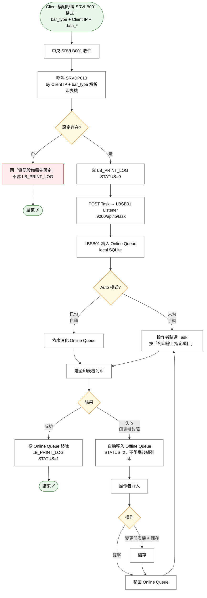

# User Story 1 — UCLB001 標籤列印

> 返回總檔：[spec.md](spec.md) | 模組：標籤列印（LB）

Client 端模組（BC 採血 / CP 成分 / BS 供應 / TL 檢驗）透過 SRVLB001 觸發標籤列印；中央依傳入的 `bar_type` + Client IP 解析目標印表機（經 SRVDP010），將 Task POST 至對應 LBSB01 的 Listener（`:9200/api/lb/task`）。LBSB01 收到後寫入 Online Queue 本地 SQLite，依 Auto/手動模式消化列印；列印失敗的 Task 自動移入 Offline Queue 供人工介入，不阻塞後續列印。

**Why this priority**: 標籤列印是 LB 模組最核心的功能，所有 Client 模組（BC/CP/BS/TL）都透過本 Story 接入列印能力；Queue 架構與離線/失敗處理為所有後續 Story 的基礎。

**Independent Test**:
- Client 端呼叫 SRVLB001 格式一 → 中央透過 SRVDP010 解析印表機 → POST Task 到 LBSB01 → LBSB01 寫 Online Queue → 依 Auto 設定列印 → `LB_PRINT_LOG.STATUS` 由 0 → 1（成功）
- 故意關閉印表機 → 列印失敗 → Task 自動移入 Offline Queue，Online Queue 繼續消化下一筆（不阻塞）
- 切換 Auto 勾 / 未勾，驗證手動/自動列印流程差異

## Acceptance Scenarios

1. **Given** Client 模組透過 API 傳入 `bar_type=CP11 + site_id=S01 + data_*`，**When** 呼叫 SRVLB001（格式一），**Then** 中央 SRVDP010 解析出 PRINTER_ID、SERVER_IP、印表機參數，寫 LB_PRINT_LOG（STATUS=0）並 POST Task 至 `http://{SERVER_IP}:9200/api/lb/task`
2. **Given** Client IP 在 DP_COMPDEVICE_LABEL 未設定對應印表機，**When** 呼叫 SRVLB001（格式一），**Then** SRVDP010 回 404，SRVLB001 回傳 MSG「資訊設備需先設定」且**不**寫 LB_PRINT_LOG
3. **Given** LBSB01 Listener 收到 POST Task，**When** `status=0`，**Then** 寫入 local.db 的 Online Queue 並通知 GUI 刷新
4. **Given** Online Queue 有待印 Task 且 Auto **未勾**，**When** 操作者點選 Task 並按「列印線上指定項目」，**Then** 送至印表機列印；成功則從 Online Queue 移除，失敗自動移入 Offline Queue
5. **Given** Online Queue 有多筆 Task 且 Auto **已勾**，**When** 系統自動消化，**Then** 依序列印，成功移除、失敗自動移入 Offline Queue，完成後等待下一筆進入
6. **Given** 區域 A 未勾固定參數，**When** 選取不同 Task，**Then** 紙張規格自動反映該 Task 的標籤類型（寬/高/gap）與指定印表機的公差參數（左位移/上位移/明暗）
7. **Given** 勾選「固定參數」CheckBox，**When** 操作者手動調整紙張規格欄位，**Then** 列印時使用畫面上的值而非自動帶入值
8. **Given** Offline Queue 有 Task 且**滑鼠指向**其中一筆，**When** 即時顯示，**Then** 區域 C 顯示該 Task 明細；可變更指定印表機後按「儲存」
9. **Given** Offline Queue 中的 Task，**When** 雙擊，**Then** 移回 Online Queue 重新排隊列印
10. **Given** LBSB01 離線（Call APILB 失敗），**When** 列印完成，**Then** `LB_PRINT_LOG` 狀態更新先寫 Local DB，Timer 3 分鐘後或 [更新] 觸發同步（詳見 [US3](spec_us3.md) / 離線原則）

## Activity Diagram（UC 內部流程）



## 關聯 UseCase 與 API

| 項目 | 說明 |
|------|------|
| UseCase | UCLB001 — 標籤列印 |
| 中央 SRV | [SRVLB001](./contracts/SRVLB001.md)（標籤列印通用 API） |
| 支援 SRV | [SRVDP010](./contracts/SRVDP010.md)（印表機解析，格式一使用） |
| 中央 API | [APILB007](./contracts/APILB007.md)（進件寫 LOG），[APILB006](./contracts/APILB006.md)（回報狀態事件） |
| LBSB01 內部 | Task Listener（:9200）、Online/Offline Queue、DB Log Queue |

## 主畫面結構（LBSB01）

```
┌─────────────────────────────────────────────────────────────┐
│ LBSB01-標籤服務程式  [●線上/●離線]  □Auto自動依序列印  時間 │
├──────────────────────┬──────────────────────────────────────┤
│ 線上列印項目明細 (A) │ 線上排隊列印項目 (Online Queue) (B)  │
│ 時間序/條碼種類/     │ [刪除單筆]                           │
│ 待列印張數/列印者/   │ [ListBox]  (雙擊→移至離線區)        │
│ 印表機編號/UUID      │ [     列印線上指定項目     ]          │
│ 指定印表機 [▼]      │                                      │
├──────────────────────┴──────────────────────────────────────┤
│ 紙張輸出規格: 標籤[▼] 尺寸[▼] 寬[] 高[] 左位移[] 上位移[]  │
│              明暗[] □固定參數                                │
├──────────────────────┬──────────────────────────────────────┤
│ 離線列印項目明細 (C) │ 離線等待重印項目 (Offline Queue) (D) │
│ (同 A 結構)          │ [刪除單筆]                           │
│ 變更待印印表機 [▼]  │ [ListBox]  (雙擊→移回線上排隊)      │
├──────────────────────┴──────────────────────────────────────┤
│ [訊息 ListBox — 系統訊息同步顯示]  │ 列印測試資料 [文字][列印]│
└─────────────────────────────────────────────────────────────┘
```

## Online / Offline Queue 協作

```
Online Queue                          Offline Queue
┌──────────┐                         ┌──────────┐
│ Task A   │──→ 列印 ──→ 成功 ✓     │          │
│ Task B   │──→ 列印 ──→ 失敗 ✗     │          │
│          │      │ 印表機故障        │          │
│          │      └──→ 自動移入 ───→ │ Task B   │
│ Task C   │──→ 列印 ──→ 成功 ✓     │          │（不阻塞）
│ Task D   │──→ 列印 ──→ 成功 ✓     │          │
└──────────┘                         │          │
                                     │ Task B   │ ← 故障排除後
              ┌──── 操作者移回 ────── │          │    操作者移回
              ▼                      └──────────┘
┌──────────┐
│ Task B   │──→ 列印 ──→ 成功 ✓
└──────────┘
```

**區域 A 互動規則**：

| 情境 | 明細顯示 | 指定印表機 | 列印按鈕 |
|------|---------|-----------|---------|
| Auto **未勾** + 點選 Queue Task | 顯示該 Task 明細 | **可變更**（覆寫該 Task 的目標印表機） | **啟用** |
| Auto **已勾**（自動列印中） | 顯示正在列印的那一筆 | **不可變更** | **不可按** |

**區域 C 互動規則**：
- 滑鼠指向 Offline Queue 中的 Task → 區域 C 即時顯示明細
- 可變更「指定印表機」後按「儲存」
- Offline Queue 不直接列印，必須移回 Online Queue

## 紙張輸出規格與印表機校正參數

列印時需組合三類參數：
1. **標籤尺寸** — 依 `bar_type` 查 `LB_TYPE` 取得 `WIDTH / LENGTH / GAP`
2. **印表機公差** — 依 `PRINTER_ID` 查 `LB_PRINTER` 取得 `SHIFT_LEFT / SHIFT_TOP / DARKNESS`
3. **固定參數 CheckBox** — 未勾時自動帶入（預設）；勾選時凍結畫面值，操作者手動調整

公差參數補償印表機長年使用後的機械漂移（送紙滾輪、列印頭位置、感熱元件老化）。詳見 [US4 印表機設定作業](spec_us4.md)。
