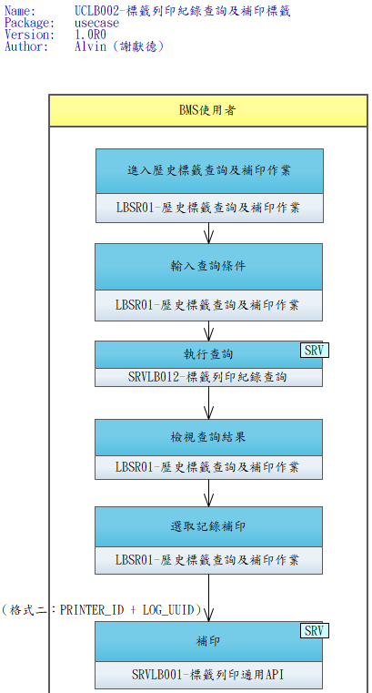

# User Story 2 — UCLB002 標籤列印紀錄查詢及補印標籤

> 返回總檔：[spec.md](spec.md) | 模組：標籤列印（LB）

操作者透過「LBSR01-歷史標籤查詢及補印作業」畫面，以日期、站點、印表機、標籤類別、檢體號碼等條件查詢 `LB_PRINT_LOG` 歷史紀錄；從結果清單選取目標紀錄後，可**補印**至指定印表機（可與原紀錄不同）。補印透過 **SRVLB001 格式二**（`printer_id` + `log_uuid`）由中央依 UUID 讀回原 `bar_type` + `data_*`，不需重傳標籤資料。補印會新增一筆 `LB_PRINT_LOG`（非更新原紀錄），以 `RES_ID` 追溯原 UUID。

**Why this priority**: 當原始列印失敗、標籤損壞或需要複本時，操作者必須能迅速找回原始列印資料並補印，不需要由業務系統端重新發起列印。此 Story 確保「列印紀錄」不僅是稽核用途，也是營運上的補救手段。

**Independent Test**:
- 以條件組合（日期範圍、站點、標籤類別）查詢 → 回傳分頁結果；無條件應回 400
- 從結果選取一筆（UUID=X）→ 指定不同印表機 → 呼叫 SRVLB001 格式二 → 新 LB_PRINT_LOG 被建立（RES_ID=X）→ 原紀錄不變 → 新 Task POST 至新印表機的 Listener
- `printer_id` 傳入中央查無的值 → 回 MSG「指定印表機不存在」
- `log_uuid` 傳入中央查無的值 → 回 MSG「原列印紀錄不存在」

**Acceptance Scenarios**:

1. **Given** 操作者開啟「歷史標籤查詢」畫面，**When** 輸入日期範圍（date_from、date_to）與 site_id，**Then** SRVLB012 回傳符合條件的分頁清單（依 CREATED_DATE DESC 排序）
2. **Given** 僅輸入 `specimen_no`，**When** 查詢，**Then** 回傳該檢體號的所有列印紀錄（跨日期、跨印表機）
3. **Given** 未輸入任何查詢條件，**When** 呼叫 SRVLB012，**Then** 回 HTTP 400「至少一項查詢條件」
4. **Given** 結果列印超過 20 筆（預設 limit=20），**When** 操作者切換頁碼，**Then** 以 `page` 參數取得下一頁，`meta.total_pages` 告知總頁數
5. **Given** 操作者選取一筆紀錄（UUID=X，原 printer_id=P1），**When** 選擇印表機 P2 並按「補印」，**Then** 呼叫 SRVLB001 格式二（`printer_id=P2, log_uuid=X`），中央：
   - 讀 `LB_PRINT_LOG(WHERE UUID=X)` 取回原 BAR_TYPE + data_1~19
   - 讀 `LB_PRINTER(WHERE PRINTER_ID=P2)` 取 SERVER_IP + 參數
   - 新增一筆 LB_PRINT_LOG（新 UUID，RES_ID=X，STATUS=0）
   - POST Task 至 P2 對應的 LBSB01
6. **Given** 選取的原紀錄已被刪除（DELETED=1），**When** 嘗試補印，**Then** 中央仍可依 UUID 讀回資料（軟刪），補印正常（業務可接受）
7. **Given** 補印後的新紀錄，**When** 該印表機離線或故障，**Then** 行為與一般列印相同（Task 自動移入 Offline Queue）
8. **Given** 補印紀錄的 RES_ID 指向原 UUID，**When** 稽核檢視，**Then** 可沿 `RES_ID` 追溯原列印紀錄與補印序列

---

## 關聯 UseCase 與 API

| 項目 | 說明 |
|------|------|
| UseCase | UCLB002 — 標籤列印紀錄查詢及補印標籤 |
| Activity 圖 | [UCLB002-標籤列印紀錄查詢及補印標籤.png](./usecase/UCLB002-標籤列印紀錄查詢及補印標籤.png) |
| 中央 SRV（查詢）| [SRVLB012](./contracts/SRVLB012.md)（標籤列印紀錄查詢） |
| 中央 SRV（補印）| [SRVLB001](./contracts/SRVLB001.md) 格式二（`printer_id` + `log_uuid`） |
| 中央 API | [APILB007](./contracts/APILB007.md)（進件寫 LOG，補印亦經此寫新紀錄） |

## 查詢條件

至少需提供一項條件（否則 400）：

| 條件 | 說明 |
|------|------|
| `date_from` / `date_to` | 列印時間範圍（CREATED_DATE） |
| `site_id` | 資料站點 |
| `printer_id` | 印表機編號 |
| `bar_type` | 標籤類別（CP01 / CP11 / TL01 …） |
| `status` | 0 待列印 / 1 終態 / 2 離線區（空=全部） |
| `specimen_no` | 檢體號碼 |

## 補印與原列印的差異

| 項目 | 一般列印（格式一） | 補印（格式二） |
|------|------------------|--------------|
| 必填參數 | `bar_type` + `site_id` + `data_*` | `printer_id` + `log_uuid` |
| 印表機解析 | 透過 SRVDP010（Client IP + bar_type） | Client 直接指定 PRINTER_ID |
| 標籤資料來源 | Client 傳入 | 中央讀 `LB_PRINT_LOG(log_uuid)` |
| 新 LOG 關聯 | 無 | `RES_ID` = 原 UUID |
| 換印表機 | 由 DP_COMPDEVICE_LABEL 決定 | Client 可任選 |
