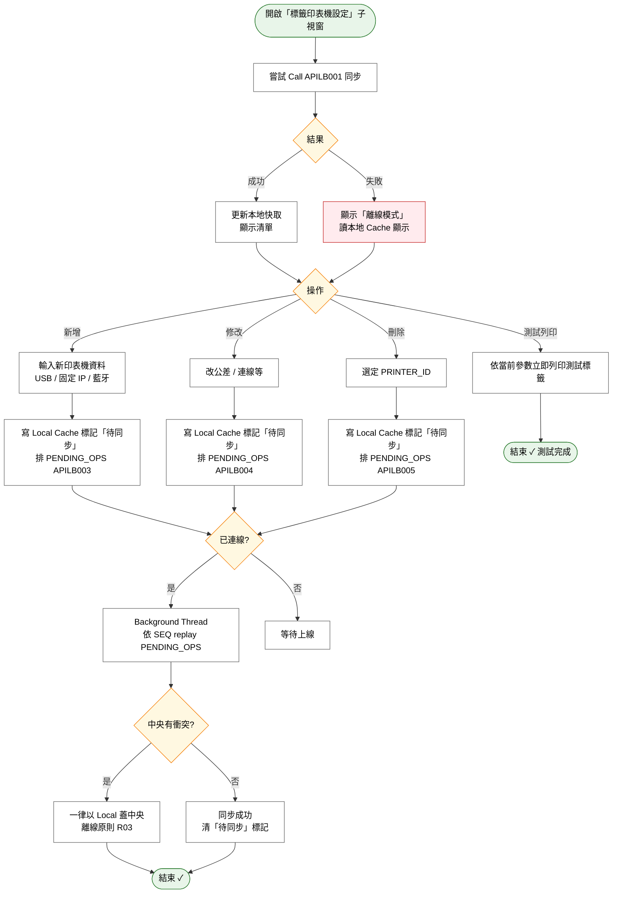

# User Story 4 — 印表機設定作業（LBSB01 端）

> 返回總檔：[spec.md](spec.md) | 模組：標籤列印（LB）

LBSB01 主機上的操作者（通常為資訊人員或護理站代管者）在 **Menu「設定 → 標籤印表機設定」**子視窗中管理該主機所接的印表機：新增（USB / 固定 IP / 藍牙三種連線方式）、修改（含公差校正參數）、刪除。所有異動一律先寫 Local SQLite Cache + 排 `PENDING_OPS`，上線時經 APILB003（新增）/ APILB004（修改）/ APILB005（刪除）replay 回中央 `LB_PRINTER`。LBSB01 **不直接 Access DB**，連線判定完全依賴 Call APILB 的結果（離線原則，詳見 [US3](spec_us3.md)）。

**Why this priority**: 印表機是列印動作的最後一哩，`LB_PRINTER` 的 `SERVER_IP` / `PRINTER_IP` / `PRINTER_DRIVER` / 公差參數（`SHIFT_LEFT` / `SHIFT_TOP` / `DARKNESS`）直接決定標籤能不能順利印出以及成品品質。印表機設定功能必須在 LBSB01 端（不能在中央統一做），因為只有接印表機的主機才能實測校正。本 Story 同時需支援**離線編輯**：API 不通時也能調校剛換的印表機，上線後自動同步。

**Independent Test**:
- 新增一台 USB 印表機（PRINTER_DRIVER=`USB`）→ 列印測試頁能出 → LB_PRINTER 取得新記錄
- 新增一台固定 IP 印表機（PRINTER_IP 有值）→ 列印走 TCP 直連 `:9100`
- 離線中修改 SHIFT_LEFT → Local Cache 立即反映、畫面顯示「離線模式」、PENDING_OPS 有一筆 UPDATE；上線後 replay → 中央 LB_PRINTER 同步
- 刪除印表機 → 本地 Cache 立即消失 → 上線 replay APILB005（硬刪 + cascade 清 DP_COMPDEVICE_LABEL 子表對應）

## Acceptance Scenarios

1. **Given** 操作者開啟「標籤印表機設定」子視窗，**When** 視窗載入，**Then** 嘗試 Call APILB001 同步；成功→更新本地快取、顯示清單；失敗→顯示「離線模式」+ 讀本地 Cache（不阻止操作）
2. **Given** 新增一台**固定 IP** 印表機，**When** 輸入 `PRINTER_IP=192.168.1.50`（`PRINTER_DRIVER` 空白）並儲存，**Then** 寫 Local Cache + 排 `PENDING_OPS(APILB003)`；列印解析優先用 `PRINTER_IP:9100`
3. **Given** 新增一台 **USB** 印表機，**When** 輸入 `PRINTER_DRIVER=USB`（`PRINTER_IP` 空白），**Then** 保留字 `"USB"` 不經 `LB_PRINTER` 驗證；列印解析走本機 USB Port（`openport("6")`）
4. **Given** 新增一台**藍牙**印表機，**When** 輸入 `PRINTER_DRIVER=#GoDEX_BT_01`（`#` 前綴），**Then** 列印解析走 OS 印表機名稱 `OpenDriver("GoDEX_BT_01")`（去掉 `#` 前綴）
5. **Given** 已存在的印表機，**When** 修改公差參數（SHIFT_LEFT / SHIFT_TOP / DARKNESS）後按測試列印，**Then** 立即以新參數列印測試標籤讓操作者觀察效果（不需先同步中央）
6. **Given** 離線中新增一台印表機，**When** 操作者儲存，**Then** 該筆寫入本地 `LB_PRINTER_CACHE`（標記「待同步」）；標題列顯示「離線模式」；列印仍可使用該印表機
7. **Given** 上線後 Timer 觸發 replay，**When** 處理「待同步」記錄，**Then** 依 `PENDING_OPS` 的 SEQ 順序呼叫 APILB003 / APILB004 / APILB005；成功後移除該筆、清除「待同步」標記
8. **Given** 同步時中央 DB 已有同 PRINTER_ID 的較新資料，**When** replay 衝突，**Then** 採「**一律以 Local DB 蓋中央 DB**」策略（離線原則 R03 第 3 條）
9. **Given** 刪除一台印表機，**When** 上線 replay `DELETE LB_PRINTER` 呼叫 APILB005，**Then** 後端在 Transaction 內 cascade 清 `DP_COMPDEVICE_LABEL` 子表對應後硬刪 `LB_PRINTER`（不再經 SRVDP020，該 SRV 已於 2026-04-22 廢除）
10. **Given** LBSB01 啟動，**When** 初始化印表機清單，**Then** Call APILB001 取得中央清單並覆蓋本地 Cache；API 不通時延用最後一次成功同步的 Cache

## Activity Diagram（UC 內部流程）



## 關聯 API 契約

| API | 用途 | 觸發時機 |
|-----|------|---------|
| [APILB001](./contracts/APILB001.md) | 查詢印表機清單 | LBSB01 啟動、設定頁開啟、定時同步 |
| [APILB002](./contracts/APILB002.md) | 查詢單筆印表機 | 編輯頁載入特定 PRINTER_ID |
| [APILB003](./contracts/APILB003.md) | 新增印表機（POST） | PENDING_OPS replay |
| [APILB004](./contracts/APILB004.md) | 修改印表機（PATCH） | PENDING_OPS replay |
| [APILB005](./contracts/APILB005.md) | 刪除印表機（DELETE 硬刪 + cascade） | PENDING_OPS replay |

## 三種連線方式

| # | 連線方式 | 接法 | 解析規則 | DLL 呼叫 |
|---|---------|------|---------|---------|
| 1 | **TCP/IP（固定 IP）** | 印表機接 LAN，設定固定 IP | `PRINTER_IP` 有值 → 優先採用 | `OpenNet(ip, 9100)` |
| 2 | **USB** | 實體 USB 線路 | `PRINTER_DRIVER="USB"`（保留字） | `openport("6")` 或 `OpenUSB(usbID)` |
| 3 | **藍牙** | OS 層配對與命名 | `PRINTER_DRIVER` 以 `#` 前綴 | `OpenDriver(name)`（去 `#`） |

**連線解析優先順序**：`PRINTER_IP` 有填 → 優先直連；否則依 `PRINTER_DRIVER`（`USB` / `#XXX`）。

## 部署拓撲

```
  ┌─────────────────────────────────────┐
  │          LBSB01 服務主機             │
  │                                     │
  │  ┌─── USB ──→ [GoDEX 印表機 A]     │  ← 實體線路
  │  │                                  │
  │  ├── LAN IP → [GoDEX 印表機 B]     │  ← 固定 IP（如 192.168.1.50:9100）
  │  │                                  │
  │  └── 藍牙 ──→ [GoDEX 印表機 C]     │  ← OS 命名（如 "GoDEX_BT_01"）
  │                                     │
  └─────────────────────────────────────┘
```

## 定址規則（列印時）

```python
if printer.PRINTER_IP:
    # 有填印表機 IP → 優先直連（TCP/IP）
    link_type = LinkType.TCP
    target_ip = printer.PRINTER_IP
    target_port = 9100  # Port 固定
elif printer.PRINTER_DRIVER == "USB":
    # USB 直連
    link_type = LinkType.USB
elif printer.PRINTER_DRIVER.startswith("#"):
    # OS 印表機名稱（藍牙/驅動程式）
    link_type = LinkType.BT
    bt_name = printer.PRINTER_DRIVER[1:]  # 去掉 # 前綴
```

## 公差校正參數（LB_PRINTER）

印表機長年使用後，內部機械構造（送紙滾輪、列印頭位置、感熱元件）會產生**公差**。三個參數用於逐台校正：

| 參數 | 用途 | 範例 |
|------|------|------|
| `SHIFT_LEFT` | 補償列印頭水平偏移 | 偏右 → `+2` |
| `SHIFT_TOP` | 補償送紙垂直偏移 | 偏下 → `-3` |
| `DARKNESS` | 補償感熱元件老化造成的濃度衰減 | 偏淡 → `14`（加深） |

儲存在 `LB_PRINTER`（PRINTER_ID 為 key）。列印時自動查表帶入 `label_setup(darkness=...)` 與 `open(shift_left=..., shift_top=...)`。

## 印表機清單同步機制

| 時機 | 動作 |
|------|------|
| LBSB01 啟動 | Call APILB001 → 覆蓋本地快取；API 不通時延用既有本地快取 |
| 定時（Timer） | 背景 Thread 呼叫 APILB001 更新本地快取；失敗不覆蓋本地 |
| 網路斷線 | 使用本地快取（最後一次成功同步的資料） |
| 設定頁開啟 | 嘗試同步 + 顯示本地快取清單（API 不通時仍可開啟） |

## 離線編輯機制

| 項目 | 說明 |
|------|------|
| 資料來源 | 一律從本地 SQLite 快取讀取，不直接依賴 API 回應 |
| 離線編輯 / 新增 | 寫本地 Cache，標記「待同步」，排 `PENDING_OPS` |
| 同步時機 | 上線後背景 Thread 依 SEQ replay 至中央 |
| 衝突處理 | 採「一律以 Local 蓋中央」（離線原則 R03 第 3 條） |
| UI 提示 | 離線時設定頁標題列顯示「離線模式」 |

```
印表機設定頁操作流程（含離線）：

開啟設定頁
  │
  ├─ 嘗試 Call APILB001 同步
  │   ├─ 成功 → 更新本地快取 → 顯示清單
  │   └─ 失敗 → 顯示「離線模式」→ 讀取本地快取 → 顯示清單
  │
  ▼ 操作者編輯/新增
  │
  ├─ 儲存至本地 SQLite（標記「待同步」）
  │
  ▼ 背景 Thread 偵測上線（Call API 成功）
  │
  ├─ 批次 replay PENDING_OPS 至中央 DB
  └─ 清除「待同步」標記
```
