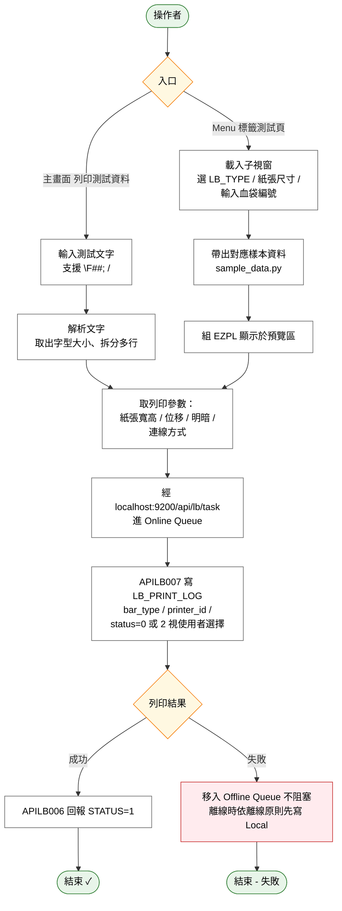

# User Story 5 — 標籤測試與測試頁

> 返回總檔：[spec.md](spec.md) | 模組：標籤列印（LB）

操作者（通常為資訊人員或護理師）於 LBSB01 主畫面 **「列印測試資料」** 區、或 Menu 開啟的 **「標籤測試頁」** 子視窗，快速驗證：
1. 印表機是否能正常驅動（連線 / USB / 藍牙 / 固定 IP）
2. 目前公差校正參數（左位移 / 上位移 / 明暗）是否合適
3. 指定標籤類型（`LB_TYPE`）的實際印出效果（尺寸、間隙、字型）

兩個入口使用**同一套列印路徑**：經 LBSB01 Listener（`localhost:9200/api/lb/task`）→ 進 Online Queue 消化列印。測試頁的任務同樣在 `LB_PRINT_LOG` 留下紀錄（具備完整稽核軌跡），但可標記 `status=2` 走離線區以避免干擾真實列印佇列。

**Why this priority**: 印表機校正、標籤類型調試、離線故障排除都需要快速產生一張可丟的測試標籤，而不需要依賴真實業務流程（BC/CP/BS/TL）觸發。這是印表機設定作業（[US4](spec_us4.md)）和離線除錯的關鍵支援功能。

**Independent Test**:
- 在「列印測試資料」輸入一段含格式控制碼的文字（`\F40;測試第一行\n第二行`）→ 按列印 → 印表機輸出兩行，第一行字高 40 dots
- 開啟「標籤測試頁」→ 選 LB_TYPE=CP11 → 輸入測試血袋編號 → 預覽 EZPL 指令 → 實際列印
- 測試頁列印後 `LB_PRINT_LOG` 有記錄，`bar_type` / `printer_id` 對應操作者選擇
- 斷網中進行測試列印（走本機 `localhost:9200`）→ 仍可列印成功

## Acceptance Scenarios

1. **Given** 操作者於主畫面「列印測試資料」輸入預設測試文字，**When** 按「列印」按鈕，**Then** LBSB01 依當前紙張輸出規格區的值（標籤/尺寸/位移/明暗）組 EZPL，送至當前指定的印表機
2. **Given** 測試文字開頭為 `\F##;`，**When** 解析，**Then** 取出字型大小（預設 60）並移除前綴；字高設為該值
3. **Given** 測試文字含 `\n`，**When** 解析，**Then** 拆成多行依序印出；每行 Y += 字型大小
4. **Given** 操作者 Menu 開「標籤測試頁（SampleDataPrint）」，**When** 子視窗載入，**Then** 提供：標籤類型 ComboBox、紙張尺寸 ComboBox（+手動寬/高）、血袋編號輸入、產生 EZPL 檔案按鈕、列印按鈕、EZPL 指令預覽區
5. **Given** 選擇 LB_TYPE=CP11（血品核對標籤-合格），**When** 輸入血袋編號，**Then** 系統帶出對應樣本資料（`sample_data.py`），組 EZPL 顯示於預覽區
6. **Given** 預覽 EZPL 無誤，**When** 按「列印」，**Then** 透過 `localhost:9200/api/lb/task` 進 Online Queue 執行列印，行為與外部 API 送入相同（走 APILB007 進件 + APILB006 狀態回報）
7. **Given** 測試頁列印 Task，**When** 寫 LB_PRINT_LOG，**Then** `bar_type` 對應選擇的 LB_TYPE，`printer_id` 為當前指定印表機，`status` 依使用者選擇可為 0（Online Queue）或 2（Offline Queue 測試用）
8. **Given** 選擇 **USB 直連**的印表機（保留字 `PRINTER_ID="USB"`），**When** 測試列印，**Then** APILB007 跳過 LB_PRINTER 驗證；列印走本機 USB Port
9. **Given** LBSB01 離線，**When** 於測試頁列印，**Then** 本機列印流程（`localhost:9200`）不受離線影響仍可執行；列印完成事件依離線原則先寫 Local、上線後 replay
10. **Given** 列印格式控制碼無效（如 `\F999;` 超出範圍），**When** 解析，**Then** 系統套用合理上限（如字高上限 200）或提示錯誤，不造成印表機當機

## Activity Diagram（UC 內部流程）



## 相關功能

| 入口 | 位置 | 主要用途 |
|------|------|---------|
| 列印測試資料 | 主畫面下方區塊 | 快速文字列印（移植自 VB6 `PrintTest` / `Bar_ANY`） |
| 標籤測試頁 | Menu → 標籤測試頁 | 完整測試各標籤類型 + EZPL 預覽 |

## 文字格式控制碼（列印測試資料）

| 控制碼 | 說明 | 範例 |
|--------|------|------|
| `\F##;` | 設定字型大小（置於文字最前方），預設 60 | `\F40;` 設定字高 40 dots |
| `\n` | 換行（拆成多行依序往下印出） | `第一列\n第二列` |

## 列印流程

```
1. 解析文字
   ├─ 若開頭為 \F##; → 取出字型大小，移除前綴
   └─ 以 \n 拆分成多行

2. 取得列印參數
   ├─ 紙張寬/高/gap：從「紙張輸出規格」區取得
   ├─ 左位移/上位移/明暗：同上（自印表機設定檔帶入或手動）
   └─ 連線方式/IP/Port：從當前指定印表機取得

3. 開啟印表機連線（TCP/USB/BT 依 PRINTER_DRIVER/PRINTER_IP 判斷）
4. label_setup(寬, 高, gap, darkness, speed=2)
5. job_start()
6. 逐行印出：
   ├─ 起始座標：X = 5 + 左位移, Y = 5 + 上位移
   ├─ 每行呼叫 text_out(X, Y, 字型大小, "標楷體", 該行文字)
   └─ Y += 字型大小（下一行）
7. job_end()
8. 關閉連線
```

## 預設測試文字

```
\F40;測試標籤列印資料本頁此列\n第二列,加\F##;可設定字型大小\n第三列測試頁- *****測試頁***\n第四列測試頁- *****測試頁***
```

## 標籤測試頁（SampleDataPrint）特性

- 可選 `LB_TYPE` 下所有啟用標籤類型（目前 4 種：TL01 / CP01 / CP11 / CP19）
- 紙張尺寸可自動帶入（依 LB_TYPE）或手動覆寫
- 產生 `.ezpl` 檔案供本地除錯（標籤 EZPL 原始碼）
- **同樣經 LBSB01 Listener `:9200`** 走 Online Queue，與外部 API 進件共用同一路徑
- 補印功能（格式二）亦可從歷史查詢畫面（[US2](spec_us2.md)）觸發

## 關聯 API 契約

| API | 用途 |
|-----|------|
| [APILB007](./contracts/APILB007.md) | 測試頁進件寫 LOG（可帶 `status=2` 到 Offline Queue） |
| [APILB006](./contracts/APILB006.md) | 測試列印完成後回報狀態事件 |
