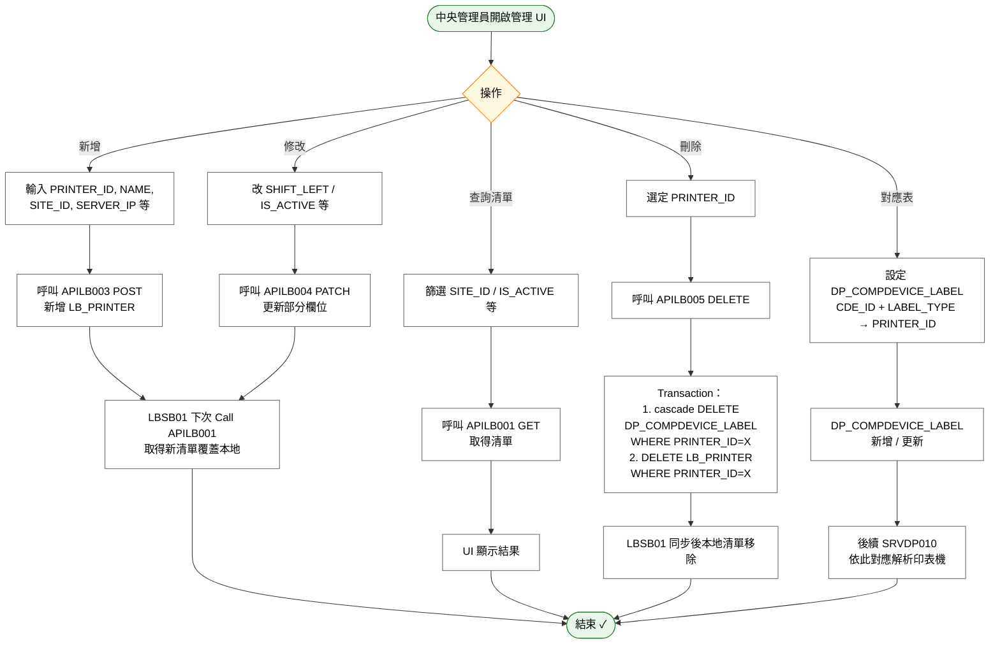

# User Story 6 — 中央端印表機主檔管理（管理員作業）

> 返回總檔：[spec.md](spec.md) | 模組：標籤列印（LB）

**對應 UseCase**: —（管理員作業，無獨立 UC）
**對應 SRV/API**: 中央 TBMS UI / Admin Portal（前端對後端），後端提供 LB_PRINTER CRUD 與 DP_COMPDEVICE_LABEL 維護；LBSB01 則透過 APILB001~005 / SRVDP010 取用
**對應 FR**: FR-019 ~ FR-021
**對應 Table**: `LB_PRINTER`、`DP_COMPDEVICE_LABEL`
**優先級**: P2

> **本 Story 實作於中央 TBMS 系統（非 LBSB01）**，後端契約見 [contracts/](contracts/)。

中央系統管理員透過中央 TBMS UI（或 Admin Portal）維護全域 `LB_PRINTER` 主檔：新增、查詢、修改、刪除印表機記錄。同時維護 `DP_COMPDEVICE_LABEL` 對應表（「哪台工作站 IP + 哪種標籤類別 → 由哪台印表機列印」），以支援 LBSB01 SRVDP010 印表機解析邏輯。刪除印表機時後端需 cascade 清 `DP_COMPDEVICE_LABEL` 子表對應，避免孤立記錄。

**Why this priority**: 中央印表機主檔是 LB 模組的全域參考資料——LBSB01 只是「取得並快取」、前端列印請求（SRVLB001 格式一）依賴 SRVDP010 查 `DP_COMPDEVICE_LABEL` 解析目標印表機。若主檔不完整或對應錯誤，會造成「資訊設備需先設定」錯誤或列印到錯印表機。本 Story 讓中央管理員能集中管理所有 LBSB01 主機所接的印表機。

**Independent Test**:
- 管理員新增一台印表機（`PRN-020`）→ 呼叫 APILB003 → `LB_PRINTER` 新增一筆 → 所有 LBSB01 下次同步（APILB001）取得新清單
- 管理員設定 `DP_COMPDEVICE_LABEL` 對應（`CDE_ID=DEV-001` (IP=10.1.1.10), `LABEL_TYPE=CP11 → PRINTER_ID=PRN-020`）→ Client 由該工作站發 SRVLB001 格式一（bar_type=CP11）→ SRVDP010 正確解析 → 列印到 PRN-020
- 管理員刪除 `PRN-020`（APILB005）→ 後端 cascade 清 `DP_COMPDEVICE_LABEL` 中 `PRINTER_ID=PRN-020` 的記錄 → 原對應的工作站再發 SRVLB001 格式一 → SRVDP010 回 404 → SRVLB001 回「資訊設備需先設定」
- 同時發生 LBSB01 端離線修改 + 中央修改同一 PRINTER_ID → 上線 replay → 採「以 Local 蓋中央」（見 [US3](spec_us3.md) 離線原則）

## Acceptance Scenarios

1. **Given** 中央管理員於管理 UI 按「新增印表機」，**When** 輸入必填欄位（`PRINTER_ID`、`PRINTER_NAME`、`SITE_ID`、`SERVER_IP`）並儲存，**Then** 呼叫 [APILB003](./contracts/APILB003.md) 新增一筆 `LB_PRINTER`
2. **Given** 已存在的印表機，**When** 管理員修改 `SHIFT_LEFT` / `IS_ACTIVE` 等欄位，**Then** 呼叫 [APILB004](./contracts/APILB004.md) PATCH 更新
3. **Given** 管理員篩選 `SITE_ID` + `IS_ACTIVE=1`，**When** 查詢，**Then** 呼叫 [APILB001](./contracts/APILB001.md) 取得符合清單（不含軟刪記錄）
4. **Given** 管理員點選特定 `PRINTER_ID` 查看詳細，**When** 載入，**Then** 呼叫 [APILB002](./contracts/APILB002.md) 取得完整欄位
5. **Given** 管理員刪除印表機 `PRN-020`，**When** 呼叫 [APILB005](./contracts/APILB005.md)，**Then** 後端在 Transaction 內：
   - 先 `DELETE FROM DP_COMPDEVICE_LABEL WHERE PRINTER_ID='PRN-020'`（cascade）
   - 再 `DELETE FROM LB_PRINTER WHERE PRINTER_ID='PRN-020'`（硬刪）
6. **Given** 管理員於「資訊設備」功能建立「哪台工作站 + 哪種標籤 → 哪台印表機」對應，**When** 儲存，**Then** `DP_COMPDEVICE_LABEL` 新增一筆 `(CDE_ID, LABEL_TYPE, PRINTER_ID)`；缺了任何一對應，該工作站發相關 `bar_type` 的 SRVLB001 格式一會回「資訊設備需先設定」
7. **Given** 工作站需設定本機 USB 直連列印，**When** 管理員先於 `LB_PRINTER` 建立一筆 USB 印表機記錄（`PRINTER_DRIVER='USB'`、`PRINTER_IP` 空白），再於 `DP_COMPDEVICE_LABEL` 對應「某 CDE_ID + 某 LABEL_TYPE → 該 PRINTER_ID」，**Then** SRVLB001 格式一解析時 SRVDP010 回傳的 `printer_driver='USB'`，呼叫端據此走本機 USB 直連輸出（不經 LBSB01 HTTP Listener）
8. **Given** 中央修改某 `PRINTER_ID` 的欄位，**When** 對應的 LBSB01 下次 Call APILB001 同步，**Then** 本地 Cache 被更新；但若該 LBSB01 本地對同一 PRINTER_ID 也有離線修改，依 PENDING_OPS replay 時**以 Local 蓋中央**（離線原則 R03）
9. **Given** 中央刪除某 `PRINTER_ID`（硬刪），**When** 該印表機對應的工作站再發格式一請求，**Then** SRVDP010 回 404，SRVLB001 回「資訊設備需先設定」
10. **Given** 非管理員的 LBSB01 使用者，**When** 於 LBSB01 端新增/修改/刪除印表機（[US4](spec_us4.md)），**Then** 同樣經 APILB003/004/005 寫入中央，**不需經過**中央管理員的 UI；管理員 UI 與 LBSB01 UI 共用同一組 API

## Activity Diagram（UC 內部流程）

## 關聯 API 契約

| API | HTTP 動作 | 用途 |
|-----|-----------|------|
| [APILB001](./contracts/APILB001.md) | GET `/api/lb/printers` | 查詢印表機清單（可篩選 SITE_ID / IS_ACTIVE） |
| [APILB002](./contracts/APILB002.md) | GET `/api/lb/printers/{id}` | 查詢單筆印表機 |
| [APILB003](./contracts/APILB003.md) | POST `/api/lb/printers` | 新增印表機 |
| [APILB004](./contracts/APILB004.md) | PATCH `/api/lb/printers/{id}` | 修改印表機（部分欄位） |
| [APILB005](./contracts/APILB005.md) | DELETE `/api/lb/printers/{id}` | 刪除印表機（硬刪 + cascade `DP_COMPDEVICE_LABEL`） |

相關跨模組：
- [SRVDP010](./contracts/SRVDP010.md) — SRVLB001 格式一使用；依入參 `client_ip` + `bar_type`（內部中介到 `DP_COMPDEVICE_LABEL.CDE_ID` + `LABEL_TYPE`）解析 `PRINTER_ID` + 連線資訊

## LB_PRINTER 欄位摘要

| 欄位 | 型態 | 說明 |
|------|------|------|
| `PRINTER_ID` | VARCHAR(20) | 主鍵；管理者自訂代號（無保留字；USB 直連印表機由 `PRINTER_DRIVER='USB'` 識別）|
| `PRINTER_NAME` | VARCHAR(100) | 印表機名稱 |
| `SITE_ID` | VARCHAR(10) | 所屬站點（FK→DP_SITE） |
| `SERVER_IP` | VARCHAR(45) | LBSB01 主機 IP（Task 路由依據） |
| `PRINTER_IP` | VARCHAR(45) | 印表機固定 IP（有填則優先採用，Port 固定 9100） |
| `PRINTER_DRIVER` | VARCHAR(100) | USB / `#OS 印表機名` |
| `SHIFT_LEFT` / `SHIFT_TOP` / `DARKNESS` | INT | 公差校正參數 |
| `IS_ACTIVE` | INT | 1=啟用 / 0=停用 |

## DP_COMPDEVICE_LABEL 欄位摘要

| 欄位 | 說明 |
|------|------|
| `CDE_ID` | 設備編號（PK1，FK→`DP_COMPDEVICE.CDE_ID`；SRVDP010 用 `client_ip` 經 `DP_COMPDEVICE.IP` 中介取得）|
| `LABEL_TYPE` | 標籤類別代碼（PK2，`LB_TYPE` 代碼，如 CP11）|
| `PRINTER_ID` | 目標印表機（FK→`LB_PRINTER.PRINTER_ID`；指向實際存在的印表機記錄，含 USB 直連者）|

> 未設定或設為錯誤 `PRINTER_ID` 時，SRVLB001 格式一會回「資訊設備需先設定」MSG 且不寫 LB_PRINT_LOG。
