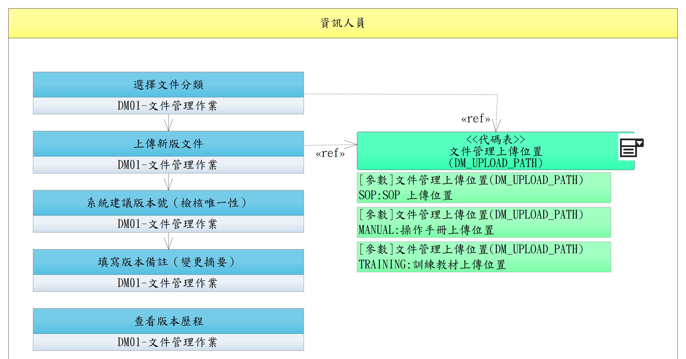

# UCDM001-文件管理與版本管控

使用者於 DM 系統上傳 **SOP / 操作手冊 / 訓練教材**（文件型）三類文件並完成版本資訊填寫；上傳完成後文件 `STATUS=DRAFT`。**送審 / 核准 / 系統建版本流程移至 [UCDM006-文件審查作業流程](UCDM006-文件審查作業流程.md)**。

> 影片型教材不收，仍由 ET 模組自管以保留 RQET004 強制觀看追蹤；表單不在 DM 範圍。

- **主要參與者**：使用者（任一帳號 + DM01 功能權限）
- **對應功能**：DM01-文件管理作業（功能選項）
- **前置條件**：
  - 已通過 [UCDM004 DM 登入](UCDM004-DM%20登入.md)，瀏覽器 session 持有 Bearer Token
  - DM 服務啟動時已透過 APIDP003 取得 `DM_UPLOAD_PATH` 三組路徑（MANUAL / SOP / TRAINING）
- **後置條件**：文件已上傳到 **`{DM_UPLOAD_PATH[CATEGORY]}/待審查/{BASE_FILENAME含版號}`**，`STATUS=DRAFT`；不直接覆蓋最新版位置（外部連結指向的 PUBLISHED 版本不受影響）；後續發布流程由 [UCDM006](UCDM006-文件審查作業流程.md) 接手

## 正常流程（4 步：純上傳 + 版本資訊）

1. **選擇文件分類**（**SOP / 操作手冊 / 訓練教材** 三類擇一）
2. **上傳新版文件**（PDF/Word/PPT/圖片，亦可線上編輯）
   - 系統自動標準化檔名：空格→底線、Unicode NFC、移除前後空白；副檔名保留
   - 例：使用者上傳 `LBSB01 操作手冊.pdf` → 系統識別為 BASE_FILENAME `LBSB01_操作手冊.pdf`
3. **系統建議版本號（檢核唯一性）**
   - 系統以 `(CATEGORY, BASE_FILENAME)` 查 DM_DOC：
     - 不存在 → 視為新文件，預填 `V1.0`
     - 已存在 → 顯示既有文件版本歷程，預填建議版本號 `Vx.yR(z+1)`（最低衝擊）
   - 使用者可手改版本號（V1.1 / V2.0 / 自訂），系統檢核：不可與該文件**任何先前已發布版本**重複
4. **填寫版本備註（變更摘要）** — 必填

完成後系統把實體檔放到 `{DM_UPLOAD_PATH[CATEGORY]}/待審查/{BASE_FILENAME含版號}`（例 `/data/dm/manual/待審查/LBSB01_操作手冊V1.0R1.pdf`），DM_DOC_VERSION 寫入新版本 `STATUS=DRAFT`、`FILE_PATH` 指向待審查檔。**不覆蓋最新版位置**，外部連結（ET 模組課程教材、主系統線上操作手冊入口）仍指向先前已 PUBLISHED 的版本。

後續流程：使用者建立 / 加入 [UCDM006 審查單](UCDM006-文件審查作業流程.md) 送審；通過後系統批次執行原子搬移：
- 舊最新版 → `{原目錄}/歷史版本/{BASE_FILENAME含版號}`
- 待審查檔 → `{原目錄}/{BASE_FILENAME}`（取代最新版位置）

## 替代流程

- **2a**. 線上編輯器撰寫（HTML / Markdown）取代上傳檔案
- **3a**. 同名檔案再次上傳被使用者確認後，視為新版本繼續流程；若使用者意在建立另一份同名新文件，須取消後改檔名重新上傳

> **查看版本歷程**為獨立可隨時執行的動作：使用者可於 DM01 檢視該文件全部版本，下載任一歷史版本作回溯比對；歷史版本目錄不開放外部 URL，下載僅能透過 DM 後端轉發。

## 流程圖

