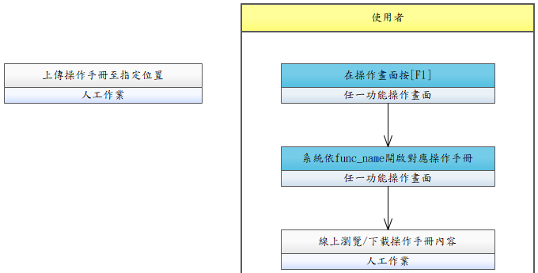

# UCDM002-線上操作手冊查閱

使用者於主系統任何操作畫面開啟對應的線上操作手冊，系統依 func_name（功能代號）對應到 DM 模組內的手冊檔案。

- **主要參與者**：使用者
- **前置條件**：已登入主系統；DM 模組已有該 func_name 對應之操作手冊
- **後置條件**：DM 記錄查閱 Log（誰、何時、由何 func_name 來源）

## 正常流程

1. 使用者於主系統操作畫面開啟線上操作手冊
2. 主系統以 func_name 呼叫 DM（APIDMxxx 或 URL 轉跳）
3. DM 依 func_name 查詢對應操作手冊
4. 開啟並顯示操作手冊內容（DM 端頁面）
5. 使用者線上瀏覽或下載 PDF

## 替代流程

- **3a**. 該功能尚無操作手冊 → DM 回「尚無操作手冊」提示

## 前置作業（資訊人員）

- 於 DM 管理後台上傳操作手冊（PDF 或線上編輯），標記對應 func_name（如 `IFSM01-系統登入頁`）
- 文件經簽核流程（UCDM001）後才會對使用者可見

## 流程圖

