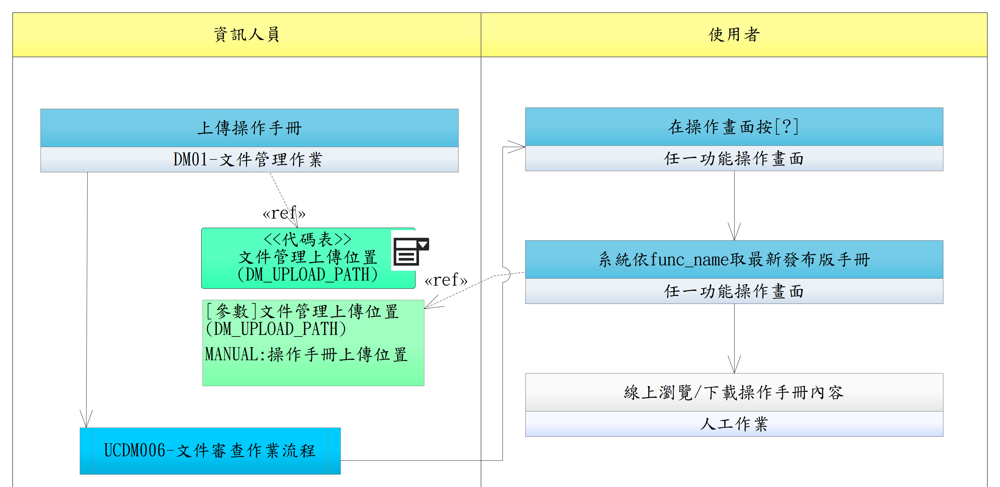

# UCDM002-線上文件查閱

使用者於主系統任何操作畫面或 ET 模組課程章節，開啟 DM 對應的線上文件（**SOP / 操作手冊 / 訓練教材** 三類皆適用）。系統依不同入口取得文件並顯示最新發布版本。

- **主要參與者**：使用者
- **次要參與者**：資訊人員（前置作業：透過 DM01 上傳文件並完成簽核 → UCDM001）
- **前置條件**：
  - 已登入主系統（DP Token）或 ET 模組 / DM（SS Token）
  - DM 已有對應分類的文件且 STATUS=PUBLISHED
  - 操作手冊類另需建立 func_name → DOC_ID 對照（`DM_FUNC_MANUAL_MAP`）
- **後置條件**：DM 記錄查閱 Log（誰、何時、由何入口 / func_name / DOC_ID 來源、查閱了哪份文件的哪版）

> **不在範圍**：影片型訓練教材不在 DM 範圍（仍由 ET 模組自管以保留 RQET004 強制觀看追蹤），UCDM002 不涵蓋影片型素材的查閱。

## 三類文件入口情境

| # | 分類 | 入口 | 取 DOC_ID 方式 |
|---|------|------|----------------|
| 1 | **操作手冊** | 主系統操作畫面按 **[?]** 鍵 | 主系統以 func_name 呼叫 DM `APIDM001` → 查 `DM_FUNC_MANUAL_MAP` 對照取 DOC_ID |
| 2 | **訓練教材** | ET 模組課程章節點教材連結（外部連結）| URL `https://dm.tbms.internal/doc/{DOC_ID}` 直接帶入 DOC_ID |
| 3 | **SOP 文件** | DM 文件庫首頁 / 分類頁 / 搜尋 / 主系統選單導向 | 使用者於 DM 端選取 / 點選列表項目 |

> 三類入口殊途同歸，**取得 DOC_ID 後流程一致**（下方共用流程 2~5）。

## 正常流程

1. **觸發查閱**（按 [?] / 點教材連結 / DM 文件庫瀏覽，依分類選一）
2. 系統取得 DOC_ID（由 func_name 對照、URL 帶入、或使用者選取）
3. 系統依 `DM_DOC.CURRENT_VERSION_ID` 取**最新發布版**（STATUS=PUBLISHED）
4. 顯示文件內容（PDF inline 預覽 / HTML 渲染 / 提供下載按鈕）
5. DM 記 access log

## 替代流程

- **2a**. 操作手冊查無對應 func_name → 顯示「尚無操作手冊」提示，不阻擋使用者繼續操作
- **3a**. 文件已撤回（`STATUS=WITHDRAWN`）→ 回 410 Gone + 「此文件已撤回」頁
- **4a**. 具 DM02 功能權限之使用者皆可於 DM 端切換歷史版本檢視（系統權限管控僅至功能層，DM02 通過即可讀全部版本，依 `DM_DOC_VERSION` 全部紀錄；舊版檔案保留不可被覆寫；歷史版本目錄不開放外部 URL，下載僅能透過 DM 後端轉發）

> **版本一致性**：UCDM001 上傳新版時系統會建立新 `DM_DOC_VERSION` 並更新 `CURRENT_VERSION_ID`，UCDM002 取得的永遠是最新發布版；舊版本保留為歷程，由 UCDM001 「查看版本歷程」回溯。

## 流程圖

