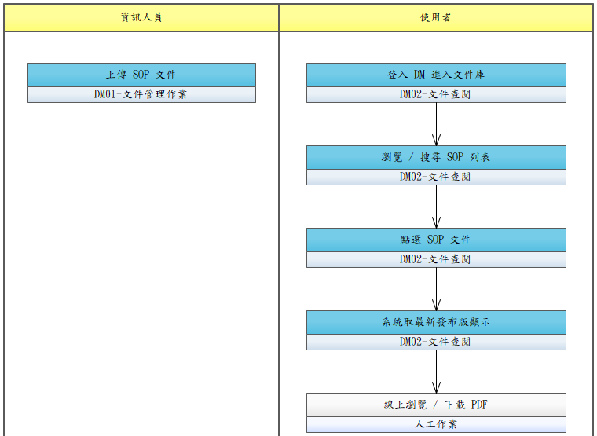

# UCDM003-SOP 文件查閱

使用者於 **DM 系統**主動查閱 **SOP 文件（標準作業程序）**。SOP 不像操作手冊由主系統線上操作手冊入口觸發、也不像訓練教材由 ET 模組課程引用，而是使用者**主動**登入 DM 系統進行查詢。

- **主要參與者**：使用者（含醫護、技術師、品保、稽核等需查閱作業規範者）
- **次要參與者**：資訊人員（前置作業：透過 DM01 上傳 SOP 並完成簽核 → UCDM001）
- **前置條件**：
  - 已登入 DM 系統（透過 SS API 取得 Token）
  - DM 已有對應 SOP 文件且 `STATUS=PUBLISHED`
  - 使用者具該 SOP 之查閱權限（依分類權限或文件層級限縮）
- **後置條件**：
  - DM 記錄查閱 Log（誰、何時、由何入口、查閱了哪份 SOP 的哪版）

## 入口

**單一入口**：使用者登入 **DM 系統**後，於文件庫進行查詢（分類瀏覽 / 全文搜尋擇一）。

> 主系統選單導向、訂閱通知連結等其他入口情境**目前不在範圍**。

## 正常流程

1. 使用者登入 **DM 系統**並進入文件庫
2. 系統依使用者權限過濾可見 SOP 清單（依分類或文件層級限縮）
3. 使用者**瀏覽列表**（顯示文件名、分類、目前發布版本、發布日期、作者）或於搜尋框輸入關鍵字 / 文件名篩選
4. 點選某 SOP 文件
5. 系統依 `DM_DOC.CURRENT_VERSION_ID` 取**最新發布版**（`STATUS=PUBLISHED`）
6. 顯示文件內容（PDF inline 預覽 / HTML 渲染 / 提供下載按鈕）
7. DM 記 access log
8. （可選）下載 PDF 供離線參考

## 替代流程

- **2a**. 使用者對該分類 / 文件無查閱權限 → 列表不顯示該項；若直接 URL 帶 DOC_ID → 回 403 Forbidden
- **5a**. SOP 已撤回（`STATUS=WITHDRAWN`）→ 回 410 Gone + 「此文件已撤回」頁
- **6a**. 具 DM02 功能權限之使用者皆可於 DM 端切換歷史版本檢視（系統權限管控僅至功能層，DM02 通過即可讀全部版本；舊版檔案保留不可被覆寫；歷史版本目錄不開放外部 URL，下載僅能透過 DM 後端轉發）

## 與其他 UC 的關係

| 關係 | 說明 |
|------|------|
| UCDM001 | SOP 由 UCDM001 上傳/簽核/發布而來 |
| UCDM002 | UCDM002 為三類文件共用之線上查閱機制概觀；UCDM003 聚焦於 **SOP 之使用者主動查閱情境** |
| UCET013 | 若 ET 課程引用 SOP 作為教材閱讀，採超連結指向 DM SOP 頁（與訓練教材引用同機制）|

## 對應需求

- RQDM001（文件儲存與檢索）
- RQDM002（版本管理與線上存取）

> 註：RQDM003（ET 教材引用 DM 文件 URL）為 ET → DM 連結引用情境（涵蓋於 UCDM002 入口 #2），不在本 UC 範圍。

## 流程圖

