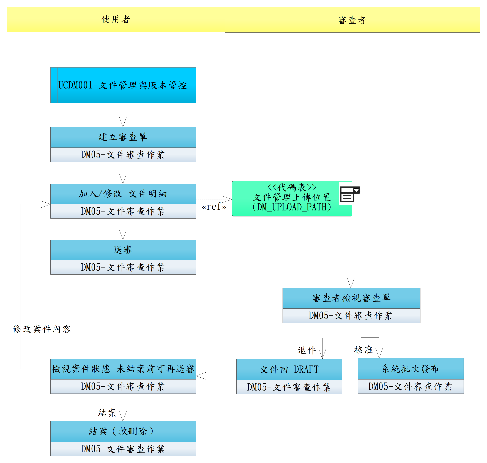

# UCDM006-文件審查作業流程

使用者於 **DM05-文件審查作業**（一支程式覆蓋整個狀態機）建立審查單、加入文件明細、送審；具 `SOP_REVIEWER` 角色之帳號對審查單作核准 / 退件；通過後系統批次為文件建版本（沿用 [UCDM001](UCDM001-文件管理與版本管控.md) 設計之原子搬移流程）。

- **主要參與者**：
  - **使用者**（送審者）：任一帳號 + DM05 功能權限
  - **審查者**（SOP_REVIEWER）：具 SOP_REVIEWER 角色之帳號（**不限自審**，同一人若兼具 SOP_REVIEWER 角色可核准自己送審的 ticket）
- **對應功能**：DM05-文件審查作業（功能選項）
- **前置條件**：
  - 文件已透過 [UCDM001](UCDM001-文件管理與版本管控.md) 上傳，狀態 `DRAFT`
  - 送審者已登入（[UCDM004](UCDM004-DM%20登入.md)）且具 DM05 功能權限
  - 核准 / 退件動作執行者具 SOP_REVIEWER 角色
- **後置條件**：
  - 審查單 STATUS 持久化（APPROVED / REJECTED）
  - 通過：明細文件版本進入 PUBLISHED，DM_DOC.CURRENT_VERSION_ID 更新，舊版搬到歷史目錄
  - 退件：明細文件回 DRAFT
  - DM_APPROVAL（動作歷程）+ DM_AUDIT + DP_AUDIT_LOG 三軌歷程留存

## 對應 RQ

| 來源 | 條目 | 對應方式 |
|------|------|---------|
| RQDM001 | §4 電子簽核與稽核軌跡 | 直接對應 |
| RQSS011 | 角色↔功能對應（功能層級） | 沿用 SS 端設定（DM 於登入時取 functions 即可決策）|

> 註：「審查單」屬實作設計，無 RFP 直接條目，不新增 RQDM 條目。

## 角色卡點

| 操作 | 角色卡點 |
|------|---------|
| 建立審查單 | 任一帳號 + DM05 功能權限 |
| 加入 / 移除文件明細 | 任一帳號 + DM05 功能權限（且為該單建立者）|
| 送審 | 任一帳號 + DM05 功能權限 |
| 讀取審查單 / 文件 | 任一帳號 + DM05 / DM02 功能權限 |
| **核准 / 退件** | **`SOP_REVIEWER` 硬卡點** |
| 自審 | **不限制**（同一人若兼具 SOP_REVIEWER 角色可核准自己送審的 ticket）|

## 狀態機（per 審查單）

```
DRAFT ──送審──► SUBMITTED ──核准──► APPROVED （系統批次發布）
   ▲              │
   │              └──整批退件──► REJECTED
   │                              │
   └──修改 / 再送審────────────────┘
                                  │
   任何狀態 (DRAFT/SUBMITTED/REJECTED) ──結案──► DELETED（軟刪除，final）
```

> 結案（軟刪除）為使用者主動放棄該審查單；不可逆。APPROVED 流程已完成，不需結案。

## 正常流程

> 流程涵蓋兩個泳道：**使用者**（送審者）泳道與**審查者**（SOP_REVIEWER）泳道。

1. **使用者** 於 DM05 **建立審查單**：填寫 TITLE、選定 REVIEWER_USER_ID。`DM_APPROVAL_TICKET` 寫入 STATUS=DRAFT
2. **使用者 加入 / 修改 文件明細**：選取已上傳之 DM_DOC（任意分類，文件 STATUS=DRAFT；同文件可同時加入多張 ticket，**不檢查鎖定**）；亦可移除錯加的明細。寫入 `DM_APPROVAL_TICKET_DOC`（TICKET_ID + DOC_ID + VERSION_ID 複合 PK）
3. **使用者 送審**：ticket STATUS DRAFT → SUBMITTED；明細文件 STATUS 同步 DRAFT → SUBMITTED；寫 `DM_APPROVAL` ACTION=SUBMIT；通知 REVIEWER_USER_ID（Email / 主系統通知中心 — Phase 2）
4. **審查者 檢視審查單**：開啟審查單，逐文件預覽內容、版本號、變更摘要，準備決策
5. **審查者擇一動作**：
   - **5a. 系統批次發布**（核准）：ticket SUBMITTED → APPROVED；寫 `DM_APPROVAL` ACTION=APPROVE；系統批次處理 ticket 內每份文件，per FR-007c **原子搬移**：
     1. 鎖定 DOC_ID
     2. 舊最新檔 `{原目錄}/{BASE_FILENAME}` → `{原目錄}/歷史版本/{BASE_FILENAME含版號}`（依該檔當時版號）
     3. 待審查檔 `{原目錄}/待審查/{BASE_FILENAME含版號}` → `{原目錄}/{BASE_FILENAME}`（取代最新版位置）
     4. DB transaction：DM_DOC_VERSION（舊版 IS_CURRENT=0 + FILE_NAME_ARCHIVED、新版 IS_CURRENT=1 + STATUS=PUBLISHED）+ DM_DOC.CURRENT_VERSION_ID + DM_AUDIT + DP_AUDIT_LOG
     5. 釋放鎖、通知送審者結果
     - 第一次發布省略 Step 2（無舊版需歸檔）
     - 若該版本已 PUBLISHED（被其他 ticket 通過）→ noop（仍寫 DM_APPROVAL 動作歷程）
   - **5b. 文件回 DRAFT**（退件）：必填 REJECT_REASON；ticket SUBMITTED → REJECTED；寫 `DM_APPROVAL` ACTION=REJECT, COMMENT=REJECT_REASON；ticket 內所有明細文件 STATUS → DRAFT（**整批回 DRAFT，不可單一文件退件**）；待審查檔**保留於原目錄不動**（送審者可修改後重送）；寫 DM_AUDIT；通知送審者退件原因
6. **使用者 檢視案件狀態**（未結案前可再送審）：
   - 退件後 → 看到 REJECT_REASON；可回 Step 2「加入/修改 文件明細」修改後重新送審（回 Step 3，ticket 回 SUBMITTED）
   - 通過後 → 流程結束，無需動作
   - 任何狀態下可選擇「**結案（軟刪除）**」徹底放棄該審查單（→ Step 7）
7. **使用者 結案（軟刪除）**：DM_APPROVAL_TICKET 標記 DELETED=1；寫 DM_APPROVAL ACTION=CLOSE 動作歷程 + DM_AUDIT；ticket 不再可動，明細文件 STATUS 留原狀，待審查檔由 admin 定期清理。**結案不可逆**。

## 替代流程

- **1a**. 同一文件可同時出現在多張 ticket 上（系統不檢查鎖定）— 任一 ticket 通過即觸發發布；其他 ticket 通過時若文件已 PUBLISHED 則 noop（但仍記 DM_APPROVAL 動作歷程）
- **2a**. 審查單為空（沒附任何文件）就送審 → 系統阻止
- **3a**. ticket SUBMITTED 後送審者嘗試修改文件清單 → 系統阻止；只能撤回 ticket（回 DRAFT）後再改
- **5c**. 系統批次建版本中途失敗（檔案搬移錯誤 / DB 錯誤）→ 整批回滾；ticket 標記 FAILED，由 admin 介入處理
- **5d**. ticket APPROVED 後文件已 PUBLISHED 又被加入新 ticket（更版用）→ 允許；新版本通過後 PUBLISHED 文件搬到歷史目錄，新版取代

## 設計要點

- **一支程式（DM05）覆蓋整個狀態機**
- 角色卡點：核准 / 退件僅 SOP_REVIEWER；其餘任一帳號 + DM05 功能權限可送審 / 讀取
- **不限自審**：同一人若兼具 SOP_REVIEWER 角色可核准自己送審的 ticket
- **不鎖定文件**：同文件可同時在多 ticket 中；任一 ticket 通過即文件 PUBLISHED
- **退件僅 ticket 級別**（整批退），不可單一文件退件
- **未結案前可再送審**：REJECTED 後可修改重送（ticket 回 SUBMITTED），重複直到通過或結案
- **結案（軟刪除）為 final state**：使用者主動放棄；不可逆
- DM_APPROVAL 為動作歷程（每動作一筆 append-only）
- 「軌跡不可竄改」鐵則保留（spec.md FR-013）

## 流程圖


