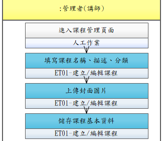

# UCET001-建立與編輯課程

管理者建立新課程或編輯既有課程基本資料（名稱、描述、封面圖、分類）。

- **主要參與者**：管理者（講師/資訊人員）
- **前置條件**：已登入且具管理者權限
- **後置條件**：課程已建立/更新，可進一步編排章節

## 正常流程

1. 進入課程管理頁面
2. 點選「新增課程」或選擇既有課程編輯
3. 填寫課程名稱、描述、分類
4. 上傳封面圖片
5. 儲存課程基本資料

## 流程圖

