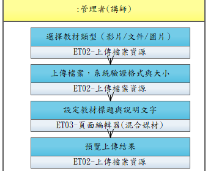

# UCET002-上傳教材

管理者上傳課程所需的影片檔、PDF、PPT 等教材至課程章節。

- **主要參與者**：管理者
- **前置條件**：課程已建立
- **後置條件**：教材已上傳並掛載於對應章節

## 正常流程

1. 進入課程章節編輯頁
2. 選擇教材類型（影片/文件/圖片）
3. 上傳檔案，系統驗證格式與大小
4. 設定教材標題與說明文字
5. 預覽上傳結果

## 替代流程

- **3a**. 檔案格式不支援或超過大小限制，提示錯誤

## 流程圖

