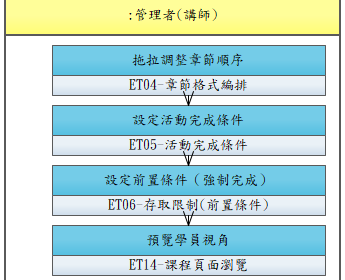

# UCET003-編排課程章節與進度條件

管理者透過拖拉介面調整章節順序，設定強制完成條件（如必須看完影片才能進下一章）。

- **主要參與者**：管理者
- **前置條件**：課程已建立且有教材
- **後置條件**：課程章節順序與進度條件已更新

## 正常流程

1. 進入章節編排頁面
2. 拖拉調整章節、教材、測驗的先後順序
3. 設定各章節的前置條件（強制觀看完成/測驗通過）
4. 預覽學員視角
5. 儲存章節設定

## 流程圖

