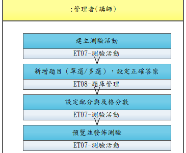

# UCET004-建立線上測驗

管理者在課程章節後方建立隨堂測驗，支援單選/多選題型，系統自動閱卷。

- **主要參與者**：管理者
- **前置條件**：課程章節已建立
- **後置條件**：測驗已建立，學員觀看完章節後可進行

## 正常流程

1. 進入測驗建立頁面
2. 設定測驗名稱、及格分數、作答時間
3. 新增題目（單選/多選），設定選項與正確答案
4. 設定配分
5. 預覽測驗
6. 儲存並發佈

## 流程圖

