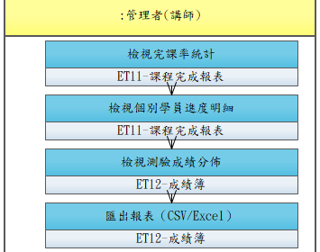

# UCET006-檢視學習報表與完課率

管理者檢視課程的學員學習進度、完課率、測驗成績等統計報表。

- **主要參與者**：管理者
- **前置條件**：課程已有學員參與
- **後置條件**：管理者掌握學習狀況

## 正常流程

1. 進入課程報表頁面
2. 檢視完課率統計（已完成/進行中/未開始）
3. 檢視個別學員進度明細
4. 檢視測驗成績分佈
5. 匯出報表（CSV/Excel）

## 流程圖

