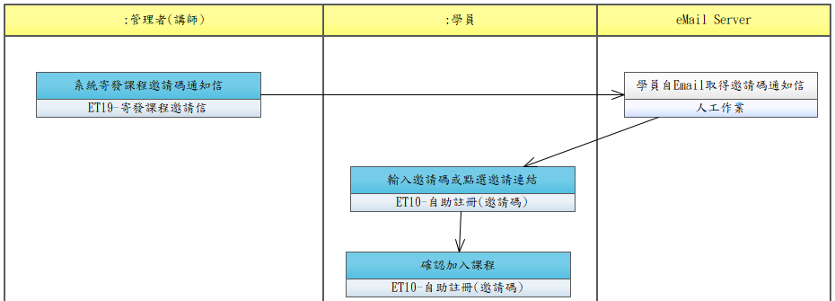

# UCET007-加入課程

學員透過邀請碼或 Email 邀請連結加入指定課程。

- **主要參與者**：學員
- **前置條件**：已登入系統，管理者已設定課程邀請碼並寄發通知信
- **後置條件**：學員已加入課程，課程列表顯示該課程

## 正常流程

1. 系統寄發課程邀請碼通知信給學員（eMail Server）
2. 學員輸入邀請碼或點選邀請連結
3. 系統驗證邀請碼有效性
4. 顯示課程資訊，學員確認加入
5. 系統將學員加入課程

## 替代流程

- **3a**. 邀請碼無效或已過期，提示錯誤

## 流程圖

