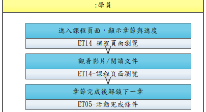

# UCET008-學習課程內容

學員依序觀看課程章節內容（影片、文件、圖文），系統追蹤觀看進度並強制完成。

- **主要參與者**：學員
- **前置條件**：已加入課程
- **後置條件**：學習進度已更新

## 正常流程

1. 進入課程頁面，顯示章節清單與進度
2. 點選章節開始學習
3. 觀看影片（系統記錄播放進度）
4. 閱讀文件/圖文內容
5. 章節完成後解鎖下一章

## 替代流程

- **5a**. 影片未看完，下一章仍鎖定，提示「請先完成本章」

## 流程圖

