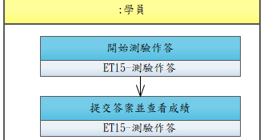

# UCET009-進行線上測驗

學員在完成章節後進行隨堂測驗，系統自動閱卷並顯示成績。

- **主要參與者**：學員
- **前置條件**：前置章節已完成
- **後置條件**：測驗成績已記錄

## 正常流程

1. 系統解鎖測驗，學員點選開始
2. 依序作答（單選/多選題）
3. 提交答案
4. 系統自動閱卷，顯示成績與答對/答錯明細

## 替代流程

- **4a**. 未達及格分數，可依設定重新作答

## 流程圖

