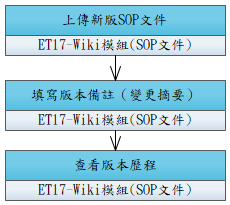

# UCET011-維護SOP文件與版本

資訊人員上傳、更新作業規範與 SOP 文件，系統自動管理版本歷程。

- **主要參與者**：資訊人員
- **前置條件**：已登入且具文件管理權限
- **後置條件**：文件已更新，使用者可查閱最新版

## 正常流程

1. 進入 SOP 文件管理頁面
2. 選擇文件分類
3. 上傳新版文件（PDF/Word）
4. 填寫版本備註（變更摘要）
5. 系統自動建立新版本，保留舊版本歷程

## 替代流程

- **3a**. 可回溯查看/下載歷史版本

## 流程圖

