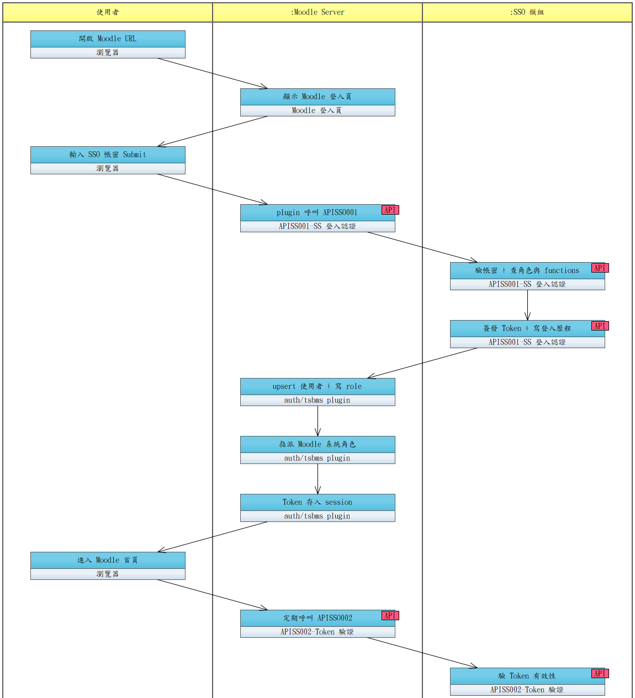

# UCET013-登入線上學習平台（SS）

使用者於 Moodle 登入頁輸入 SS 帳密；Moodle 透過 `auth/tsbms/` custom plugin 呼叫 SS 模組之 APISS001 完成認證，依回傳之角色與可用功能清單建立 Moodle session；後續每次請求呼叫 APISS002 驗證 Token。

> **2026-04-28 變更**：認證來源由主系統 DP API 改為獨立的 **SS 模組**（與主系統 DP 帳密**完全切開**）。SS 使用者為一般軍人。

- **主要參與者**：一般使用者（軍人）
- **次要參與者**：Moodle Server（含 `auth/tsbms` plugin）、SS 模組
- **關聯需求**：RQSS013、RQSS014、RQSS015、RQSS018
- **前置條件**：
  - 使用者於 SS 已建立帳號並指派角色（UCSS001）；角色↔功能對應已設定（UCSS004）
  - SS 已提供 APISS001（登入認證）與 APISS002（Token 驗證）
  - Moodle 已安裝 `auth/tsbms/` custom plugin 並設好 SS endpoint / API Key（或 mTLS 憑證）
- **後置條件**：
  - Moodle 已 upsert 該使用者（account、name、role）
  - Moodle 系統角色與 SS 角色一致
  - Moodle session 已存有效 SS Token，後續請求可持續驗證

## 正常流程

1. 使用者開啟 Moodle URL
2. Moodle 偵測未登入，顯示 Moodle 登入頁
3. 使用者輸入 SS 帳密並送出
4. `auth/tsbms` plugin 攔截，以 POST 呼叫 APISS001（account、password）
5. SS 驗帳密成功（比對帳號未停用 / 未鎖定，比對密碼雜湊），查使用者角色與可用功能
6. SS 簽發 Token、回傳 `{ token, expires_in, user: { account, name, roles, functions } }`，並寫入登入歷程
7. Plugin 在 Moodle 本地 upsert 使用者資料，將 roles 寫入 `profile_field_role`
8. Plugin 依 `profile_field_role` 自動指派 Moodle 系統角色（Manager / Teacher / Student）
9. Plugin 將 Token 存入 Moodle session，建立登入狀態
10. 使用者進入 Moodle 首頁，依 `functions` 渲染功能列
11. 使用期間 Moodle 定期呼叫 APISS002 驗 Token
12. SS 驗 Token 有效性，回傳結果（401 → Moodle 強制登出並回登入頁）

## 替代流程

- **4a**. Moodle 呼叫 APISS001 逾時或 SS 不可達 → 登入頁顯示系統錯誤，重試或回報 IT
- **5a**. 帳密錯誤 → APISS001 回 401（INVALID_CREDENTIAL）→ Moodle 顯示「帳號或密碼錯誤」；SS 累計失敗達 `SS_LOCK_THRESHOLD` 自動鎖定
- **5b**. 帳號已停用 / 鎖定 → APISS001 回 403（ACCOUNT_DISABLED / ACCOUNT_LOCKED）→ Moodle 顯示對應訊息
- **5c**. 首次登入或密碼到期 → APISS001 回 426（PASSWORD_CHANGE_REQUIRED）→ Moodle 導向 SS 變更密碼頁（UCSS002）
- **10a**. 使用者所屬角色尚無任何功能對應 → Moodle 僅顯示登入後首頁，無功能可進入
- **12a**. Token 過期 / 簽章錯誤 / 對應帳號已停用 / 對應帳號剛變更密碼 → APISS002 回 401 → Moodle 強制登出並導回登入頁

## 設計要點

- Moodle **不**在本地儲存 SS 密碼，亦**不**從主系統 DP 同步任何使用者資料
- `auth/tsbms` plugin 為本案客製產出，安裝於 Moodle `/local/auth/tsbms/`
- Token 過期由 SS 控管（`SS_TOKEN_EXPIRE`，預設 3600 秒）；Moodle 不主動 refresh Token
- SS 端帳號狀態變更（停用 / 鎖定 / 改密）後，Moodle 端 session 於下一次 APISS002 驗證即被拒，最大延遲為一個驗證週期
- Moodle 系統角色（Manager / Teacher / Student）對應 SS 角色之規則於 plugin 設定中維護

## 流程圖

